```{r setup, include = FALSE}
# Setup chunk
# Paquetes a usar
#options(htmltools.dir.version = FALSE) cambia la forma de incluir código, los colores

library(knitr)
library(tidyverse)
library(xaringanExtra)
library(icons)
library(fontawesome)
library(emo)
library(countdown) # remotes::install_github("gadenbuie/countdown", subdir = "r"), Explicacion de su uso: https://pkg.garrickadenbuie.com/countdown/#5
library(palmerpenguins)

# set default options
opts_chunk$set(collapse = TRUE,
               dpi = 300,
               warning = FALSE,
               error = FALSE,
               comment = "#")

top_icon = function(x) {
  icons::icon_style(
    icons::fontawesome(x),
    position = "fixed", top = 10, right = 10
  )
}

knit_engines$set("yaml", "markdown")

# Con la tecla "O" permite ver todas las diapositivas
xaringanExtra::use_tile_view()
# Agrega el boton de copiar los códigos de los chunks
xaringanExtra::use_clipboard()

# Crea paneles impresionantes 
xaringanExtra::use_panelset()

# Para compartir e incrustar en otro sitio web
xaringanExtra::use_share_again()
xaringanExtra::style_share_again(
  share_buttons = c("twitter", "linkedin")
)

# Funcionalidades de los chunks, pone un triangulito junto a la línea que se señala
xaringanExtra::use_extra_styles(
  hover_code_line = TRUE,         #<<
  mute_unhighlighted_code = TRUE  #<<
)

# Agregar web cam
xaringanExtra::use_webcam()

# barra de progreso
xaringanExtra::use_progress_bar(color = "#0051BA", location = "top", height = "10px")
```

```{r xaringan-editable, echo=FALSE}
# Para tener opciones para hacer editable algun chunk
xaringanExtra::use_editable(expires = 1)
# Para hacer que aparezca el lápiz y goma
xaringanExtra::use_scribble()
```

```{r xaringan-themer Eve, include=FALSE, warning=FALSE}
# Establecer colores para el tema
library(xaringanthemer)

palette <- c(
 orange        = "#fb5607",
 pink          = "#ff006e",
 blue_violet   = "#8338ec",
 zomp          = "#38A88E",
 shadow        = "#87826E",
 blue          = "#1381B0",
 yellow_orange = "#FF961C"
  )

#style_xaringan(
style_duo_accent(
  background_color = "#FFFFFF", # color del fondo
  link_color = "#562457", # color de los links
  text_bold_color = "#225ea8",
  primary_color = "#01002B", # Color 1
  secondary_color = "#CB6CE6", # Color 2
  inverse_background_color = "#41b6c4", # Color de fondo secundario 
  colors = palette,
  
  # Tipos de letra
  header_font_google = google_font("Barlow Condensed", "600"), #titulo
  text_font_google   = google_font("Work Sans", "300", "300i"), #texto
  code_font_google   = google_font("IBM Plex Mono") #codigo
  #text_font_size = "1.5rem" # Tamano de letra
)

# https://www.rdocumentation.org/packages/xaringanthemer/versions/0.3.4/topics/style_duo_accent
```

class: title-slide, middle, center
background-image: url(figures/Slide1.png) 
background-position: 90% 75%, 75% 75%, center
background-size: 1210px,210px, cover


.center-column[
# `r rmarkdown::metadata$title`
### `r rmarkdown::metadata$subtitle`

#### <span class="author">`r rmarkdown::metadata$author`</span>
#### <span class="date">`r rmarkdown::metadata$date`</span>
]

.left[.footnote[
[R-Ladies Theme](https://www.apreshill.com/project/rladies-xaringan/)]]

---

class: inverse, center, middle

`r fontawesome::fa("laptop-file", height = "3em")`
# Aspectos generales de scRNA-seq

---

## Repaso: Secuenciación de RNA

.pull-left[
```{r, echo=FALSE, out.width='100%', fig.align='center'}
knitr::include_graphics("figures/singlecell-v.-bulk-image.png")
```

.footnote-right[ 
Imagen tomada de: [Yan *et al.* 2024. *Int J Biol Sci*](https://doi.org/10.7150/ijbs.92525)]
]

.pull-right[
- **Bulk RNA-seq:** mide expresión promedio en un tejido; útil para detectar cambios globales, pero oculta heterogeneidad celular.
  + **Insuficiente para:** estudios de desarrollo temprano o tejidos complejos como el cerebro.

]

---

## Single cell RNA-seq (**scRNA-seq**)

.pull-left[
- Primera publicación en 2009 ([Tang *et al*, 2009](https://www.nature.com/articles/nmeth.1315))
- Popularidad en [2014](https://www.nature.com/articles/nmeth.2801)
- Estimar la distribución de los **niveles de expresión de cada gen en una población celular**.
- Análisis a **nivel de célula individual**
- Permite revelar **tipos celulares** (poblaciones raras) 
- Analizar las **dinámicas temporales y heterogeneidad**.
]

.pull-right[
```{r, echo=FALSE, out.width='100%', fig.align='center'}
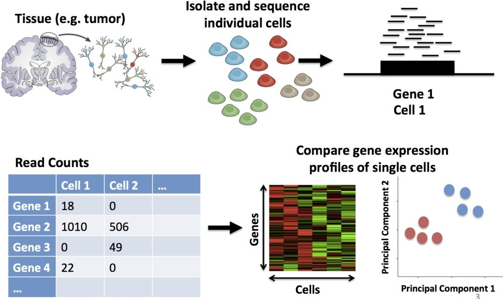
```
]

.footnote-right[ 
Imagen tomada de: [Single cell RNA sequencing](https://learn.gencore.bio.nyu.edu/single-cell-rnaseq/)]


---

## **Heterogeneidad:** Diversidad interna de un sistema o de un conjunto

.pull-left[
- 🔬 **No todas las células son iguales:** incluso dentro de un mismo tejido, existen diferencias en *tipos celulares, estados funcionales y niveles de expresión génica*.

- 🧬 **Variabilidad genética y transcriptómica:** cada célula puede expresar distintos genes o cantidades de RNA, reflejando funciones específicas.

- 🩺 **Relevancia en enfermedad:** la heterogeneidad celular explica por qué un tumor, por ejemplo, contiene subpoblaciones con distintos comportamientos (algunas más agresivas, otras más sensibles a tratamiento).
]

.pull-right[
Visualización a través de **UMAP** (Uniform Manifold Approximation and Projection):

```{r, echo=FALSE, out.width='100%', fig.align='center'}
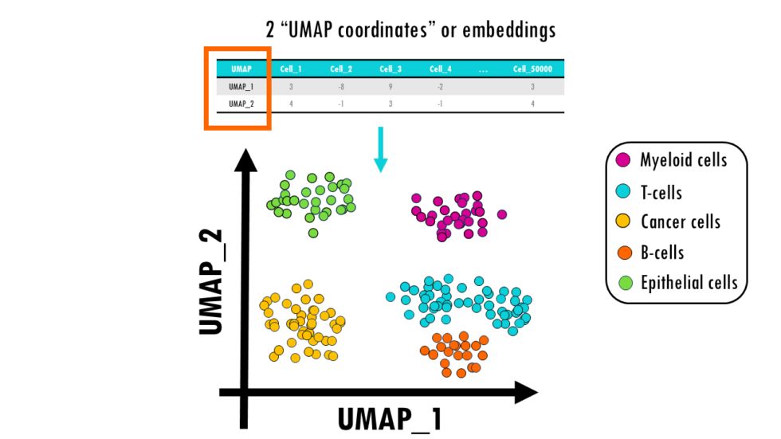
```
]

.footnote-right[ 
Imagen tomada de: [Explicación completa de un UMAP](https://biostatsquid.com/umap-simply-explained/)]

---

.pull-left[
# Preguntas que se pueden responde scRNA-seq

- Descubrir **tipos celulares nuevos o raros**.
- Identificar **composición celular diferencial** entre sano vs. enfermo.
- Comprender la **diferenciación celular** en desarrollo y regeneración.
- Analizar **plasticidad y dinámicas de expresión** en células individuales.
- Construir **atlas celulares/genéticos** → catálogo completo de diversidad celular.
- Aplicaciones en **investigación básica y medicina personalizada**.
]

.pull-right[
```{r, echo=FALSE, out.width='100%', fig.align='center'}
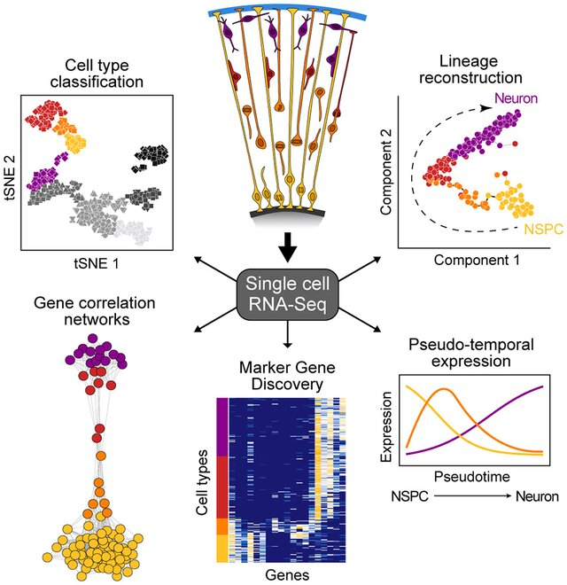
```
]

.footnote-right[ 
Imagen tomada de: [Kageyama, *et al*. 2018. *Front. Neurosci* ](https://doi.org/10.3389/fnins.2018.00315)]

---

## Variaciones de scRNA-seq

| Tipo de análisis         | Qué aporta                          |
|--------------------------|--------------------------------------|
| Unimodal (solo RNA)      | Heterogeneidad en expresión génica   |
| Multimodal (RNA + otros) | Regulación, proteómica, contexto     |
| Trajectories             | Dinámica temporal de procesos        |
| Interacciones celulares  | Comunicación y redes funcionales     |
| Integración datasets     | Comparación entre condiciones        |

---

class: inverse, center, middle

`r fontawesome::fa("barcode", height = "3em")`
# Consideraciones sobre la planificación experimental

---

## Flujo experimental de scRNA-Seq

```{r, echo=FALSE, out.width='80%', fig.align='center'}
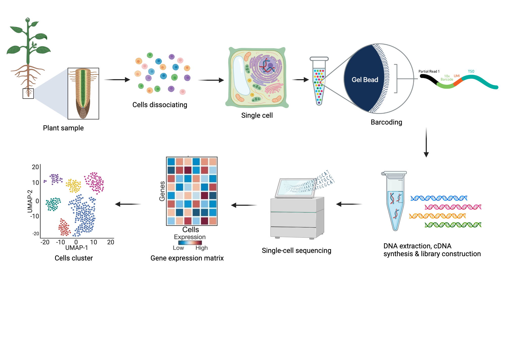
```

.footnote-right[
Imagen tomada de: [Biorender](https://www.biorender.com/template/single-cell-rna-sequencing-scrna-seq)]

---

## Variaciones en las plataformas de scRNA-seq

Las plataformas varían en:
- **Rendimiento:** número de células que pueden analizarse.
- **Cobertura de transcripción:** si se basan en etiquetas *3’/5’* o en transcripción completa.
- **Resolución:** nivel de detalle por célula; algunas permiten detectar *isoformas y splicing*, otras solo cuantificación de genes.
- **Escalabilidad:** capacidad de procesar miles o cientos de miles de células en una sola corrida.

.content-box-gray[
- **3’ end (extremo 3’):**
  + Se captura el extremo final del mRNA, donde está la **cola poli-A**.
  + Es la estrategia más común en plataformas como 10x Genomics Chromium.
  + Limitación: no se obtiene la secuencia completa del transcrito, por lo que no se pueden estudiar isoformas ni splicing con detalle.

- **5’ end (extremo 5’):**
  + Se captura el extremo inicial del mRNA (inicio de la transcripción, TSS).
  + Útil para estudios de receptores de células inmunes (ej. TCR, BCR).
]

.footnote-right[ 
[Wellcome Sanger](https://www.singlecellcourse.org/introduction-to-single-cell-rna-seq.html)]

---

### Tecnologías de scRNA-seq

| Plataforma / Método                  | Rendimiento (número de células) | Cobertura de transcripción       | Resolución                                   | Costo relativo | Comentarios |
|--------------------------------------|---------------------------------|---------------------------------|----------------------------------------------|----------------|-------------|
| **10x Genomics Chromium (droplet)**  | Miles a cientos de miles        | Lectura parcial (*3’/5’ tags*)  | Buena para cuantificación de genes, limitada en isoformas | Moderado por célula | Estándar actual para estudios poblacionales amplios |
| **SMART-seq2/3 (well-based)**        | Centenas a miles                | Transcripción completa          | Alta resolución, detecta isoformas y splicing | Alto por célula | Ideal para estudios detallados de pocas células |
| **Micromanipulación / Dilución**     | Decenas                         | Transcripción completa (según protocolo) | Muy alta, pero poco reproducible | Alto | Útil para células raras o frágiles |
| **BGI/MGI DNBSEQ**                   | Similar a Illumina              | Parcial o completa según librería | Comparable a Illumina | Menor costo | Alternativa económica, menos extendida globalmente |
| **Oxford Nanopore (ONT)**            | Centenas a miles                | Lectura larga (transcripción completa) | Excelente para isoformas y splicing | Variable | Menor precisión en cuantificación, pero valioso para diversidad de transcriptos |

---

### Tecnologías de scRNA-seq

```{r, echo=FALSE, out.width='80%', fig.align='center'}
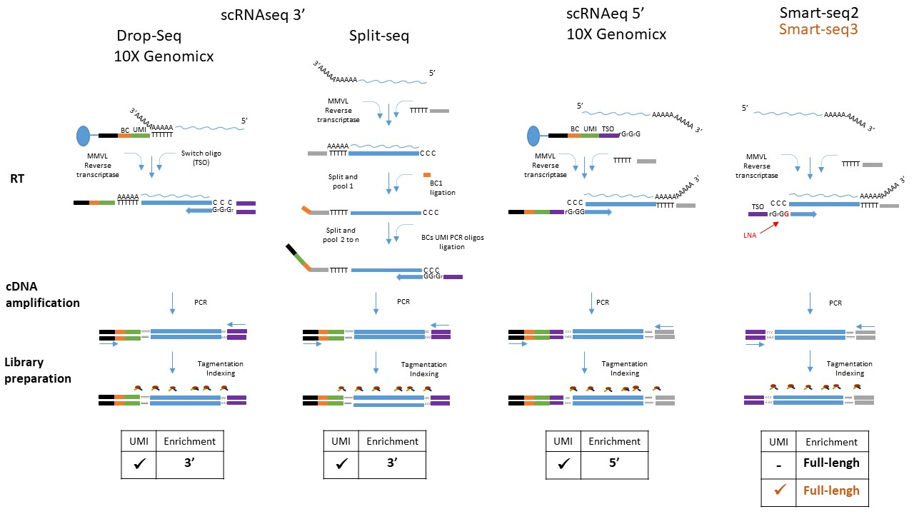
```

.footnote-right[ Imagen tomada de:
[France Genomique](https://www.france-genomique.org/technological-expertises/single-cell/scrnaseq/?lang=en)]

---

## Sistema de microfluidos de [10x Genomics](https://www.10xgenomics.com/products/universal-three-prime-gene-expression)

```{r, echo=FALSE, out.width='90%', fig.align='center'}
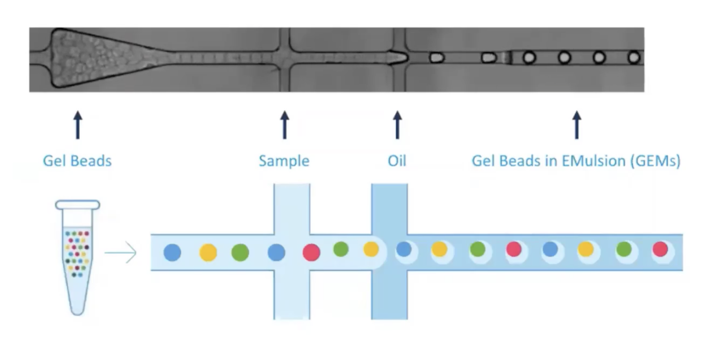
```

.footnote-right[
Imagen tomada de: [Single-cell RNA sequencing ~ Session 1](https://rockefelleruniversity.github.io/scRNA-seq/presentations/slides/Session1.html#11)
]

---

## Barcoding en la secuenciación con [10x Genomics 3’](https://www.10xgenomics.com/products/universal-three-prime-gene-expression)

.pull-left[
- **Cell barcodes (CB):** cada célula recibe un identificador único, lo que permite distinguir de qué célula proviene cada transcrito.
- **UMIs (Unique Molecular Identifiers):** cada molécula de ARN dentro de la célula recibe un identificador adicional para evitar contar duplicados generados por la PCR.
- **Captura en el 3’ end:** se utilizan oligonucleótidos con **poli-T** que hibridan con la cola poli-A del mRNA.

.content-box-blue[ Cada secuencia de mRNA tendrá un UMI distinto, por lo que un UMI = un mRNA
]

```{r, echo=FALSE, out.width='30%', fig.align='center'}

```
]

.pull-right[

```{r, echo=FALSE, out.width='100%', fig.align='center'}
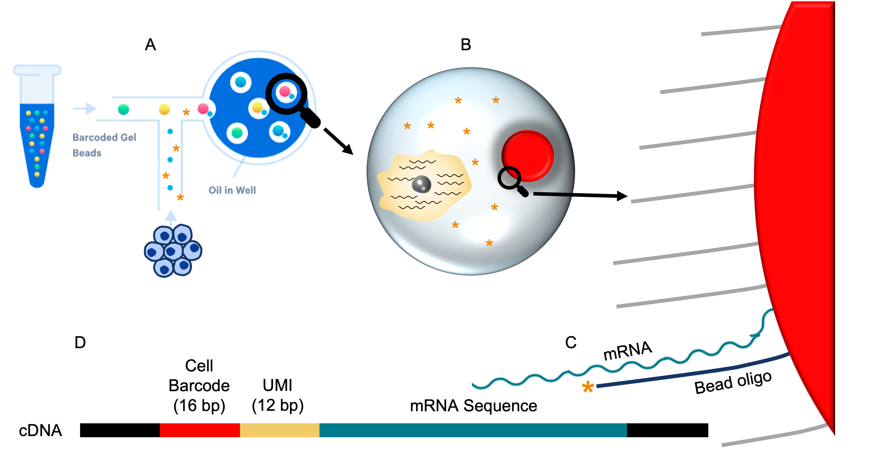
```
```{r, echo=FALSE, out.width='80%', fig.align='center'}
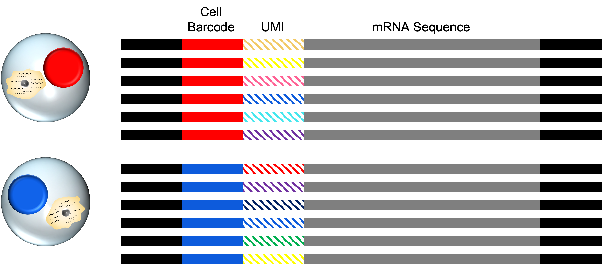
```

]

.footnote-right[Imagen tomada de:
[Intro to scRNA-seq](https://umich-brcf-bioinf.github.io/workshop-intro-single-cell/release/html/00A-OrientingOnScRNASeq.html)]

---

## Secuenciación En 10x Genomics

- Generalmente se usa *paired-end*.
  + **Read 1:** contiene CB + UMI.
  + **Read 2:** contiene la secuencia del transcrito.
- Lista de los barcodes válidos: [Whitelist file](https://www.singlecellcourse.org/processing-raw-scrna-seq-sequencing-data-from-reads-to-a-count-matrix.html#chromium-versions-and-cell-barcode-whitelists)

```{r, echo=FALSE, out.width='80%', fig.align='center'}
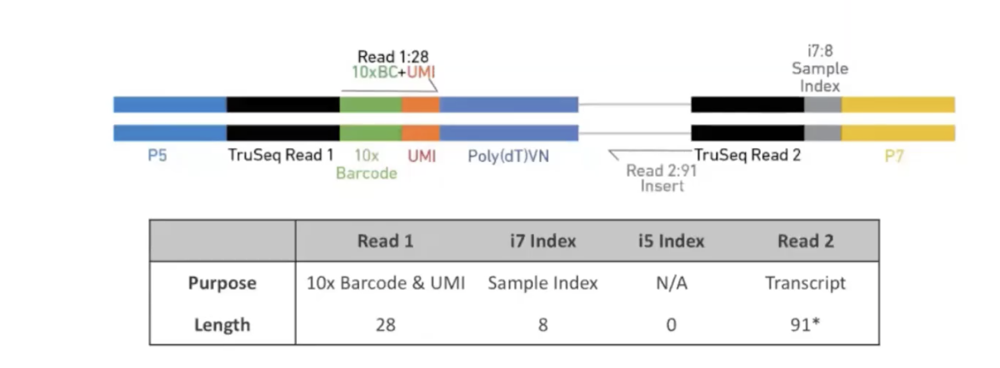
```

.footnote-right[
[Intro to scRNA-seq](https://umich-brcf-bioinf.github.io/workshop-intro-single-cell/release/html/00A-OrientingOnScRNASeq.html); [Processing Raw scRNA-Seq Sequencing Data: From Reads to a Count Matrix](https://www.singlecellcourse.org/processing-raw-scrna-seq-sequencing-data-from-reads-to-a-count-matrix.html); Imagen tomada de: [Single-cell RNA sequencing ~ Session 1](https://rockefelleruniversity.github.io/scRNA-seq/presentations/slides/Session1.html#11)
]

---
class: inverse, center, middle

`r fontawesome::fa("dna", height = "3em")`
# Bases de datos de scRNA-seq

---

| Base de datos | Organismo/Tema principal | Características clave | Limitaciones |
|-------------------|------------------------------|---------------------------|------------------|
| [**Human Cell Atlas (HCA)**](https://data.humancellatlas.org/) | Humano | Proyecto global para mapear todos los tipos celulares humanos. Datos abiertos, estandarizados, con metadatos ricos. | En construcción; cobertura desigual entre tejidos. |
| [**scRNASeqDB (UTHealth)**](https://bioinfo.uth.edu/scrnaseqdb/) | Humano | 36 datasets de GEO, 8,910 células, 174 grupos celulares. Incluye visualizaciones (heatmaps, boxplots), correlaciones y anotaciones GO. | Limitado en tamaño comparado con HCA; centrado en humanos. |
| [**Broad Institute Single Cell Portal**](https://singlecell.broadinstitute.org/single_cell) | Humano y modelos | Portal interactivo con datasets de múltiples proyectos, herramientas de exploración y descarga. | Requiere familiaridad con su ecosistema; algunos datos restringidos. |
| [**CellxGene (Chan Zuckerberg Initiative)**](https://cellxgene.cziscience.com/) | Humano y ratón | Plataforma interactiva para explorar datasets masivos, con filtros y visualizaciones. | Necesita conexión estable; algunos datasets aún no integrados. |
| [**Single Cell Expression Atlas (EMBL-EBI)**](https://www.ebi.ac.uk/gxa/sc/experiments) | Multiespecies | Datos integrados de múltiples estudios, con herramientas de búsqueda por gen, condición o tejido. | Curación depende de estándares de cada estudio. |

---

## Datasets en Bioconductor

| **Paquete**            | **Contenido/Datasets**                                                                 | **Características clave**                                   | **Notas** |
|-------------------------|----------------------------------------------------------------------------------------|-------------------------------------------------------------|-----------|
| [**TENxPBMCData**](https://www.bioconductor.org/packages/release/data/experiment/html/TENxPBMCData.html)        | 9 datasets de PBMC (pbmc68k, pbmc33k, pbmc3k, pbmc6k, pbmc4k, pbmc8k, pbmc5k-CITEseq). | Usa HDF5Array para manejar datos grandes sin cargarlos en RAM. | Ideal para enseñanza y benchmarking en humanos. |
| [**TENxBrainData**](https://www.bioconductor.org/packages/release/data/experiment/html/TENxBrainData.html)       | Datos de cerebro humano y ratón generados con 10x Genomics.                            | Formato *SingleCellExperiment* estandarizado.               | Útil para estudios neurobiológicos. |
| [**TENxGenomicsData**](https://www.bioconductor.org/packages//release/data/experiment/manuals/TENxPBMCData/man/TENxPBMCData.pdf)    | Colección de paquetes en Bioconductor con datasets de distintos tejidos.               | Interoperable con *SingleCellExperiment*.                   | Recurso general para exploración. |
| [**scRNAseq**](https://www.bioconductor.org/packages/release/data/experiment/html/scRNAseq.html)            | Colección amplia de datasets de scRNA-seq de múltiples fuentes, incluyendo 10x.        | Compatible con *SingleCellExperiment*.                      | No limitado a 10x, incluye otras tecnologías. |
| [**HCAData**](https://www.bioconductor.org/packages/release/data/experiment/html/HCAData.html)             | Datasets del Human Cell Atlas (HCA) integrados en Bioconductor.                        | Acceso directo a datos curados del HCA en formato estándar. | Excelente para estudios de atlas celular humano. |

---

class: inverse, center, middle

`r fontawesome::fa("bug", height = "3em")`
# Problemas y desafíos comunes

---

## Diseño de la corrida de secuenciación

**Propósito:** Evitar introducir sesgos técnicos que afecten el procesamiento de los datos.

- En plataformas como *10x Genomics*, las células se encapsulan en microgotas con oligos que incluyen barcodes únicos.
  + Para una sola gota (droplet), todos los códigos de barras de las células coincidirán. Los códigos de barras de las células serán distintos en todas las gotas.
- Esto permite **mezclar múltiples células en una misma corrida** sin perder la identidad de cada una.
- Para comparar condiciones, se puede usar **hashing o multiplexing de muestras** (ej. CITE-seq, MULTI-seq), donde cada muestra recibe un código adicional.
- Minimizar *batch effect* incluyendo condiciones en la misma corrida.
- **Corrección computacional** posterior si hay múltiples lotes.

.footnote-right[
[Intro to scRNA-seq](https://umich-brcf-bioinf.github.io/workshop-intro-single-cell/release/html/00A-OrientingOnScRNASeq.html); [Processing Raw scRNA-Seq Sequencing Data: From Reads to a Count Matrix](https://www.singlecellcourse.org/processing-raw-scrna-seq-sequencing-data-from-reads-to-a-count-matrix.html)
]

---

## *Batch effect*

.pull-left[

- Aunque cada célula tiene su barcode, sigue existiendo el riesgo de sesgos entre corridas o lotes de preparación.
- Lo ideal es procesar todas las muestras en la misma corrida de secuenciación.
- Si no es posible, se recomienda balancear condiciones en cada lote y aplicar **correcciones computacionales** (ej. `Seurat, Harmony, Liger`).
]

.pull-right[

```{r, echo=FALSE, out.width='100%', fig.align='center'}
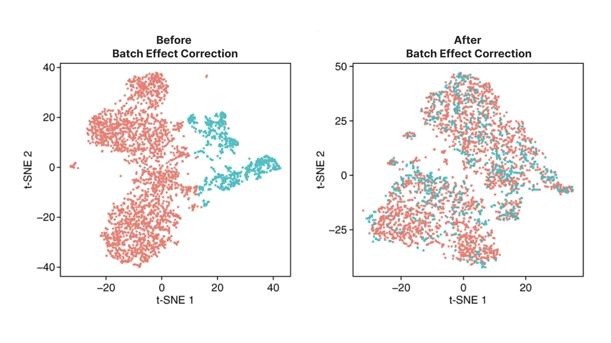
```
]

.footnote-right[Imagen tomada de:
[Batch Effect in Single-cell RNA-seq](https://www.elucidata.io/blog/batch-effect-in-single-cell-rna-seq-frequently-asked-questions-and-answers)]

---

class: inverse, center, middle

`r fontawesome::fa("code", height = "3em")`
# Consideraciones en el análisis bioinformático

---

## Pipeline general

.left-col[
1. Preprocesamiento
2. Control de Calidad (QC)
3. Normalización
4. Imputación (opcional)
5. Selección de atributos (feature selection)
6. Reducción de dimensiones
7. Clustering y anotación de células
8. Integración de conjuntos de datos
9. Análisis downstream (dependiendo del objetivo)
]

.center-col[

```{r, echo=FALSE, out.width='60%', fig.align='center'}
knitr::include_graphics("figures/scRNAseq_workflow_v2_p1.png")
```
]

.right-col[
```{r, echo=FALSE, out.width='60%', fig.align='center'}
knitr::include_graphics("figures/scRNAseq_workflow_v2_p2.png")
```
]

.footnote[Imagen tomada de:
[Best practices for single-cell analysis across modalities](https://www.nature.com/articles/s41576-023-00586-w)]

---

## Paso 1. Preprocesamiento

- A. **Alineamiento y conteo**: `Cell Ranger (count), STARsolo, Subread cellCounts`.
- B. **Pseudoalineamiento y conteo **: `Salmon - Alevin, kallisto - Bustools`, 

.pull-left[
### En 10x Genomics:

- Herramienta estándar: `Cell Ranger` (10x Genomics).
- Alineador usado: `STAR` (splicing-aware).
- Clasificación de lecturas según anotación GTF:
  + ***Exónicas:*** ≥50% de la lectura intersecta un exón.
  + ***Intrónicas:*** no exónicas, pero intersectan un intrón.
  + ***Intergénicas:*** no intersectan exones ni intrones.
  + Sentido/antisentido.
]

.pull-right[

.content-box-yellow[
- Si una lectura se alinea a un locus exónico y también a loci no exónicos, se prioriza el exónico.
- Se asigna máxima calidad de mapeo al locus exónico.
]

```{r, echo=FALSE, out.width='100%', fig.align='center'}
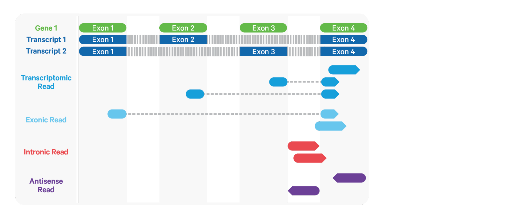
```
]

.footnote-right[
[Processing Raw scRNA-Seq Sequencing Data: From Reads to a Count Matrix](https://www.singlecellcourse.org/processing-raw-scrna-seq-sequencing-data-from-reads-to-a-count-matrix.html); [Yu *et al.* 2022. Methods Mol Biol](https://pmc.ncbi.nlm.nih.gov/articles/PMC7771369/); [Single-cell RNA sequencing ~ Session 1](https://rockefelleruniversity.github.io/scRNA-seq/presentations/slides/Session1.html#11)
]

---

## 📌 ¿Qué es `Cell Ranger`?

.pull-left[
- Software de 10x Genomics para análisis de datos de single-cell RNA-seq y otras aplicaciones.
- Procesa datos crudos provenientes de secuenciadores (FASTQ/BCL) y genera matrices de expresión.
- Incluye múltiples pipelines especializados según el tipo de experimento.

⚙️ Requisitos técnicos
- **Alto consumo de memoria y CPU:** recomendado instalar en servidores o clusters.
- Compatible con Linux (Ubuntu/CentOS).
- Se integra con **Loupe Browser**, herramienta gráfica para explorar resultados.
]

.pull-right[
.content-box-blue[ 
- `cellranger count` → genera matrices de expresión a partir de FASTQ.
- `cellranger vdj` → analiza receptores inmunes (TCR/BCR).
- `cellranger aggr` → combina múltiples muestras y realiza corrección de lotes.
- `cellranger reanalyze` → permite aplicar nuevos parámetros a resultados previos.
- `cellranger multi` → soporta multiplexing de muestras.
]
]

.footnote-right[
[Single-cell RNA sequencing ~ Session 1](https://rockefelleruniversity.github.io/scRNA-seq/presentations/slides/Session1.html#23); [Cell Ranger](https://www.10xgenomics.com/support/software/cell-ranger/9.0?utm_source=copilot.com)
]

---

## Referencias empleadas en `Cell Ranger` (10x Genomics)

- `Cell Ranger` prepara referencias usando el *genoma primario* y filtrando la *anotación GTF* para quedarse solo con genes relevantes
- Filtrado de **biotipos:**
  + Retiene: Protein coding (codificantes de proteínas), Long noncoding RNA (lncRNA), Antisense RNA, Genes de BCR/TCR (V/D/J), 
  + Elimina: Pseudogenes y Small noncoding RNAs (snRNA, miRNA, etc.).

.content-box-blue[
Ejemplo: 2020-A human (GRCh38/GENCODE v32):
- Anotación original: 60,668 genes.
- Después del filtrado: 36,601 genes.
- Esto significa que Cell Ranger descartó pseudogenes y RNAs pequeños, quedándose solo con los biotipos relevantes para scRNA-seq.
]

.footnote-right[
[Processing Raw scRNA-Seq Sequencing Data: From Reads to a Count Matrix](https://www.singlecellcourse.org/processing-raw-scrna-seq-sequencing-data-from-reads-to-a-count-matrix.html)
]

---

Interpretación de las columnas:

- **Genes before filtering:** número total de genes en la anotación original.
- **Genes after filtering:** genes retenidos tras aplicar los filtros de Cell Ranger (se eliminan pseudogenes y RNAs pequeños, se conservan protein coding, lncRNA, antisense y BCR/TCR).
- El número final de filas en la matriz de expresión dependerá de esta columna. 

| Cell Ranger Reference | Species | Assembly/Annotation     | Genes before filtering | Genes after filtering |
|-----------------------|---------|-------------------------|------------------------|-----------------------|
| 2020-A                | human   | GRCh38 / GENCODE v32    | 60,668                 | 36,601                |
| 2020-A                | mouse   | mm10 / GENCODE vM23     | 55,421                 | 32,285                |
| 3.0.0                 | human   | GRCh38 / Ensembl 93     | 58,395                 | 33,538                |
| 3.0.0                 | human   | hg19 / Ensembl 87       | 57,905                 | 32,738                |
| 3.0.0                 | mouse   | mm10 / Ensembl 93       | 54,232                 | 31,053                |
| 2.1.0                 | mouse   | mm10 / Ensembl 84       | 47,729                 | 28,692                |
| 1.2.0                 | human   | GRCh38 / Ensembl 84     | 60,675                 | 33,694                |
| 1.2.0                 | human   | hg19 / Ensembl 82       | 57,905                 | 32,738                |
| 1.2.0                 | mouse   | mm10 / Ensembl 84       | 47,729                 | 27,998                |


.footnote-right[
[Processing Raw scRNA-Seq Sequencing Data: From Reads to a Count Matrix](https://www.singlecellcourse.org/processing-raw-scrna-seq-sequencing-data-from-reads-to-a-count-matrix.html)
]

---

class: inverse, center, middle

`r fontawesome::fa("code", height = "3em")`
# Cell Ranger - Output files

---

## Cell Ranger: Outputs

.pull-left[
Después de correr el comando `cellranger count`, se crea una carpeta con el nombre que diste en el flag `--id`. Dentro de esa carpeta está el subdirectorio `outs/`, que es donde se guardan todos los resultados.

- **filtered_feature_bc_matrix/** → matriz de expresión filtrada (solo células válidas).
- **raw_feature_bc_matrix/** → matriz sin filtrar (incluye barcodes de fondo).
- **web_summary.html** → reporte interactivo con métricas de calidad.
- **metrics_summary.csv** → tabla con estadísticas clave (lecturas por célula, saturación de UMIs, etc.).
- **cloupe.cloupe** → archivo para abrir en Loupe Browser y explorar clusters.
]

.pull-right[
```{r, echo=FALSE, out.width='100%', fig.align='center'}
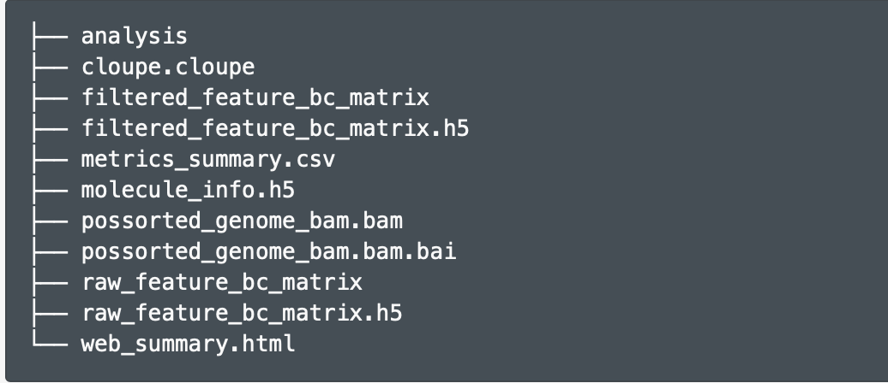
```
]

.footnote-right[Imagen tomada de: [Single-cell RNA sequencing ~ Session 1](https://rockefelleruniversity.github.io/scRNA-seq/presentations/slides/Session1.html#34)
]

---

.pull-left[

## Conteo de Droplets (gotas)

- El resultado de estas herramientas es una matriz de señal atribuida a **células y genes** (normalmente conteos de lecturas).
- `cellranger count`
- Esta matriz sirve como entrada para el procesamiento posterior.
- 💾 La matriz de salida suele almacenarse en formatos comprimidos como:
  + **MEX (Market Exchange Format)**
  + **HDF5 (Hierarchical Data Format)**
]

.pull-right[
```{r, echo=FALSE, out.width='100%', fig.align='center'}
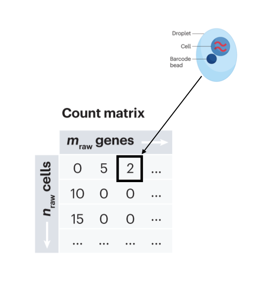
```
]

.footnote-right[
[Single-cell RNA sequencing ~ Session 1](https://rockefelleruniversity.github.io/scRNA-seq/presentations/slides/Session1.html#11)
]
---

## Formato **MEX (Market Exchange Format)**

.pull-left[
- Es una manera estándar y ligera de almacenar **matrices de expresión génica** (UMIs o lecturas) asociadas a genes/transcritos y barcodes de células.
- [Cell Ranger Feature Barcode Matrices (MEX Format)](https://www.10xgenomics.com/support/software/cell-ranger/latest/analysis/outputs/cr-outputs-mex-matrices)
- Formato de texto plano/comprimido
- Empleado en `Cell Ranger` de 10x Genomics.
- Separación clara: 
  + **filas** = genes/transcritos (features)
  + **columnas** = células/barcodes
]

.pull-right[
.content-box-blue[
- Estructura de archivos:
  + `matrix.mtx` → archivo en formato Matrix Market que contiene la matriz dispersa de conteos.
  + `barcodes.tsv` → lista de barcodes (identificadores de células).
  + `features.tsv` (o genes.tsv) → lista de genes o transcritos.
]  
  
```{r, echo=FALSE, out.width='60%', fig.align='center'}
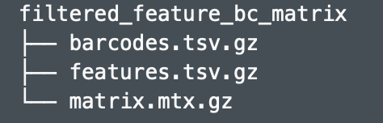
```
]

.footnote-right[
[Single-cell RNA sequencing ~ Session 1](https://rockefelleruniversity.github.io/scRNA-seq/presentations/slides/Session1.html#11)
]

---

## `features.tsv.gz`

.pull-left[
- **ID del feature** → normalmente el identificador del gen (por ejemplo, ENSG00000141510).
- **Nombre del feature (gene_id del GTF)** → el símbolo del gen o el nombre de la molécula (por ejemplo, TP53, BRCA1).
- **Tipo de feature** → aquí es donde se especifica si el feature corresponde a:
 + Gene Expression
 + Antibody Capture
 + CRISPR Guide Capture
 + Multiplexing Capture
 + CUSTOM

]

.pull-right[

```{bash, eval=FALSE}
gzip -cd filtered_feature_bc_matrix/features.tsv.gz

ENSG00000141510       TP53         Gene Expression
ENSG00000012048       BRCA1        Gene Expression
ENSG00000139687       RB1          Gene Expression
CD3_GCCTGACTAGATCCA   CD3          Antibody Capture
CD19_CGTGCAACACTCGTA  CD19         Antibody Capture
```
]

.footnote-right[
[Cell Ranger Feature Barcode Matrices (MEX Format)](https://www.10xgenomics.com/support/software/cell-ranger/latest/analysis/outputs/cr-outputs-mex-matrices)
]
---

## Formato **HDF5 (Hierarchical Data Format)**/Loom

.pull-left[
- ⚡ Formato optimizado para *big data* → diseñado para manejar datasets muy grandes de manera eficiente.
- 📊 Contiene la información de la matriz junto con datos de **filas y columnas (barcodes de células y features de genes/transcritos).**
- *🔄 Versión Loom* → una variante popular del HDF5 en transcriptómica de célula única.
- 💻 Eficiente programáticamente → permite acceso rápido y flexible desde lenguajes como Python o R mediante librerías especializadas.
- 📦 Almacenamiento **binario jerárquico** → más compacto que texto plano y con mejor rendimiento en lectura/escritura.
- [Cell Ranger Molecule Info (HDF5 File)](https://www.10xgenomics.com/support/software/cell-ranger/latest/analysis/outputs/cr-outputs-molecule-info)
]

.pull-right[
  
```{r, echo=FALSE, out.width='100%', fig.align='center'}
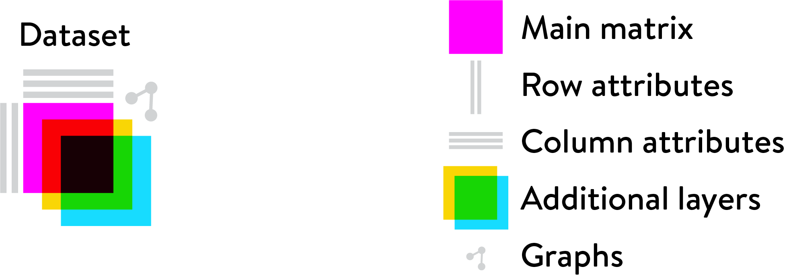
```
]

.footnote-right[
[Single-cell RNA sequencing ~ Session 1](https://rockefelleruniversity.github.io/scRNA-seq/presentations/slides/Session1.html#11)
]

---

class: inverse, center, middle

`r fontawesome::fa("code", height = "3em")`
# Control de Calidad

---

## Paso 2. Control de Calidad (QC)

- **Número de genes detectados por célula**
   + Filtrar células con muy pocos genes (posibles células muertas o vacías).
   + También descartar células con un número excesivo de genes (posibles dobles o multipletes).
- **Número total de lecturas/UMIs por célula**
   + Células con muy pocas lecturas suelen ser ruido.
   + Células con demasiadas lecturas pueden ser dobles encapsulados.
- **Porcentaje de genes mitocondriales**
   + Un alto porcentaje indica células dañadas o en apoptosis.
   + Se suele aplicar un umbral (ej. >10–20%).
- **Porcentaje de genes ribosomales**
   + Un exceso puede indicar sesgo técnico o células con actividad transcripcional anómala.
- **Detección de multipletes/dobletes**
   + Herramientas como `DoubletFinder o Scrublet` ayudan a identificar células que en realidad son mezclas de dos.
- **Distribución de células por muestra/lote**
   + Verificar que no haya sesgos de batch antes de la integración.

---

## Detección de douplets y multiplets

- ¿Cuántas gotas (droplets) traen más de una célula? (douplets 🍪🍪 o multiplets 🍪🍪🍪).
- ¿Cuántas células murieron durante el proceso de secuenciacion?

.content-box-blue[
- **A.** Cada gota debe contener **una sola perla y una sola célula sana**. 
- **B.** Gota con **una perla**, pero **sin una célula**.
- **C.** **Dos microesferas** en la misma gota con **una célula**.
- **D.** A veces, **dos células** se unen mediante **una sola perla en una gota**, creando un *doblete (douplet)*.
- **E.** Apoptosis
- **F.** Descomposición de las células en la suspensión. El mRNA de las células reventadas se combinan en el flujo acuoso para crear una mezcla de RNA ambiental
]

```{r, echo=FALSE, out.width='40%', fig.align='center'}
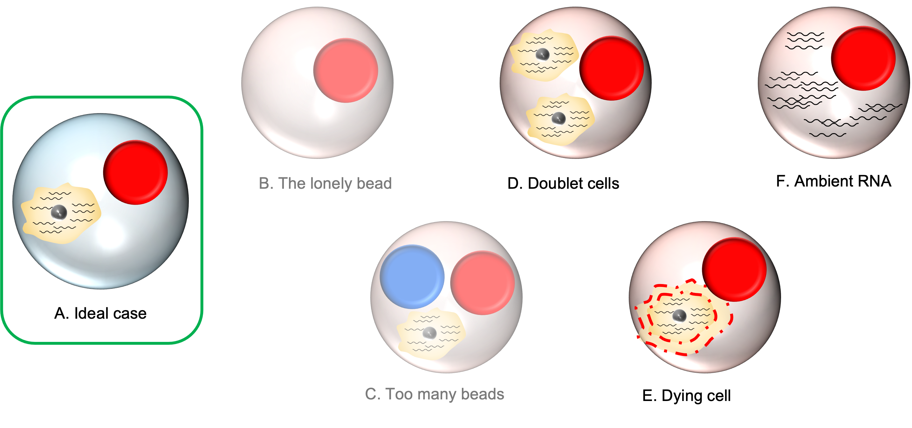
```

.footnote-right[Imagen tomada de: [Intro to scRNA-seq](https://umich-brcf-bioinf.github.io/workshop-intro-single-cell/release/html/00A-OrientingOnScRNASeq.html)
]

---

## Ejemplo: Reporte de Cell Ranger 

.pull-left[
### Calidad de mapeo y secuenciación
El *dataset pbmc4k* proviene de **células mononucleares de sangre periférica (PBMCs) humanas**, con un total de **4,340 células con buena calidad.** Para más información consulta la página web en [10X Genomics](https://cf.10xgenomics.com/samples/cell-exp/2.0.1/pbmc4k/pbmc4k_web_summary.html).


- **Mediana de 1,235 genes por célula**
- **Saturación de secuenciación muy alta (90.5%):** Esto indica que la librería está bien representada y que el análisis downstream puede hacerse con confianza
- Cell Ranger v2.0.1
]

.pull-right[

```{r, echo=FALSE, out.width='100%', fig.align='center'}
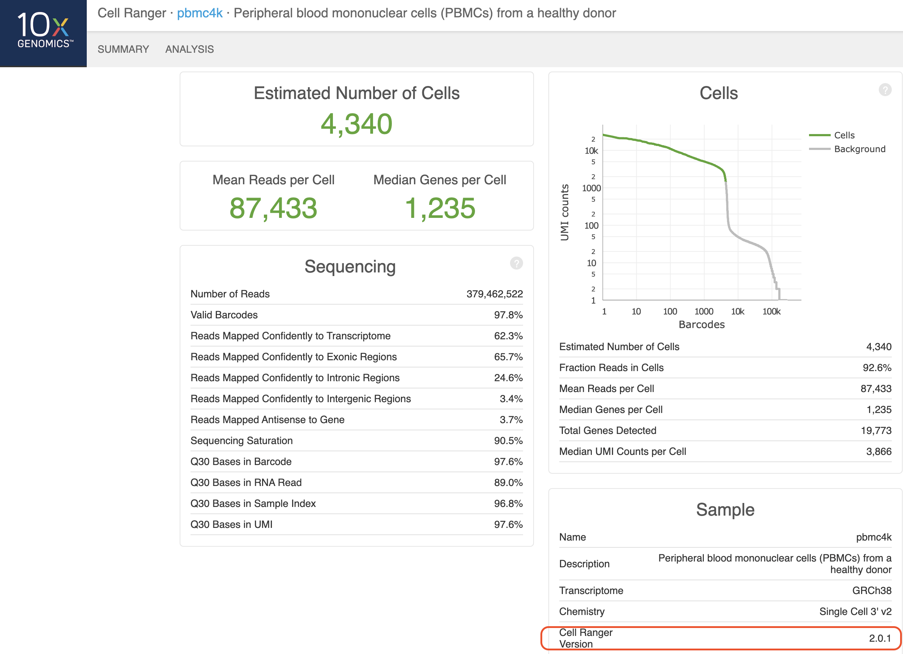
```
]

.footnote-right[Imagen tomada de: [dataset pbmc4k de 10X Genomics](https://cf.10xgenomics.com/samples/cell-exp/2.0.1/pbmc4k/pbmc4k_web_summary.html)
]

---

## Sample panel

.pull-left[
En el panel de información de la muestra dentro del reporte de cellranger count (por ejemplo en el archivo web_summary.html), lo primero que se revisa son los metadatos básicos del análisis. Estos incluyen:

- *🆔 Sample ID* → el nombre de la muestra asignado mediante el flag --id al correr cellranger count.
- *Chemistry* → la química de 10x Genomics utilizada (ej. Single Cell 3’, Single Cell 5’, Multiome, etc.).
- *📚 Reference Path y Transcriptome* → ruta y referencia genómica/transcriptómica empleada para mapear las lecturas.
- *🔢 Pipeline Version* → versión de Cell Ranger usada para el análisis, importante para reproducibilidad y compatibilidad.
]


.pull-right[

```{r, echo=FALSE, out.width='100%', fig.align='center'}
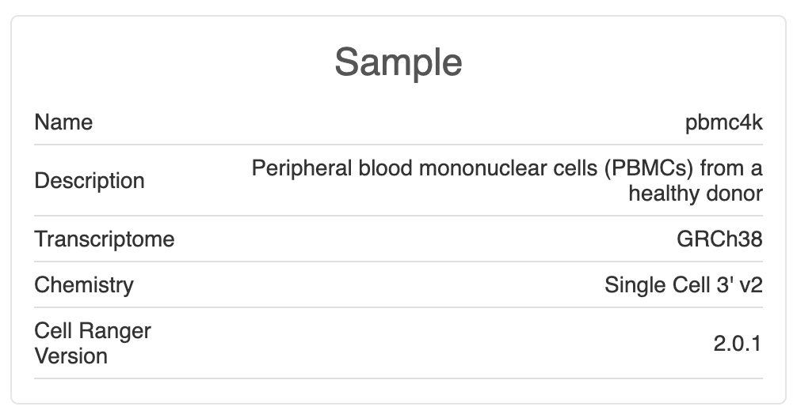
```
]

.footnote-right[Imagen tomada de: [Single-cell RNA sequencing ~ Session 1](https://rockefelleruniversity.github.io/scRNA-seq/presentations/slides/Session1.html#41)
]


---

## Sequencing panel

.pull-left[
- *📚 Number of reads* → número total de lecturas pareadas en la librería.
- *🧩 Valid barcodes* → cantidad de barcodes que coinciden con la lista blanca conocida del kit (aprox. 1 millón posibles).
- *🔢 Valid UMIs* → número de UMIs válidos (no compuestos por una sola base repetida y sin bases desconocidas).
- *📈 Sequencing saturation* → proporción de UMIs únicos válidos frente al total de UMIs válidos; mide qué tan exhaustivo fue el muestreo.
- *🎯 Q30 scores* → evaluación de la calidad de secuenciación para cada tipo de lectura: barcodes, UMIs, índices y lecturas de RNA.
]

.pull-right[

```{r, echo=FALSE, out.width='80%', fig.align='center'}
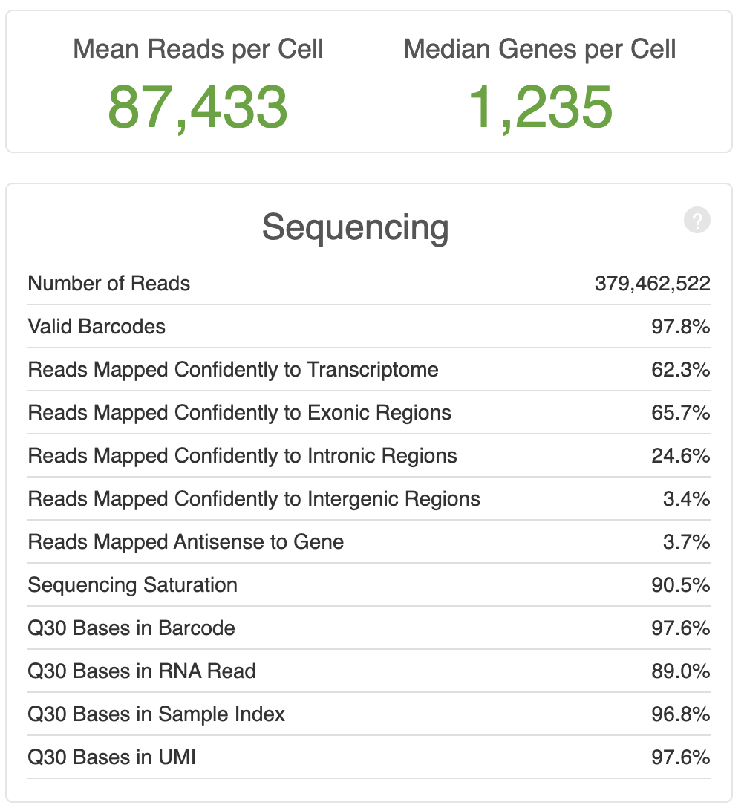
```
]

.footnote-right[Imagen tomada de: [Single-cell RNA sequencing ~ Session 1](https://rockefelleruniversity.github.io/scRNA-seq/presentations/slides/Session1.html#42)
]

---

## Sequencing panel

En el panel de métricas clave de Cell Ranger, se destacan dos indicadores muy importantes para evaluar la calidad de la secuenciación y la complejidad de la librería:

- 🎯 **Q30 Bases en lecturas de RNA**
  + Umbral mínimo: > 65% (lo esperado es > 80%).
  + Refleja la **calidad de la secuenciación.**
  + Si el valor es bajo, conviene revisar con el proveedor de secuenciación para descartar problemas técnicos.
  
- 📈 **Sequencing saturation**
  + Umbral mínimo: > 40% (aunque típicamente se observa entre 20% y 80%).
  + Indica la **complejidad de la librería** y qué tan exhaustivo fue el muestreo de UMIs únicos.
  + Si es demasiado bajo, puede sugerir que la librería no fue suficientemente diversa; en algunos casos se considera reconstruir la librería, aunque no siempre es obligatorio. 

---

## Mapping panel

.pull-left[
- **🧬 Reads mapped to genome** → número total de lecturas que se alinean al genoma de referencia.
- **🎯 Reads mapped confidently to genome** → lecturas que se alinean de manera única y específica al genoma (sin ambigüedad).
- **📑 Reads mapped confidently to exonic/intronic** → lecturas que se alinean de forma única a regiones *exónicas* (codificantes) o *intrónicas* (no codificantes).
- **🔎 Reads mapped confidently to transcriptome** → lecturas que se asignan de manera única a un gen específico y son consistentes con las uniones de exones (splice junctions).
]


.pull-right[

```{r, echo=FALSE, out.width='80%', fig.align='center'}

```
]

.footnote-right[Imagen tomada de: [Single-cell RNA sequencing ~ Session 1](https://rockefelleruniversity.github.io/scRNA-seq/presentations/slides/Session1.html#41)
]

---

## Mapping panel

- **🧬 Mapped to Genome > 60%**
  + Lo usual es un rango de 50% ~ 90%.
  + Refleja la tasa de mapeo de lecturas al genoma de referencia.
  + Si el valor es demasiado bajo, conviene revisar la versión del genoma de referencia usada (puede haber incompatibilidad o falta de anotaciones).

- **🎯 Reads Mapped Confidently to Transcriptome > 30%**
  + Lo esperado es > 60% en la mayoría de los experimentos.
  + Indica qué proporción de lecturas se asignan de manera única a genes, respetando las uniones de exones.
  + Si el valor es bajo, puede reflejar problemas con la anotación del transcriptoma (ej. referencia incompleta o desactualizada).
  
.footnote-right[Imagen tomada de: [Single-cell RNA sequencing ~ Session 1](https://rockefelleruniversity.github.io/scRNA-seq/presentations/slides/Session1.html#45)
]

---

## Cell panel

.pull-left[
- **🧮 Estimated number of cells** → número total de barcodes asociados con al menos una célula (estimación del total de células capturadas).
- **📊 Fraction reads in cells** → fracción de lecturas provenientes de barcodes válidos que están asociadas a una célula y mapeadas al transcriptoma.
- **📈 Median reads per cell** → número mediano de lecturas del transcriptoma por cada célula (barcodes asociados).
- **🧬 Median genes per cell** → número mediano de genes detectados (con al menos un conteo) por célula.
]


.pull-right[

```{r, echo=FALSE, out.width='80%', fig.align='center'}
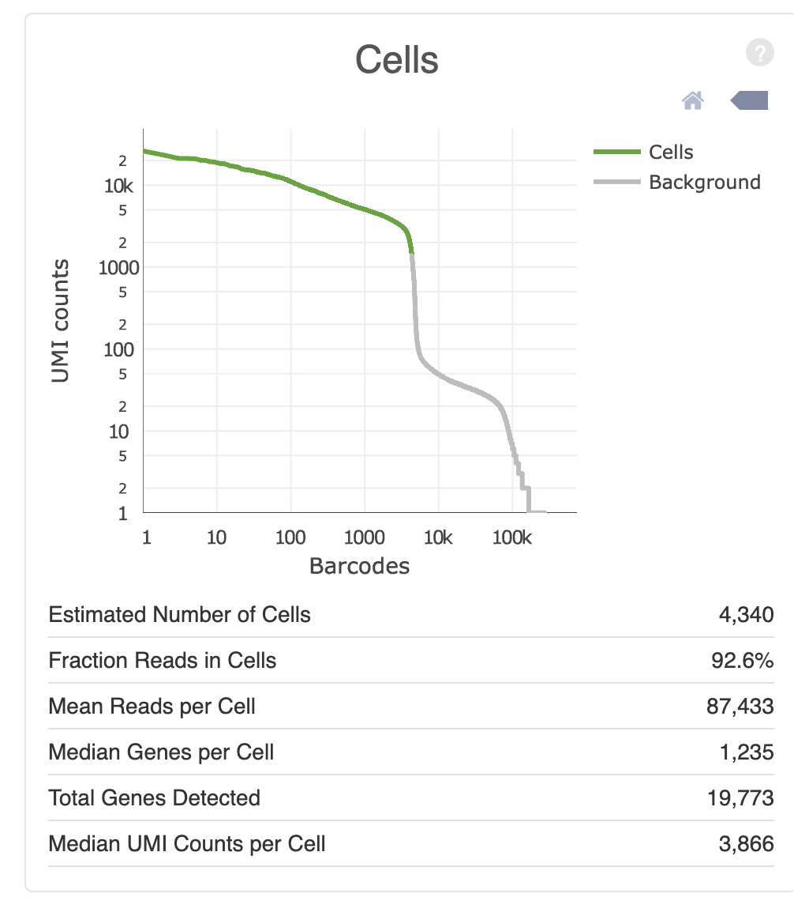
```
]

.footnote-right[Imagen tomada de: [Single-cell RNA sequencing ~ Session 1](https://rockefelleruniversity.github.io/scRNA-seq/presentations/slides/Session1.html#46)
]

---

## Cell panel

- **📊 Fraction Reads in Cells > 70% (usualmente > 85%)**
  + Refleja el nivel de contaminación por **RNA ambiental.**
  + Si es menor a 90%, se recomienda considerar correcciones por RNA ambiental (ej. algoritmos como SoupX).

- **📈 Median reads per cell > 20,000/célula y Estimated number of cells entre 500 ~ 10,000**
  + Valores fuera de este rango pueden indicar problemas en la **identificación de células.**
  + Si los valores no son normales, conviene revisar el knee plot (gráfico de rodilla) y re-evaluar el número de células detectadas.
  
---

## knee plot / Gráfica en forma de "codo" (knee):

.pull-left[
En el Cell Filtering clásico (Cell Ranger 2.2) se genera una curva que muestra:

- **Eje X:** barcodes ordenados por abundancia.
- **Eje Y:** número de UMIs asociados a cada barcode.

.content-box-blue[
Interpretación: 
- Al inicio, los barcodes con muchos UMIs corresponden a células reales.
- Después, la curva cae abruptamente → ese punto de inflexión es el knee point.
- Más allá del knee, los barcodes tienen muy pocos UMIs y suelen ser gotas vacías con RNA ambiente.
]
]

.pull-right[
```{r, echo=FALSE, out.width='90%', fig.align='center'}
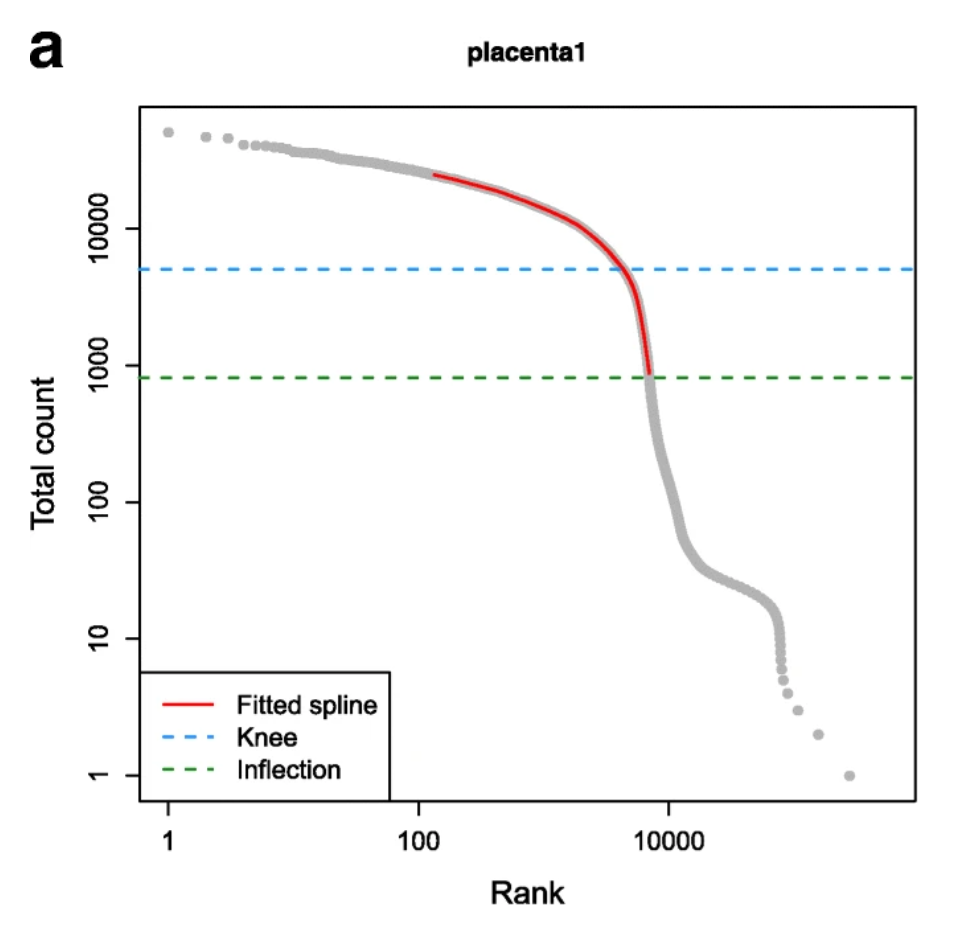
```
]

.footnote-right[Imagen tomada de: [Lun *et al*. 2019. *Genome Biology*](https://comunidadbioinfo.github.io/cdsb2023/control-de-calidad.html#:~:text=Lun%20et%20al%2C%20Genome%20Biology%2C%202019); [Processing Raw scRNA-Seq Sequencing Data: From Reads to a Count Matrix](https://www.singlecellcourse.org/processing-raw-scrna-seq-sequencing-data-from-reads-to-a-count-matrix.html); [Droplet processing](https://bioconductor.org/books/3.12/OSCA/droplet-processing.html)
]

---

## Clustering y expresión diferencial

.pull-left[
El reporte incluye proyecciones t-SNE con agrupamientos automáticos (8 clusters principales).

- Cada cluster tiene genes característicos con log2 fold-change (L2FC) significativo. Ejemplos:
  + **Cluster 1:** *LEF1, TCF7, CD27* (linfocitos T).
  + **Cluster 5:** *CD8A, GZMK, PRF1* (células T citotóxicas).
  + **Cluster 7:** *CD14, LYZ* (monocitos).

Esto confirma que el dataset captura la diversidad esperada en PBMCs (linfocitos, monocitos, etc.).

]

.pull-right[
```{r, echo=FALSE, out.width='100%', fig.align='center'}
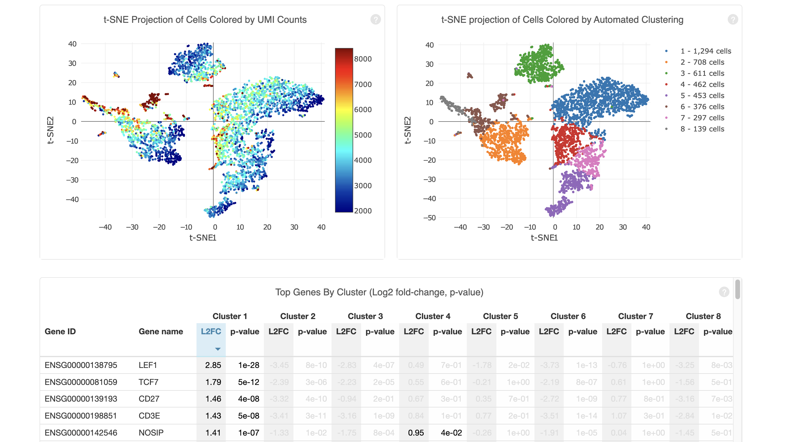
```
]

.footnote-right[Imagen tomada de: [dataset pbmc4k de 10X Genomics](https://cf.10xgenomics.com/samples/cell-exp/2.0.1/pbmc4k/pbmc4k_web_summary.html)
]

---

### ✅ Interpretación general a partir del reporte de Cell Ranger

- **Alta calidad técnica:** buena profundidad, alta saturación, barcodes válidos.
- **Buen número de células:** ~4,300, suficiente para análisis robustos.
- **Diversidad celular clara:** clusters bien definidos con genes marcadores esperados.
- **Conclusión:** el dataset *pbmc4k* es un ejemplo de referencia de datos de scRNA-seq bien generados, ideal para pruebas de análisis y benchmarking.

---

class: inverse, center, middle

`r fontawesome::fa("star", height = "3em")`
# ¿Qué veremos en las siguientes clases?

---

.pull-left[

```{r, echo=FALSE, out.width='100%', fig.align='center'}
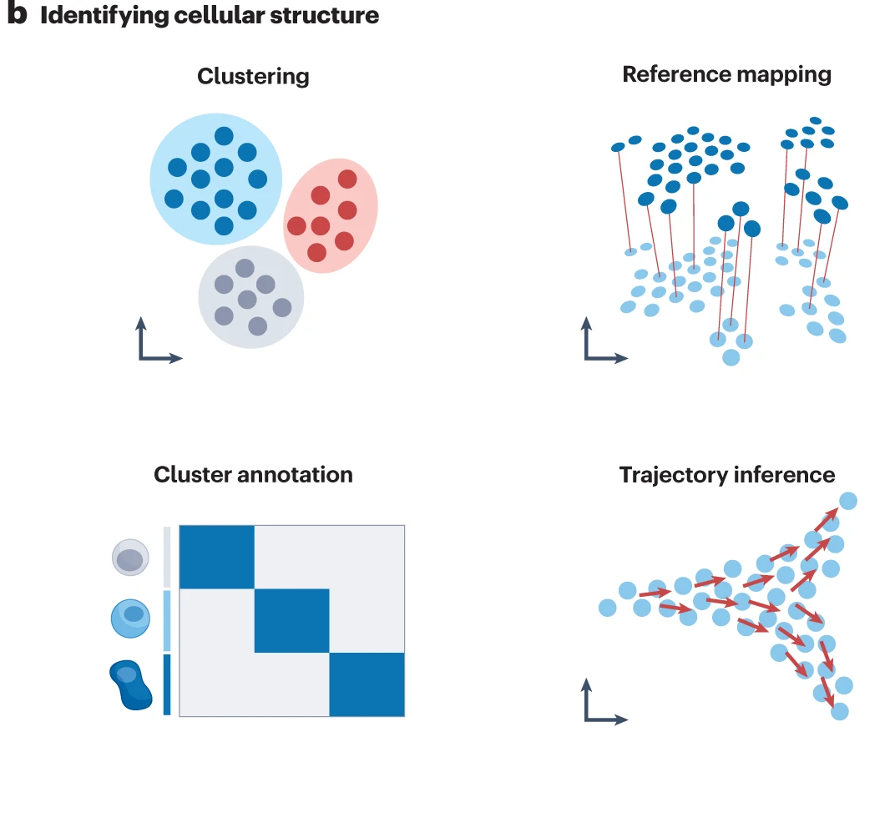
```
]

.pull-right[
```{r, echo=FALSE, out.width='100%', fig.align='center'}
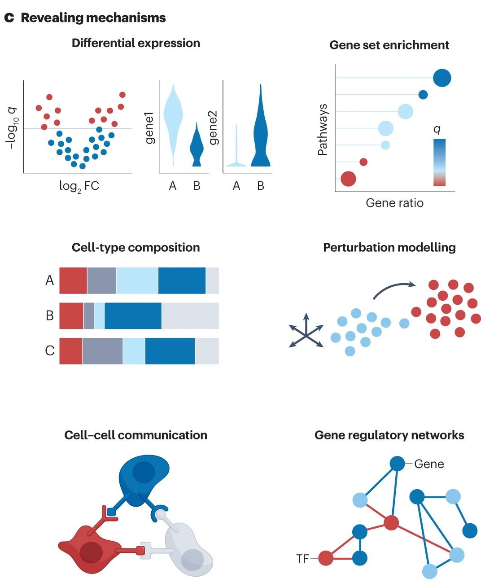
```
]

.footnote[Imagen tomada de:
[Best practices for single-cell analysis across modalities](https://www.nature.com/articles/s41576-023-00586-w)]

---

class: inverse, center, middle

```{r, echo=FALSE, out.width='20%', fig.align='center'}

```

`r fontawesome::fa("face-smile", height = "3em")`
# Ejercicio
## https://ahaslides.com/M7VOS


---

class: center, middle

`r fontawesome::fa("code", height = "3em")`
## Gracias por su atención

Respira y coméntame tus dudas. 

```{r, echo=FALSE, out.width='20%', fig.align='right'}
knitr::include_graphics("figures/cat.png")
```

.left[.footnote[.black[
Imagen tomada de: [Allison Horst](https://allisonhorst.com/) 
]]]