```{r setup, include = FALSE}
# Setup chunk
# Paquetes a usar
#options(htmltools.dir.version = FALSE) cambia la forma de incluir código, los colores

library(knitr)
library(tidyverse)
library(xaringanExtra)
library(icons)
library(fontawesome)
library(emo)
library(countdown) # remotes::install_github("gadenbuie/countdown", subdir = "r"), Explicacion de su uso: https://pkg.garrickadenbuie.com/countdown/#5
library(palmerpenguins)

# set default options
opts_chunk$set(collapse = TRUE,
               dpi = 300,
               warning = FALSE,
               error = FALSE,
               comment = "#")

top_icon = function(x) {
  icons::icon_style(
    icons::fontawesome(x),
    position = "fixed", top = 10, right = 10
  )
}

knit_engines$set("yaml", "markdown")

# Con la tecla "O" permite ver todas las diapositivas
xaringanExtra::use_tile_view()
# Agrega el boton de copiar los códigos de los chunks
xaringanExtra::use_clipboard()

# Crea paneles impresionantes 
xaringanExtra::use_panelset()

# Para compartir e incrustar en otro sitio web
xaringanExtra::use_share_again()
xaringanExtra::style_share_again(
  share_buttons = c("twitter", "linkedin")
)

# Funcionalidades de los chunks, pone un triangulito junto a la línea que se señala
xaringanExtra::use_extra_styles(
  hover_code_line = TRUE,         #<<
  mute_unhighlighted_code = TRUE  #<<
)

# Agregar web cam
xaringanExtra::use_webcam()

# barra de progreso
xaringanExtra::use_progress_bar(color = "#0051BA", location = "top", height = "10px")
```

```{r xaringan-editable, echo=FALSE}
# Para tener opciones para hacer editable algun chunk
xaringanExtra::use_editable(expires = 1)
# Para hacer que aparezca el lápiz y goma
xaringanExtra::use_scribble()
```

```{r xaringan-themer Eve, include=FALSE, warning=FALSE}
# Establecer colores para el tema
library(xaringanthemer)

palette <- c(
 orange        = "#fb5607",
 pink          = "#ff006e",
 blue_violet   = "#8338ec",
 zomp          = "#38A88E",
 shadow        = "#87826E",
 blue          = "#1381B0",
 yellow_orange = "#FF961C"
  )

#style_xaringan(
style_duo_accent(
  background_color = "#FFFFFF", # color del fondo
  link_color = "#562457", # color de los links
  text_bold_color = "#225ea8",
  primary_color = "#01002B", # Color 1
  secondary_color = "#CB6CE6", # Color 2
  inverse_background_color = "#41b6c4", # Color de fondo secundario 
  colors = palette,
  
  # Tipos de letra
  header_font_google = google_font("Barlow Condensed", "600"), #titulo
  text_font_google   = google_font("Work Sans", "300", "300i"), #texto
  code_font_google   = google_font("IBM Plex Mono") #codigo
  #text_font_size = "1.5rem" # Tamano de letra
)

# https://www.rdocumentation.org/packages/xaringanthemer/versions/0.3.4/topics/style_duo_accent
```

class: title-slide, middle, center
background-image: url(figures/Slide1.png) 
background-position: 90% 75%, 75% 75%, center
background-size: 1210px,210px, cover


.center-column[
# `r rmarkdown::metadata$title`
### `r rmarkdown::metadata$subtitle`

#### <span class="author">`r rmarkdown::metadata$author`</span>
#### <span class="date">`r rmarkdown::metadata$date`</span>
]

.left[.footnote[
[R-Ladies Theme](https://www.apreshill.com/project/rladies-xaringan/)]]

---

.pull-left[
## Contenido de la clase:

### Paso 1. Descarga e importación de datos en R
### Paso 2. Estructura del objeto `Seurat`
### Paso 3. Control de calidad con `Seurat`
### Paso 4. Normalización de los datos

]

.pull-right[
```{r, echo=FALSE, out.width='50%', fig.align='center'}
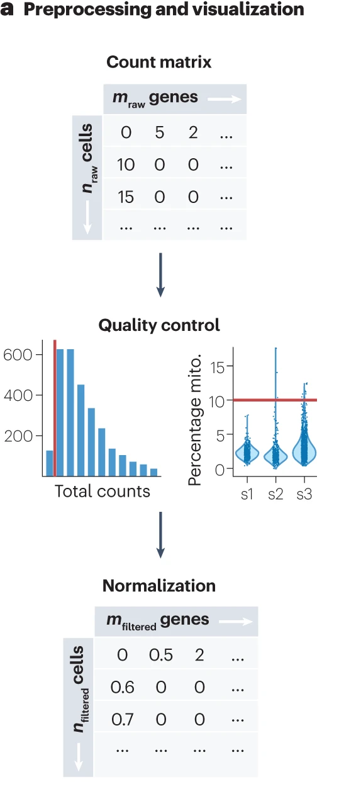
```
]


.footnote[Imagen tomada de:
[Best practices for single-cell analysis across modalities](https://www.nature.com/articles/s41576-023-00586-w)]


---

class: inverse, center, middle

`r fontawesome::fa("laptop-file", height = "3em")`
# Información del dataset y ouput de Cell Ranger

---

# Instalar estos paquetes

```{r, eval=FALSE}
if (!require("pacman")) install.packages("pacman")

# Usar pacman para instalar y cargar los paquetes
pacman::p_load(
  BiocManager,     # para instalar paquetes de Bioconductor
  dplyr,           # para manipulación de datos
  Seurat,          # análisis single-cell
  patchwork        # combinar gráficos
)

# Instalar con Bioconductor
BiocManager::install("BiocFileCache")
```

---

# Dataset: “3k PBMCs from a Healthy Donor” de 10x Genomics

.pull-left[
.content-box-blue[ 
- **Tipo de células:** Células mononucleares humanas de sangre periférica (PBMC, Peripheral Blood Mononuclear Cells) de un donador sano.
- **Número de células detectadas:** ~2,700 (aunque se configuró --cells=3000).
- **Tecnología/Chemistry:** Chromium Single Cell 3’ v1. (14bp I7 GemCode barcode and 10bp read2 (UMI))
- **Secuenciador:** Illumina NextSeq 500.
- **Plataforma:** 10x Genomics
- **Genoma usado para el alineamiento:** hg19 / Ensembl 87
- **Versión de Cell Ranger:** 1.1.0
]

]
.pull-right[
```{r, echo=FALSE, out.width='100%', fig.align='center'}
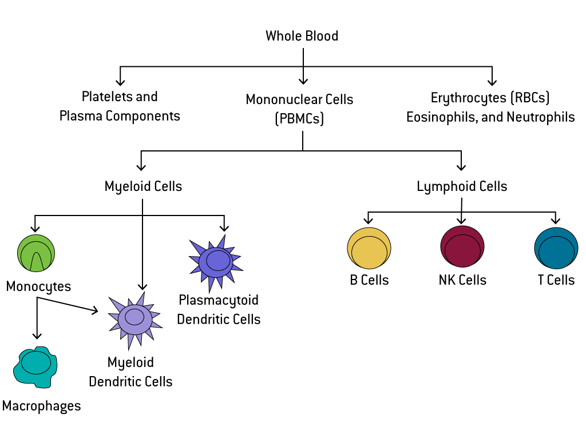
```
]

.footnote-right[
[Reporte pbmc3k](https://www.10xgenomics.com/datasets/3-k-pbm-cs-from-a-healthy-donor-1-standard-1-1-0). Imagen tomada de [PBMCs – The one stop immune cell shop](https://bioscience.lonza.com/lonza_bs/CH/en/pbmcs-the-one-stop-immune-cells-shop?srsltid=AfmBOoqZGeYNG__4DRXJur9-MIuzE215RRoXkdi0RwB-P4JnRH8EGfzA)
]


---

## Matriz de cuentas filtradas

```{r, echo=FALSE, out.width='100%', fig.align='center'}
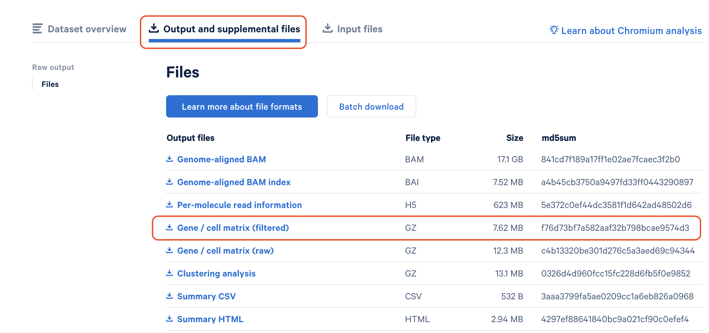
```

.footnote[
[Reporte pbmc3k](https://www.10xgenomics.com/datasets/3-k-pbm-cs-from-a-healthy-donor-1-standard-1-1-0)
]

---

## Pipeline

```{r, echo=FALSE, out.width='60%', fig.align='center'}

```

.footnote[
[Current best-practices in single-cell RNA-seq: a tutorial](https://github.com/theislab/single-cell-tutorial)
]

---

## Cargar paquetes

```{r, message=FALSE, warning=FALSE}
## Cargar paquetes de R
library(BiocFileCache) ## para descargar datos
library(dplyr) ## para filtar datos
library(Seurat) ## paquete principal de este capítulo
library(patchwork) ## para graficar imágenes juntas
library(SeuratData) # paquete de datos de Seurat
```

---

class: inverse, center, middle

`r fontawesome::fa("download", height = "3em")`
# Paso 1. Descarga e importación de datos en R

---

## 3 maneras de cargar el dataset **pbmc3k** 

- A) Descargar y descomprimir en la carpeta de trabajo
- B) Descargar en archivos temporales
- C) Usar el paquete `SeuratData`

---

## A) Descargar y descomprimir en la carpeta de trabajo

Descarga el archivo, colócalo en tu directorio de trabajo (Rproject) y descomprímelo antes de cargarlo en R.

Puedes descargar los datos de [aquí](https://cf.10xgenomics.com/samples/cell/pbmc3k/pbmc3k_filtered_gene_bc_matrices.tar.gz) (7.3MB).

.footnote-right[
[Tutorial Seurat con pbmc3k](https://satijalab.org/seurat/articles/pbmc3k_tutorial.html)
]

---

## B) Descargar en archivos temporales (esta es la que usaremos en clase)

```{r}
# Descagar en archivo temporales
bfc <- BiocFileCache()
raw.path <- bfcrpath(bfc, file.path(
    "http://cf.10xgenomics.com/samples",
    "cell/pbmc3k/pbmc3k_filtered_gene_bc_matrices.tar.gz"
))

# Descomprimir archivo tar.gz
untar(raw.path, exdir = file.path(tempdir(), "pbmc3k"))
# Importar ruta del archivo
fname <- file.path(tempdir(), "pbmc3k/filtered_gene_bc_matrices/hg19")
# Cargar dataset de 10X genomics
pbmc.data <- Read10X(data.dir = fname)
```

.footnote-right[
[Tutorial CDSB2021 con pbmc3k](https://comunidadbioinfo.github.io/cdsb2021_scRNAseq/introducci%C3%B3n-a-seurat.html)
]

---

## Paquete `SeuratData`

Paquete de datasets de demostración, empaquetados como objetos Seurat.

```{r}
AvailableData()
```

```
                     Dataset Version                                                        Summary species            system ncells                                                            tech         notes Installed InstalledVersion
cbmc.SeuratData         cbmc   3.0.0                   scRNAseq and 13-antibody sequencing of CBMCs   human CBMC (cord blood)   8617                                                        CITE-seq          <NA>      TRUE            3.0.0
hcabm40k.SeuratData hcabm40k   3.0.0 40,000 Cells From the Human Cell Atlas ICA Bone Marrow Dataset   human       bone marrow  40000                                                          10x v2          <NA>     FALSE            3.0.0
ifnb.SeuratData         ifnb   3.0.0                              IFNB-Stimulated and Control PBMCs   human              PBMC  13999                                                          10x v1          <NA>      TRUE            3.0.0
panc8.SeuratData       panc8   3.0.0               Eight Pancreas Datasets Across Five Technologies   human Pancreatic Islets  14892                SMARTSeq2, Fluidigm C1, CelSeq, CelSeq2, inDrops          <NA>      TRUE            3.0.0
pbmc3k.SeuratData     pbmc3k   3.0.0                                     3k PBMCs from 10X Genomics   human              PBMC   2700                                                          10x v1          <NA>      TRUE            3.0.0
pbmcsca.SeuratData   pbmcsca   3.0.0           Broad Institute PBMC Systematic Comparative Analysis   human              PBMC  31021 10x v2, 10x v3, SMARTSeq2, Seq-Well, inDrops, Drop-seq, CelSeq2 HCA benchmark     FALSE            3.0.0
```

.footnote-right[
[Tutorial SeuratData con pbmc3k](https://github.com/satijalab/seurat-data)
]

---

## C) Usar el paquete `SeuratData`

```{r, eval=FALSE}
InstallData("pbmc3k")
data("pbmc3k")
pbmc3k
```

```
An object of class Seurat
13714 features across 2700 samples within 1 assay
Active assay: RNA (13714 features)
```

.footnote-right[
[Tutorial SeuratData con pbmc3k](https://github.com/satijalab/seurat-data)
]

---

class: inverse, center, middle

`r fontawesome::fa("database", height = "3em")`
# Paso 2. Estructura del objeto `Seurat`

---

## Función `CreateSeuratObject()` genera el **objeto `Seurat`** a partir de una matriz de conteo  (generalmente de expresión génica)

Tiene 4 parámetros principales:
- **`counts`**: la matriz de conteos de expresión génica (por ejemplo, leída de archivos h5).
- **`project`**: nombre o etiqueta del proyecto, sirve como identificación del objeto `Seurat`.
- **`min.cells`**: número mínimo de células en las que debe aparecer un gen para ser incluido (por defecto 0, pero comúnmente se usa 3 o 10).
- **`min.features`**: número mínimo de genes detectados en cada célula para que esta se conserve (por defecto 0, pero se suele usar 200 o 100 según el caso).
- `names.field`: índice de la columna que contiene los nombres de las células (*opcional*).
- `names.delim`: delimitador usado para separar nombres de células si se quiere extraer metadatos (*opcional*).

```{r}
# Generar objeto Seurat con raw data (non-normalized data).
pbmc <- CreateSeuratObject(counts = pbmc.data, project = "pbmc3k", min.cells = 3, min.features = 200)
```

.footnote-right[
[Tutorial CDSB2021 con pbmc3k](https://comunidadbioinfo.github.io/cdsb2021_scRNAseq/introducci%C3%B3n-a-seurat.html)
]

---

## Estructura del objeto `Seurat`

```{r, echo=FALSE, out.width='70%', fig.align='center'}
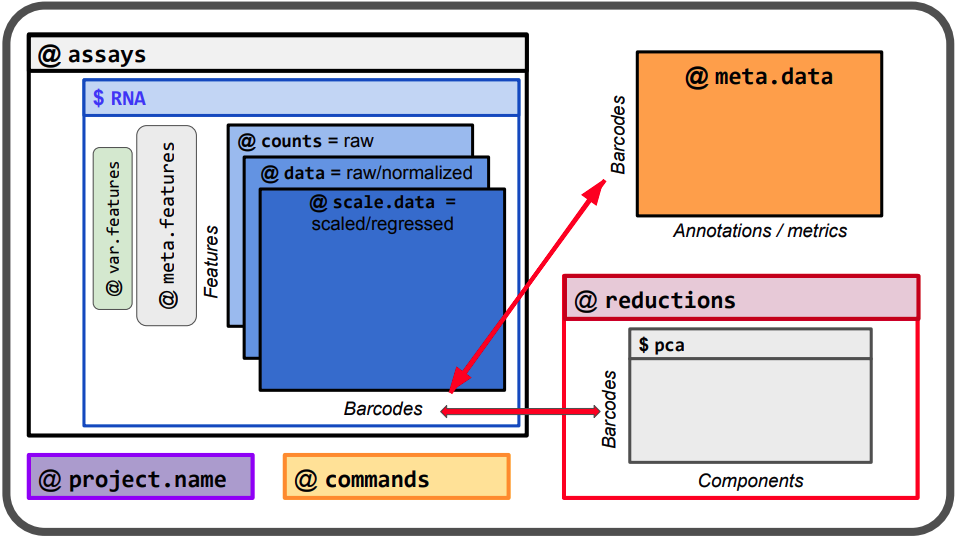
```

.footnote-right[
[The Seurat object for biologists](https://moodle.france-bioinformatique.fr/pluginfile.php/836/mod_resource/content/5/06_The_Seurat_object.pdf)
]

---

## El objeto `Seurat` se parece a una lista

Almacena múltiples objetos dentro, pero es más rígido y especializado. Esa rigidez es lo que permite que Seurat maneje de forma coherente todo el flujo de análisis de single-cell.

```{r, echo=FALSE, out.width='80%', fig.align='center'}
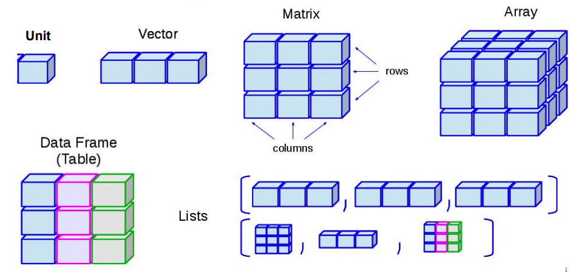
```

.footnote-right[
[The Seurat object for biologists](https://moodle.france-bioinformatique.fr/pluginfile.php/836/mod_resource/content/5/06_The_Seurat_object.pdf)
]


---

## ¿Qué contiene el **objeto `Seurat`**?

Un objeto Seurat contiene varios **slots (componentes internos)**:

```{r}
slotNames(pbmc)
```

Veamos su estructura:

.scrollable[

```{r}
str(pbmc) #<<
```
]

---

## `assays`: Tipos de datos/experimentos

- `assays` → Contiene los datos de expresión.
- En un análisis clásico de scRNA-seq, el assay activo suele llamarse **"RNA"**, pero en estudios multi-ómicos puedes tener varios assays coexistiendo en el mismo objeto. Cada uno representa un tipo de datos distinto. Por ejemplo:
  + **"RNA"** → matriz de expresión génica.
  + **"ADT"** → datos de anticuerpos (CITE-seq, proteómica de superficie).
  + **"ATAC"** → accesibilidad cromatínica (scATAC-seq).
  + **"SCT"** → datos normalizados con SCTransform.
  + **"Spatial"** → transcriptómica espacial.
  + **"integrated"** → matrices resultantes de integración de múltiples datasets.

```{r, eval=FALSE}
str(pbmc) 
```

```{r, eval=FALSE}
Formal class 'Seurat' [package "SeuratObject"] with 13 slots
  ..@ assays      :List of 1
  .. ..$ RNA:Formal class 'Assay5' [package "SeuratObject"] with 8 slots #<<
  .. .. .. ..@ layers    :List of 1
  .. .. .. .. ..$ counts:Formal class 'dgCMatrix' [package "Matrix"] with 6 slots #<<
  .. .. .. .. .. .. ..@ i       : int [1:2282976] 29 73 80 148 163 184 186 227 229 230 ...
```


---

## RNA assay

.pull-left[
- `counts`: conteos crudos.
- `data`: datos normalizados. 
- `scale.data`: datos escalados usando PCA u otros métodos.
]

.pull-right[

```{r, echo=FALSE, out.width='80%', fig.align='center'}
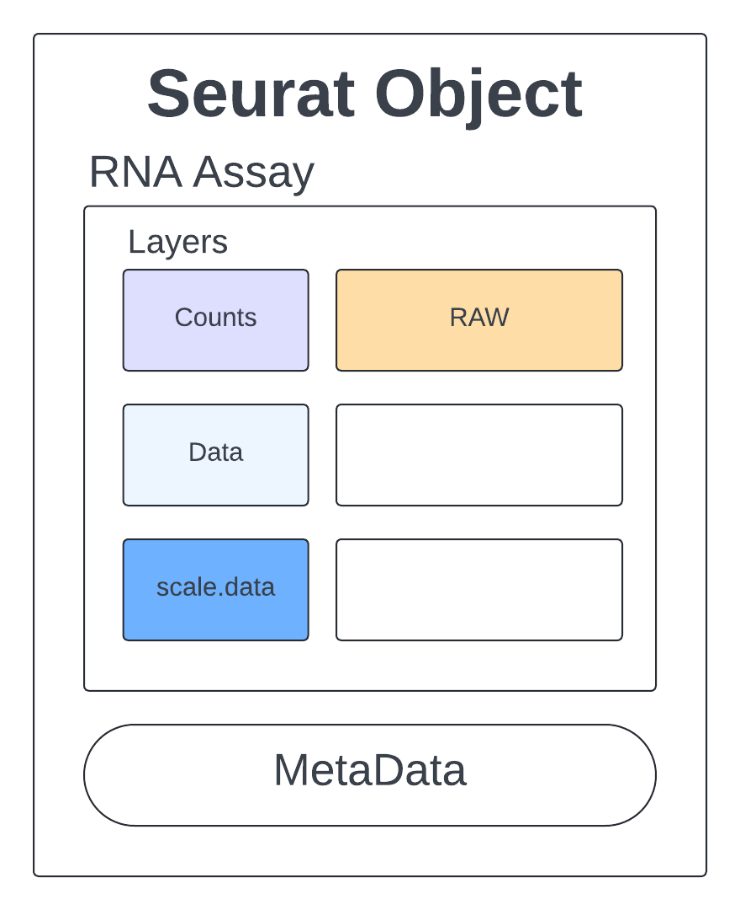
```
]

.footnote[
[Quality Assessment/Clustering](https://rnabio.org/module-08-scrna/0008/02/01/QA_clustering/)
]

---

## ¿Qué `assay` esta activo?

- `active.assay` → Indica cuál assay está activo para el análisis en curso.
- `active.ident` → Vector que guarda la identidad activa de cada célula (por ejemplo, clusters asignados).

- En este caso, todas las **2700 células** tienen la misma identidad "pbmc3k". Muestra los nombres de las células (los barcodes), que son las etiquetas únicas de cada célula en el dataset.

```{r, eval=FALSE}
  ..@ active.assay: chr "RNA"
  ..@ active.ident: Factor w/ 1 level "pbmc3k": 1 1 1 1 1 1 1 1 1 1 ...
  .. ..- attr(*, "names")= chr [1:2700] "AAACATACAACCAC-1" "AAACATTGAGCTAC-1" "AAACATTGATCAGC-1" "AAACCGTGCTTCCG-1" ...
```

---

## `DefaultAssay()`: consultar o establecer cuál assay está activo en tu objeto Seurat.

Cada `assay` tiene sus propias matrices (`counts, data, scale.data`):

```{r}
DefaultAssay(pbmc)
```

Si existiera otro assay llamado "ADT", podríamos cambiar el assay activo empleando:

```{r, eval=FALSE}
DefaultAssay(pbmc) <- "ADT"
```

De esta manera, todas las funciones que dependan del assay activo (como `NormalizeData(), FindVariableFeatures(), ScaleData()`, etc.) se aplicarían sobre el assay "ADT" en lugar de "RNA".

---

## Acceder a la información del assay activo

- Opción A: `pbmc[["RNA"]]`

```{r}
pbmc[["RNA"]]
```

- Opción B: `pbmc@assays$RNA`

```{r}
pbmc@assays$RNA
```

---

.pull-left[
```{r, echo=FALSE, out.width='80%', fig.align='center'}

```
]

.pull-right[
## Observar la matriz de cuentas crudas (`counts`) de RNA assay

Los genes están en las filas (primeros 6 genes):
```{r}
head(rownames(pbmc))
```

Las células están en las columnas (primeras 6 células):

```{r}
head(colnames(pbmc))
```

]

.footnote[
[Quality Assessment/Clustering](https://rnabio.org/module-08-scrna/0008/02/01/QA_clustering/)
]

---

.pull-left[
## `GetAssayData()`: Observar la matriz de cuentas

Argumentos:

- `object` → tu objeto Seurat (pbmc).
- `assay` → el nombre del assay del que quieres extraer datos (por defecto usa el activo, aquí "RNA").
- `slot` → la capa que quieres obtener:
  + "counts" → matriz de conteos crudos.
  + "data" → matriz normalizada (después de `NormalizeData()`).
  + "scale.data" → matriz escalada (después de `ScaleData()`).
]

.pull-right[

```{r}
GetAssayData(object = pbmc, slot = "counts")[1:3, 1:3]
```

.content-box-red[
- Esto significa que cada célula retenida tiene suficientes genes expresados en total, pero no garantiza que todos los genes tengan conteos >0.
- La mayoría de los genes en una célula típica de scRNA-seq no se expresan, así que es normal ver muchos ceros (. en la matriz sparse).
]
]

.footnote-right[
[Quality Assessment/Clustering](https://rnabio.org/module-08-scrna/0008/02/01/QA_clustering/)
]

---

## Estructura del objeto `Seurat`

```{r, echo=FALSE, out.width='70%', fig.align='center'}

```

.footnote-right[
[The Seurat object for biologists](https://moodle.france-bioinformatique.fr/pluginfile.php/836/mod_resource/content/5/06_The_Seurat_object.pdf)
]

---

## `meta.data`: Información básica de las células

Lo que nos está mostrando es la tabla de metadatos asociada a cada célula (**2700 observaciones = 2700 células**), con tres columnas iniciales:

- `orig.ident` → un factor con el nombre del proyecto o dataset de origen.
- `nCount_RNA` → número total de moléculas (UMIs = RNA) detectadas por célula. Es un valor numérico que indica la profundidad de secuenciación por célula.
- `nFeature_RNA` → número de genes detectados por célula (es decir, cuántos genes tienen al menos una lectura en esa célula).

```{r, eval=FALSE}
  ..@ meta.data   :'data.frame':	2700 obs. of  3 variables:
  .. ..$ orig.ident  : Factor w/ 1 level "pbmc3k": 1 1 1 1 1 1 1 1 1 1 ...
  .. ..$ nCount_RNA  : num [1:2700] 2419 4903 3147 2639 980 ...
  .. ..$ nFeature_RNA: int [1:2700] 779 1352 1129 960 521 781 782 790 532 550 ...
```

Corroborando el tamaño:

```{r}
dim(pbmc)
```

---

## ¿Qué contienen los slots?

Ya hemos explicado estos:

- `assays` → Contiene los datos de expresión (conteos, datos normalizados, etc.).
- `meta.data` → Tabla con metadatos de cada célula (ejemplo: número de genes detectados, porcentajes, condiciones experimentales).
- `active.assay` → Indica cuál assay está activo para el análisis en curso.
- `active.ident` → Vector que guarda la identidad activa de cada célula (por ejemplo, clusters asignados).

Pero, al inicio, los siguientes compartimentos existen pero están vacíos:

- `graphs` → Grafos de vecinos (KNN, SNN) usados en clustering.
- `neighbors` → Información sobre vecinos más cercanos, útil para análisis de agrupamiento.
- `reductions` → Resultados de reducciones de dimensionalidad (PCA, UMAP, t-SNE).
- `images` → Datos espaciales o imágenes asociadas (en transcriptómica espacial).
- `project.name` → Nombre del proyecto asignado al objeto.
- `misc` → Espacio para almacenar información adicional o personalizada.
- `version` → Versión de Seurat con la que se creó el objeto.
- `commands` → Historial de comandos ejecutados sobre el objeto (para reproducibilidad).
- `tools` → Resultados de herramientas adicionales aplicadas al objeto.   

---

class: inverse, center, middle

`r fontawesome::fa("certificate", height = "3em")`
# Paso 3. Control de calidad con `Seurat`

---

## Pipeline

```{r, echo=FALSE, out.width='60%', fig.align='center'}
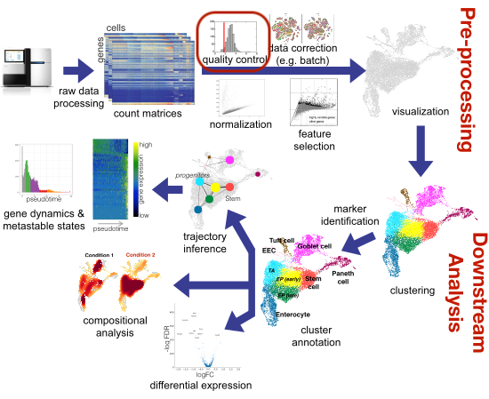
```

.footnote[
[Current best-practices in single-cell RNA-seq: a tutorial](https://github.com/theislab/single-cell-tutorial)
]

---

## Revisión de calidad con `Seurat`

.pull-left[
- `nFeature_RNA:` número de genes detectados por célula.
  + Sirve para identificar células con muy pocos genes (posibles muertas) o demasiados (dobletes).
- `nCount_RNA:` número total de moléculas/UMIs detectadas por célula.
  + Permite ver la profundidad de secuenciación por célula y detectar outliers.
- `percent.mt:` porcentaje de lecturas que provienen de genes mitocondriales.
  + Un valor alto indica células dañadas o en apoptosis.
]

.pull-right[

```{r, echo=FALSE, out.width='100%', fig.align='center'}
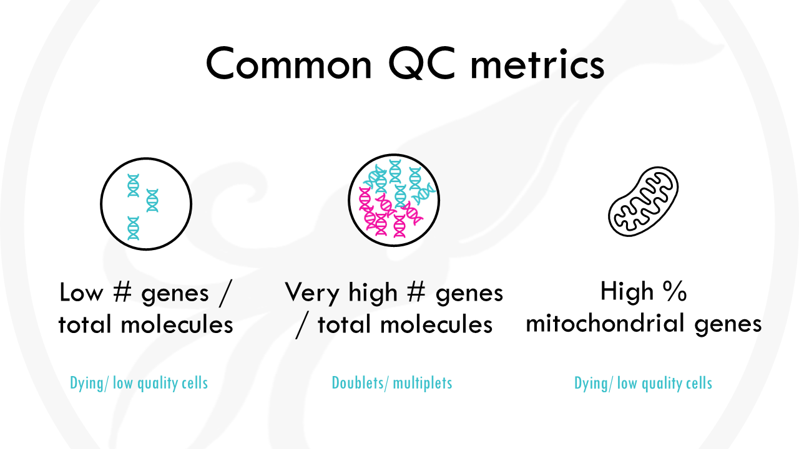
```
]

.footnote-right[Imagen tomada de: [Standard scRNAseq pre-processing workflow with Seurat](https://biostatsquid.com/scrnaseq-preprocessing-workflow-seurat/)
]

---

## Obtener el porcentaje de lecturas que se alinean al genoma mitocondrial

- Las células de **baja calidad o moribundas** suelen mostrar una contaminación mitocondrial extensa.
- Calculamos las métricas de control de calidad mitocondrial con la función `PercentageFeatureSet()`, que calcula el porcentaje de cuentas que provienen de un conjunto de características.
- Usamos el conjunto de todos los genes que comienzan con **MT-** como el conjunto de genes mitocondriales.

```{r}
pbmc[["percent.mt"]] <- PercentageFeatureSet(pbmc, pattern = "^MT-")
# Visualizar los parámetros de 5 células
head(pbmc@meta.data, 5)
```

---

### Visualización de rawData

.left-code[

### Código 
_________

```{r violin-plot, eval=FALSE}
VlnPlot(pbmc, features = c("nFeature_RNA", "nCount_RNA", "percent.mt"), ncol = 3)
```

Argumentos:
- `object` → el objeto Seurat (ej. pbmc).
- `features` → vector de genes o métricas a graficar (ej. "nFeature_RNA", "percent.mt", "CD3D").
- `ncol` → número de columnas en la cuadrícula del gráfico.
]


.right-plot[

### Plot 
_________

```{r violin-plot-out, ref.label="violin-plot", echo=FALSE, fig.width=8, fig.height=4}
```

]

---

.left-code[
## Gráficas de dispersión (scatter plots)

```{r plot-label, eval=FALSE}
plot1 <- FeatureScatter(pbmc, feature1 = "nCount_RNA", feature2 = "percent.mt") + 
  theme(legend.position="none") +
  geom_hline(yintercept = 5, color = "blue", linetype = "dashed")
plot2 <- FeatureScatter(pbmc, feature1 = "nCount_RNA", feature2 = "nFeature_RNA") + 
  theme(legend.position="none")  +
  geom_hline(yintercept = 2500, color = "blue", linetype = "dashed")
plot1 + plot2
```
]


.right-plot[
```{r plot-label-out, ref.label="plot-label", message=FALSE, warning=FALSE, echo=FALSE, fig.width=6, fig.height=3}
```

- `plot1`: Relación entre `nCount_RNA` (total de UMIs por célula) y `percent.mt` (% de lecturas mitocondriales).
- `plot1`: Relación entre `nCount_RNA` y `nFeature_RNA` (número de genes detectados).

.content-box-blue[
En resumen:
- Si ves puntos con `percent.mt` alto, esas células probablemente se descarten.
- Si ves puntos con `nCount_RNA` y `nFeature_RNA` muy altos, pueden ser dobletes.

]]

---

```{r, echo=FALSE, out.width='40%', fig.align='center'}
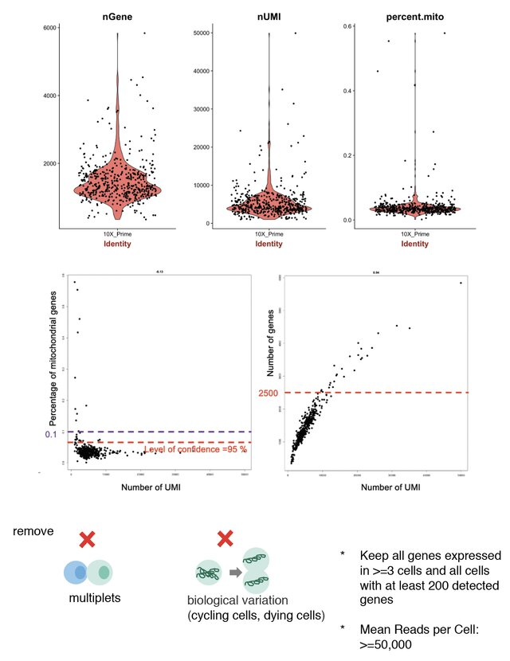
```

.footnote-right[Imagen tomada de: [Linda Yu-Ling Lan](https://doi.org/10.13140/RG.2.2.24594.48325)
]

---

.pull-left[

## Filtros de PBMCs con 10x Genomics y `Seurat`

- `nFeature_RNA` (genes detectados por célula):
  + 200 – 2,500 genes
  + <200 → célula muerta o vacía
  + 2,500 → posible doblete

- `nCount_RNA` (UMIs totales por célula):
  + 1,000 – 25,000
  + Muy bajo → célula de mala calidad
  + Muy alto → dobletes o artefactos

- `percent.mt` (% de lecturas mitocondriales):
  + < 5–10%
  + 10% → célula estresada, dañada o moribunda

]

.pull-right[  
.content-box-red[
**📌 Notas importantes:**

- Estos rangos son guías prácticas, no reglas universales. Cada tejido puede variar.
- Lo recomendable es visualizar distribuciones (con `VlnPlot() `o `FeatureScatter()`) y ajustar los umbrales según tu dataset.
- En PBMCs, el filtro de `percent.mt` suele ser el más consistente: células con >10% mitocondrial casi siempre se descartan.
- `nFeature_RNA` y `nCount_RNA` deben evaluarse juntos para detectar dobletes.  
]
]

---

.pull-left[

## Filtros de PBMCs con 10x Genomics y `Seurat`

- `nFeature_RNA` (genes detectados por célula):
  + 200 – 2,500 genes
  + <200 → célula muerta o vacía
  + 2,500 → posible doblete

- `nCount_RNA` (UMIs totales por célula):
  + 1,000 – 25,000
  + Muy bajo → célula de mala calidad
  + Muy alto → dobletes o artefactos

- `percent.mt` (% de lecturas mitocondriales):
  + < 5–10%
  + 10% → célula estresada, dañada o moribunda

]

.pull-right[  

ANTES de la limpieza:

```{r}
pbmc
```

DESPUÉS de la limpieza:

```{r}
pbmc <- subset(pbmc, subset = nFeature_RNA > 200 & nFeature_RNA < 2500 & percent.mt < 5)
pbmc
```
]

---

## En resumen

Se detectaron **13714 features (genes) en 2638 células** posterior a la limpieza de los datos. Perdiendo 62 células al aplicar los criterios de calidad (genes detectados entre 200 y 2500, y menos del 5% de genes mitocondriales).

Podemos encontrar esta información usando:

```{r}
dim(pbmc)
```

---

class: inverse, center, middle

`r fontawesome::fa("chart-area", height = "3em")`
# Paso 4. Normalización de los datos

---

## Pipeline

```{r, echo=FALSE, out.width='60%', fig.align='center'}
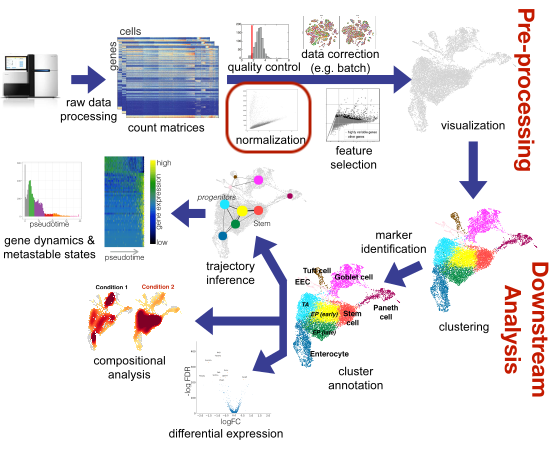
```

.footnote[
[Current best-practices in single-cell RNA-seq: a tutorial](https://github.com/theislab/single-cell-tutorial)
]

---

.pull-left[

## ¿Qué significa normalizar?

Normalizar es ajustar los datos para que puedan compararse entre células.
- Imagina que cada célula es como un estudiante que entrega una lista de palabras escritas.
- Algunos escriben mucho, otros poco.
- Para poder comparar, necesitamos ponerlos en la misma “escala”.
]

.pull-right[  
```{r, echo=FALSE, out.width='100%', fig.align='center'}
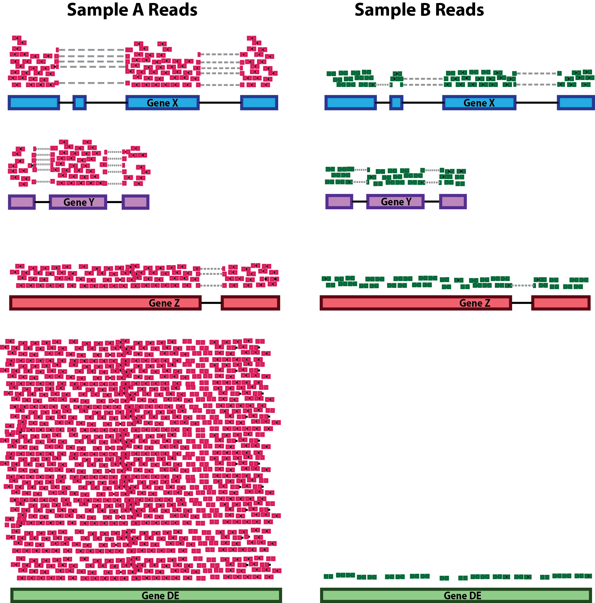
```
]


.footnote[Imagen tomada de:
[Introduction to DGE - ARCHIVED](https://hbctraining.github.io/DGE_workshop/lessons/02_DGE_count_normalization.html)
]


---

## Normalización `LogNormalize` en `Seurat`

La normalización *LogNormalize* se define como:

$$
\text{LogNormalized}(g,c) = \log \left( \frac{\text{counts}(g,c)}{\sum_{i} \text{counts}(i,c)} \cdot \text{scale.factor} + 1 \right)
$$

donde:

- $\text{counts}(g,c)$: número de lecturas del gen $g$ en la célula $c$.
- $\sum_{i} \text{counts}(i,c)$: total de lecturas en la célula $c$.
- $\text{scale.factor}$: factor de escala (por defecto 10,000).
- Se suma 1 antes de aplicar el logaritmo natural para evitar valores cero.

.footnote[Foro en GitHub:
[Clarification of Normalization method employed in Seurat](https://github.com/satijalab/seurat/issues/3630)
]

---

.pull-left[

## Explicación desglosada

1. Divide cada valor de expresión de un gen por el total de moléculas de la célula.

$$
   \frac{\text{counts}(g,c)}{\sum_i \text{counts}(i,c)}
$$

2. Multiplica por un factor de escala (por defecto 10,000).

3. Suma 1 y aplica logaritmo natural

]

.pull-right[  

```{r}
# Paso 1: proporciones por célula
total_counts <- colSums(GetAssayData(pbmc, slot = "counts"))
prop_counts <- sweep(GetAssayData(pbmc, slot = "counts"), 2, total_counts, FUN="/")

# Paso 2: multiplicar por factor de escala
scale.factor <- 10000
scaled_counts <- prop_counts * scale.factor

# Paso 3: aplicar logaritmo natural
logNorm_counts <- log1p(scaled_counts)

# Mostrar un subconjunto
logNorm_counts[1:5, 1:5]
```
]


---

## Empleando `LogNormalize`

**Mini resumen:** Normaliza las mediciones de expresión de cada característica en cada célula según la expresión total, multiplica este valor por un factor de escala (10,000 por defecto) y transforma el resultado mediante logaritmos. Los valores normalizados se almacenan en `pbmc[["RNA"]]@data`.

```{r}
# pbmc <- NormalizeData(pbmc, normalization.method = "LogNormalize", scale.factor = 10000)
pbmc <- NormalizeData(pbmc)
```
Ahora tenemos `data`:

```{r, eval=FALSE}
str(pbmc)
```

```{r, eval=FALSE}
  .. .. .. .. ..$ data  :Formal class 'dgCMatrix' [package "Matrix"] with 6 slots
  .. .. .. .. .. .. ..@ i       : int [1:2238732] 29 73 80 148 163 184 186 227 229 230 ...
  .. .. .. .. .. .. ..@ p       : int [1:2639] 0 779 2131 3260 4220 4741 5522 6304 7094
```

---

## RNA assay ahora tiene `data`

- `counts`: conteos crudos.
- `data`: datos normalizados. 


```{r, echo=FALSE, out.width='60%', fig.align='center'}
knitr::include_graphics("figures/seurat_object.normalize.png")
```

.footnote[
[Quality Assessment/Clustering](https://rnabio.org/module-08-scrna/0008/02/01/QA_clustering/)
]

---

.left-code[

```{r lognorma-plot, eval=FALSE}
# set seed and put two plots in one figure
set.seed(123)
# dos paneles en una fila, márgenes ajustados
par(mfrow=c(1,2), mar=c(4,4,2,1))
# original expression distribution
raw_geneExp <- as.vector(GetAssayData(object = pbmc, slot = "counts")) %>% sample(10000)
raw_geneExp <- raw_geneExp[raw_geneExp != 0]
hist(raw_geneExp, main="Raw counts")
# expression distribution after normalization
logNorm_geneExp <- as.vector(GetAssayData(object = pbmc, slot = "data")) %>% sample(10000)
logNorm_geneExp <- logNorm_geneExp[logNorm_geneExp != 0]
hist(logNorm_geneExp, main="LogNormalized")
```
]
.right-plot[

### Distribución de expresión génica: crudo vs normalizado

- 10,000 valores de expresión génica tomados al azar, no 10,000 genes ni 10,000 células.
- Es una muestra representativa para visualizar cómo se distribuyen los datos, sin necesidad de graficar todos los millones de valores de la matriz completa.

```{r lognorma-plot-out, ref.label="lognorma-plot", echo=FALSE, fig.width=8, fig.height=3}
```

]

.footnote-right[Ejemplo tomado de:
[Normalizing the data](https://holab-hku.github.io/Fundamental-scRNA/downstream.html)
]

---

class: inverse, center, middle

`r fontawesome::fa("chart-simple", height = "3em")`
# Ejercicio en equipo
## Equipos de 3 o 4 personas 

---

## Ejercicio en equipo

Instalar el paquete `scRNAseq`

```{r, eval=FALSE}
BiocManager::install("scRNAseq")
```

Emmplea la función `surveyDatasets()` para explorar los datasets que contiene este paquete.

```{r, eval=FALSE}
library(scRNAseq)
all.ds <- surveyDatasets()
all.ds
```

### Paso 1. Descarga e importación de datos en R

Después:

- 1) Encuentra todos los datasets relacionados con pancreas:

```{r, eval=FALSE}
searchDatasets("pancreas")[,c("name", "title")]
```

- 2) Encuentra los datasets de ratón (GRCm38) relacionados con pancreas o neuronas

```{r, eval=FALSE}
searchDatasets(
   defineTextQuery("GRCm38", field="genome") & # ratones
   (defineTextQuery("neuro%", partial=TRUE) |  # neuronas
    defineTextQuery("pancrea%", partial=TRUE)) # pancreas
)[,c("name", "title")]
```

- 3) Cárgalo en tu sesión con dataset, usando la columna "name" y la función `fetchDataset("name")`.

```{r}
sce <- fetchDataset("zeisel-brain-2015", "2023-12-14")
sce
```


---

- 4) Si hay varios datasets en un mismo estudio, podemos usar `path`:

```{r, eval=FALSE}
sce <- fetchDataset("baron-pancreas-2016", "2023-12-14", path="human")
sce
```

- Realiza los pasos vistos en esta clase: Paso 2. Estructura del objeto `Seurat`; Paso 3. Control de calidad con `Seurat` y Paso 4. Normalización de los datos.

.content-box-green[ 
- Contesta las siguientes preguntas:
 + ¿Qué dataset elegiste y qué tipo de células o tejido representa?
 + ¿Cuántas células y cuántos genes incluye tu dataset?
 + ¿Cuántas células fueron eliminadas después del filtrado de calidad y qué criterios aplicaste?
 + ¿Por qué es importante filtrar células con alto porcentaje mitocondrial?
]

```{r timmer, echo=FALSE}
countdown(minutes = 15, seconds = 00)
```

---

class: center, middle

`r fontawesome::fa("code", height = "3em")`
## Gracias por su atención

Respira y coméntame tus dudas. 

```{r, echo=FALSE, out.width='20%', fig.align='right'}
knitr::include_graphics("figures/cat.png")
```

.left[.footnote[.black[
Imagen tomada de: [Allison Horst](https://allisonhorst.com/) 
]]]