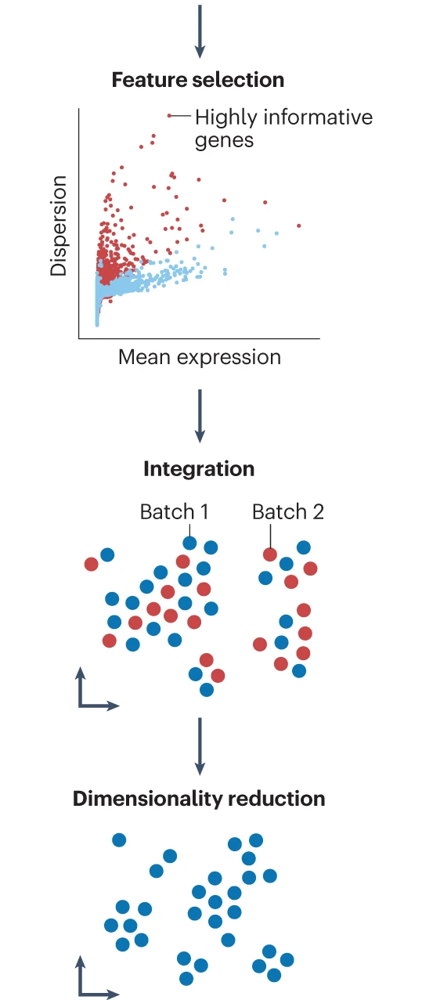
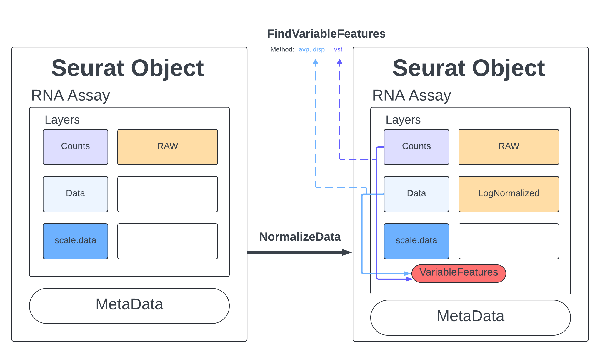
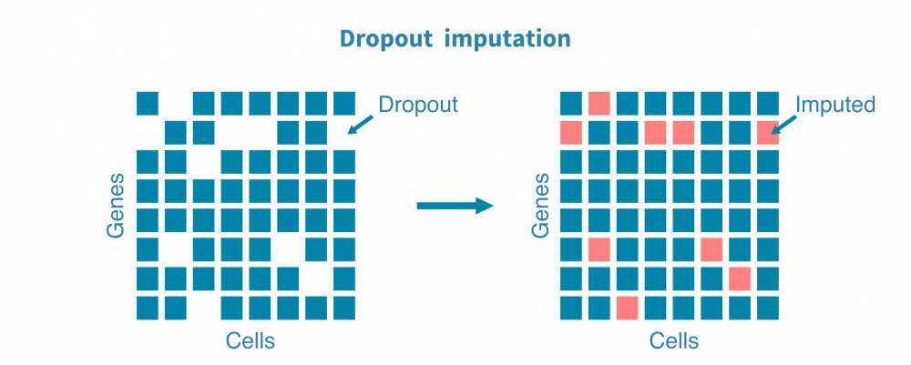
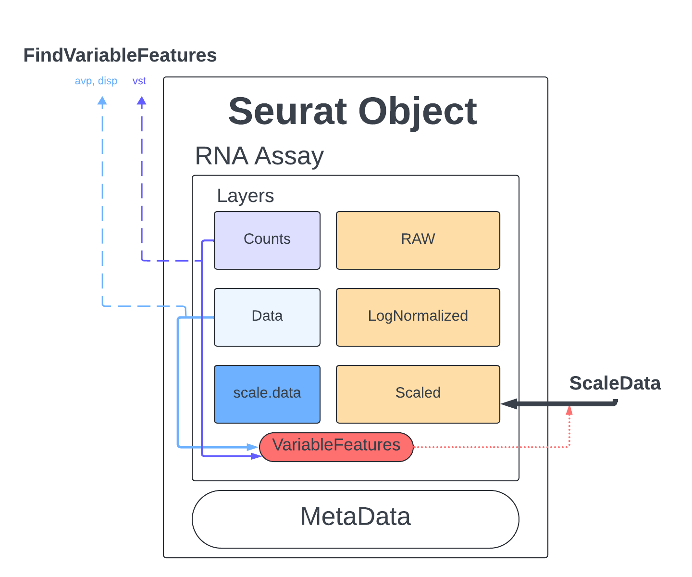
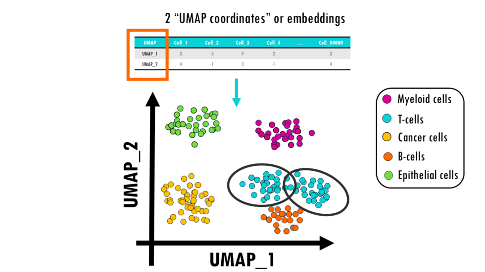
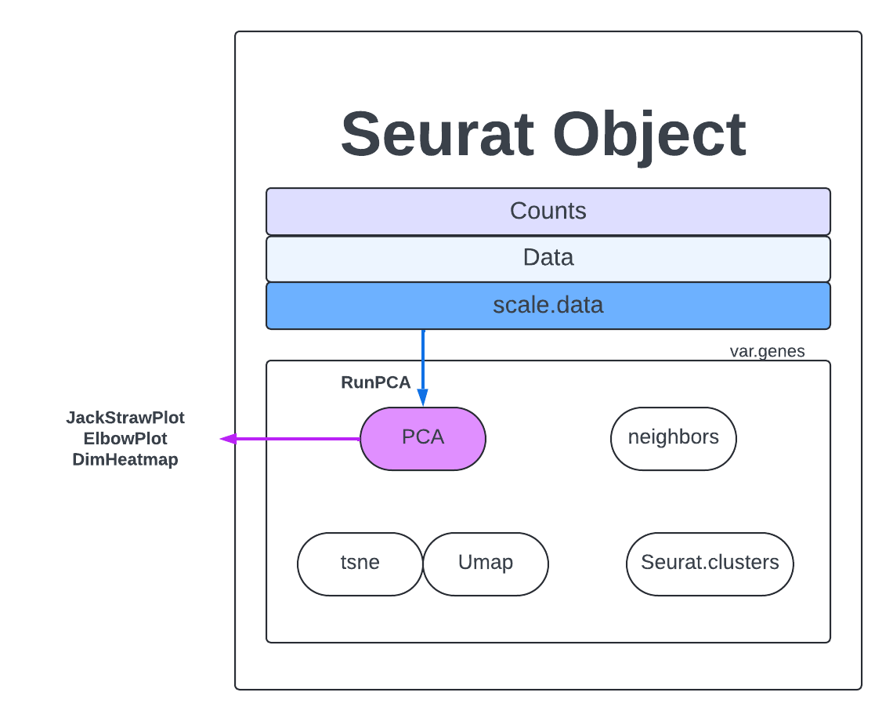
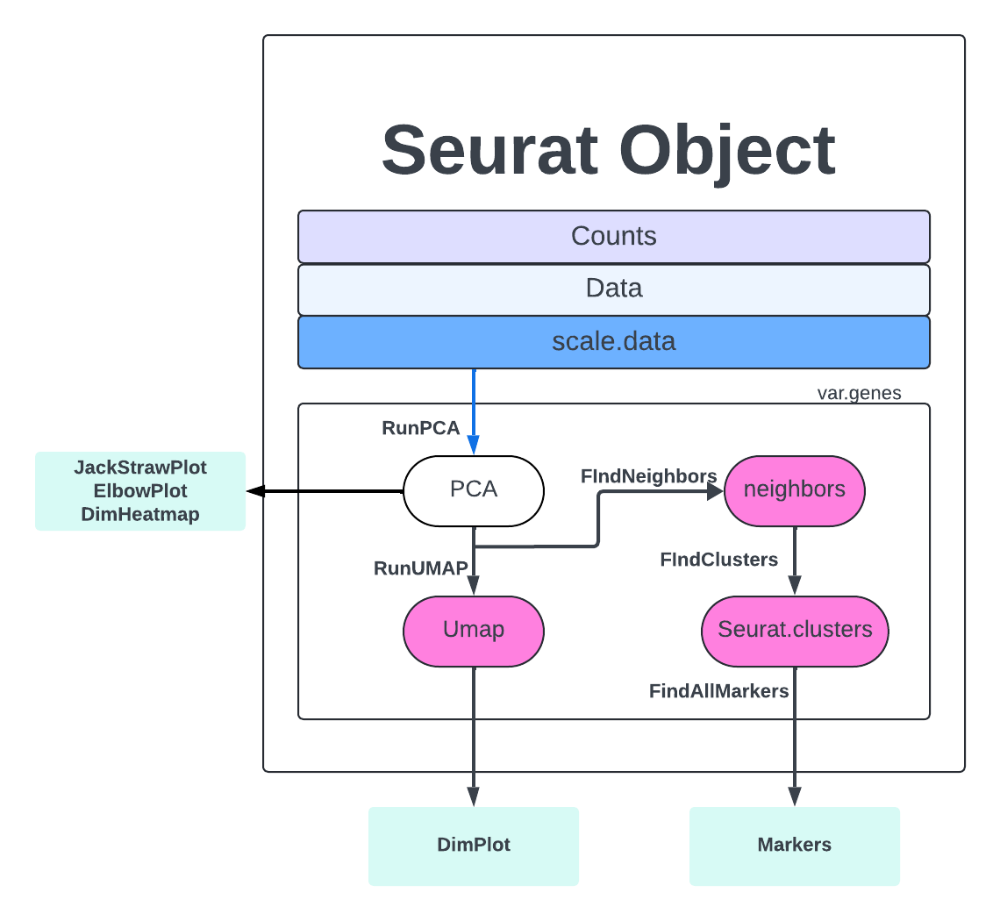
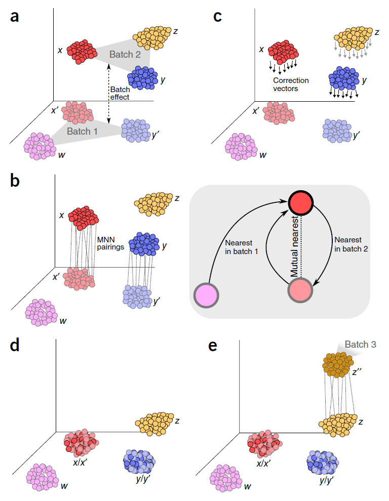
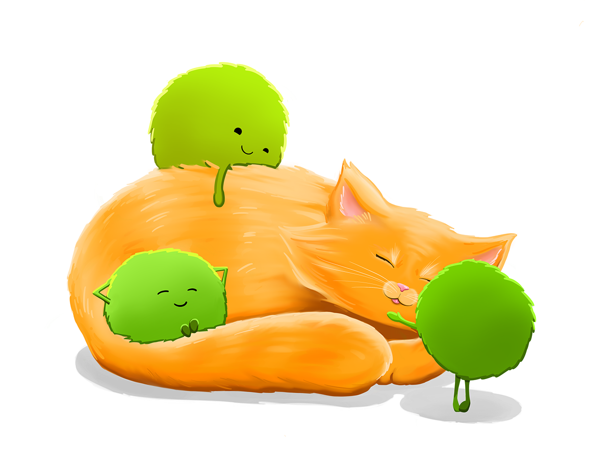

```{r setup, include = FALSE}
# Setup chunk
# Paquetes a usar
#options(htmltools.dir.version = FALSE) cambia la forma de incluir código, los colores

library(knitr)
library(tidyverse)
library(xaringanExtra)
library(icons)
library(fontawesome)
library(emo)
library(countdown) # remotes::install_github("gadenbuie/countdown", subdir = "r"), Explicacion de su uso: https://pkg.garrickadenbuie.com/countdown/#5
library(palmerpenguins)

# set default options
opts_chunk$set(collapse = TRUE,
               dpi = 300,
               warning = FALSE,
               error = FALSE,
               comment = "#")

top_icon = function(x) {
  icons::icon_style(
    icons::fontawesome(x),
    position = "fixed", top = 10, right = 10
  )
}

knit_engines$set("yaml", "markdown")

# Con la tecla "O" permite ver todas las diapositivas
xaringanExtra::use_tile_view()
# Agrega el boton de copiar los códigos de los chunks
xaringanExtra::use_clipboard()

# Crea paneles impresionantes 
xaringanExtra::use_panelset()

# Para compartir e incrustar en otro sitio web
xaringanExtra::use_share_again()
xaringanExtra::style_share_again(
  share_buttons = c("twitter", "linkedin")
)

# Funcionalidades de los chunks, pone un triangulito junto a la línea que se señala
xaringanExtra::use_extra_styles(
  hover_code_line = TRUE,         #<<
  mute_unhighlighted_code = TRUE  #<<
)

# Agregar web cam
xaringanExtra::use_webcam()

# barra de progreso
xaringanExtra::use_progress_bar(color = "#0051BA", location = "top", height = "10px")
```

```{r xaringan-editable, echo=FALSE}
# Para tener opciones para hacer editable algun chunk
xaringanExtra::use_editable(expires = 1)
# Para hacer que aparezca el lápiz y goma
xaringanExtra::use_scribble()
```

```{r xaringan-themer Eve, include=FALSE, warning=FALSE}
# Establecer colores para el tema
library(xaringanthemer)

palette <- c(
 orange        = "#fb5607",
 pink          = "#ff006e",
 blue_violet   = "#8338ec",
 zomp          = "#38A88E",
 shadow        = "#87826E",
 blue          = "#1381B0",
 yellow_orange = "#FF961C"
  )

#style_xaringan(
style_duo_accent(
  background_color = "#FFFFFF", # color del fondo
  link_color = "#562457", # color de los links
  text_bold_color = "#225ea8",
  primary_color = "#01002B", # Color 1
  secondary_color = "#CB6CE6", # Color 2
  inverse_background_color = "#41b6c4", # Color de fondo secundario 
  colors = palette,
  
  # Tipos de letra
  header_font_google = google_font("Barlow Condensed", "600"), #titulo
  text_font_google   = google_font("Work Sans", "300", "300i"), #texto
  code_font_google   = google_font("IBM Plex Mono") #codigo
  #text_font_size = "1.5rem" # Tamano de letra
)

# https://www.rdocumentation.org/packages/xaringanthemer/versions/0.3.4/topics/style_duo_accent
```

class: title-slide, middle, center
background-image: url(figures/Slide1.png) 
background-position: 90% 75%, 75% 75%, center
background-size: 1210px,210px, cover


.center-column[
# `r rmarkdown::metadata$title`
### `r rmarkdown::metadata$subtitle`

#### <span class="author">`r rmarkdown::metadata$author`</span>
#### <span class="date">`r rmarkdown::metadata$date`</span>
]

.left[.footnote[
[R-Ladies Theme](https://www.apreshill.com/project/rladies-xaringan/)]]

---

class: inverse, center, middle

`r fontawesome::fa("laptop-file", height = "3em")`
# Pipeline con **un solo dataset**

---

.pull-left[

## Pipeline con **un solo dataset**:

- Paso 1. Descarga e importación de datos en R
- Paso 2. Estructura del objeto `Seurat`
- Paso 3. Control de calidad con `Seurat`
- Paso 4. Normalización de los datos
- Paso 5. Selección de genes altamente variables
- Paso 6. Escalamiento de los datos
- Paso 7. Reducción de dimensiones inicial (PCA)
- Paso 8. Decidir cuántas PCs usar
- Paso 9. Clustering de células
- Paso 10. Reducciones no lineales (UMAP/t-SNE)

]
.pull-right[
```{r, echo=FALSE, out.width='50%', fig.align='center'}

```
]

.footnote[Imagen tomada de:
[Best practices for single-cell analysis across modalities](https://www.nature.com/articles/s41576-023-00586-w)]

---

# Instalar estos paquetes

```{r, eval=FALSE}
# CRAN
install.packages("Matrix")
install.packages("hdf5r")

# Github
remotes::install_github('chris-mcginnis-ucsf/DoubletFinder', force = TRUE)

# Instalar con Bioconductor
BiocManager::install("rhdf5")
```

---

## Estos se ejecuto la semana pasada, de aquí partimos

```{r, warning=FALSE, message=FALSE}
## Cargar paquetes de R
library(BiocFileCache) ## para descargar datos
library(dplyr) ## para filtar datos
library(Seurat) ## paquete principal de este capítulo
library(patchwork) ## para graficar imágenes juntas
library(SeuratData) # paquete de datos de Seurat

### ---- Paso 1. Descarga e importación de datos en R -----
# Descagar en archivo temporales
bfc <- BiocFileCache()
raw.path <- bfcrpath(bfc, file.path(
    "http://cf.10xgenomics.com/samples",
    "cell/pbmc3k/pbmc3k_filtered_gene_bc_matrices.tar.gz"
))

# Descomprimir archivo tar.gz
untar(raw.path, exdir = file.path(tempdir(), "pbmc3k"))
# Importar ruta del archivo
fname <- file.path(tempdir(), "pbmc3k/filtered_gene_bc_matrices/hg19")
# Cargar dataset de 10X genomics
pbmc.data <- Read10X(data.dir = fname)

### ---- Paso 2. Estructura del objeto `Seurat` ------
# Generar objeto Seurat con raw data (non-normalized data).
pbmc <- CreateSeuratObject(counts = pbmc.data, project = "pbmc3k", min.cells = 3, min.features = 200)

### ---- Paso 3. Control de calidad con `Seurat` ----
pbmc[["percent.mt"]] <- PercentageFeatureSet(pbmc, pattern = "^MT-")
pbmc <- subset(pbmc, subset = nFeature_RNA > 200 & nFeature_RNA < 2500 & percent.mt < 5)
pbmc
### ---- Paso 4. Normalización de los datos -----
pbmc <- NormalizeData(pbmc)
```

---

class: inverse, center, middle

`r fontawesome::fa("laptop-file", height = "3em")`
# Paso 5. Selección de genes altamente variables (HVGs) (feature selection)

---

## Selección de genes altamente variables (High Variable Genes, HVGs)

- **Objetivo:** Identificar aquellos genes *cuya expresión cambia significativamente entre células*, ya que son los más informativos para distinguir subpoblaciones y reducir ruido técnico.

- **Motivación:** No todos los genes aportan información útil. Muchos tienen expresión constante o solo reflejan ruido técnico. Los HVGs capturan la *heterogeneidad biológica* real entre células.

- Ayuda a resaltar la **señal biológica** en los conjuntos de datos de célula única.

- **Impacto:** La elección de estos genes afecta directamente el resultado de clustering, reducción de dimensionalidad (PCA, UMAP, t-SNE) y análisis posteriores.

.green[
### ¿Cuáles son los genes que muestran mayor variación de expresión entre células dentro de mi conjunto de datos?
]

---

## Proceso típico en `Seurat`

1. Calcular media y varianza de cada gen en todas las células.
2. Modelar la relación entre *media y varianza* (genes con mayor expresión tienden a tener mayor varianza).
3. Seleccionar genes con *varianza significativamente* mayor a lo esperado dado su nivel de expresión.
4. Guardar esta lista de HVGs para usar en PCA y clustering.

.content-box-blue[
### Riesgos y consideraciones

- **Si seleccionas muy pocos genes**, puedes perder información biológica relevante.  
- **Si seleccionas demasiados**, aumentas el ruido y el costo computacional.  
- El número típico es entre **1,000 y 3,000 genes altamente variables**, pero depende del dataset. 
]

---

## Funciones en `Seurat`

```{r, eval=FALSE}
FindVariableFeatures(object, selection.method = "vst", nfeatures = 2000)
```

- Método por defecto: “vst” (variance stabilizing transformation). 
- Por defecto, devolvemos 2,000 características por conjunto de datos. Estas se utilizarán en análisis posteriores, como PCA.

```{r, eval=FALSE}
VariableFeaturePlot(object)
```

- Visualiza la relación entre media y varianza, destacando los HVGs.

```{r, eval=FALSE}
VariableFeatures(object)
```

- Devuelve el vector con los nombres de los genes seleccionados como HVGs.

---

## Por defecto usaremos “vst” con `FindVariableFeatures` para identificar a los HVGs.

```{r, echo=FALSE, out.width='60%', fig.align='center'}

```

.footnote[
[Quality Assessment/Clustering](https://rnabio.org/module-08-scrna/0008/02/01/QA_clustering/)
]

---

## Visualización de la relación entre media y varianza de las muestras

.left-code[
```{r scatter-plot, eval=FALSE, message=FALSE}
pbmc <- FindVariableFeatures(pbmc, selection.method = "vst", nfeatures = 2000)
# Obtener los 10 genes más variables
top10 <- head(VariableFeatures(pbmc), 10)
# Visualiza la relación entre media y varianza
plot1 <- VariableFeaturePlot(pbmc)
# Colocar la etiqueta de los genes
plot2 <- LabelPoints(plot = plot1, points = top10, repel = TRUE)
# Combinar gráficos lado a lado y poner la leyenda arriba
combined_plot <- plot1 + plot2 + plot_layout(guides = "collect") & theme(legend.position = "top")
combined_plot
```
]


.right-plot[
```{r scatter-plot-out, ref.label="scatter-plot", echo=FALSE, fig.width=8, fig.height=4}
```

]

---

## Dropout imputation

.pull-left[

- Los *dropouts* son ceros en la matriz de expresión que no siempre representan ausencia real de expresión, sino limitaciones técnicas (p. ej. baja captura de ARN).

- La imputación intenta “rellenar” esos ceros con valores estimados, usando modelos estadísticos o métodos de machine learning (ej. `MAGIC, SAVER, scImpute`).

.content-box-yellow[ 
- No es parte del flujo estándar de Seurat: Seurat no realiza imputación de *dropouts* por defecto, porque puede introducir sesgos si se hace indiscriminadamente.
- En muchos análisis, se prefiere trabajar con los datos normalizados y seleccionar HVGs, sin imputar, para evitar sobreinterpretar ruido como señal.
]

]
.pull-right[

```{r, echo=FALSE, out.width='100%', fig.align='center'}

```
]

.footnote-right[
[Single-cell RNA sequencing data analysis](https://geneviatechnologies.com/bioinformatics-analyses/single-cell-rna-seq-data-analysis/)
]

---

class: inverse, center, middle

`r fontawesome::fa("laptop-file", height = "3em")`
# Paso 6. Escalado de los datos

---

## ¿Qué es el escalado de los datos?

.pull-left[
- Aplicar una **transformación lineal** a cada variable (en este caso, cada gen) para que todas tengan la misma escala y puedan compararse de manera justa.
- El paso de escalado de datos en Seurat responde a la necesidad de preparar la *matriz de expresión para técnicas de reducción de dimensionalidad como PCA*. 
- Función: `ScaleData`
- Resultado: `scale.data`
- **Objetivo:** dar el mismo peso a todos los genes en los análisis posteriores (como PCA, UMAP, clustering), evitando que los genes altamente expresados dominen los resultados.

]
.pull-right[

```{r, echo=FALSE, out.width='100%', fig.align='center'}

```
]

.footnote-right[
[Quality Assessment/Clustering](https://rnabio.org/module-08-scrna/0008/02/01/QA_clustering/)
]

---

## `ScaleData` aplica una transformación lineal a cada gen:

- **Centra cada gen:** ajusta la expresión para que la media entre todas las células sea 0.
- **Escala cada gen:** ajusta la varianza para que sea 1.

- **Opción A:** Escalar todos los genes (más pesado, pero posible)

```{r, eval=FALSE}
all.genes <- rownames(pbmc)
pbmc <- ScaleData(pbmc, features = all.genes)
```

- **Opción B:** Escalar solo los genes variables (más eficiente y recomendado)

```{r}
pbmc_var <- ScaleData(pbmc, features = VariableFeatures(pbmc))
# Verifica el resultado, ya no es el argumento slot ahora es layer
GetAssayData(object = pbmc_var, layer = "scale.data")[1:2, 1:2]
```

---

## Ejemplo 

Piensa que escalar todos los genes es como ajustar el volumen de **todos los instrumentos de una orquesta**, aunque **solo unos pocos son los que realmente marcan la melodía**. Por eso, en la práctica, se suele escalar solo los genes más informativos.

```{r, echo=FALSE, out.width='60%', fig.align='center'}
knitr::include_graphics("figures/general_plot.png")
```

.footnote-right[Imagen tomada de:
[Allison Horst](https://allisonhorst.com/everything-else)
]

---

class: inverse, center, middle

`r fontawesome::fa("laptop-file", height = "3em")`
# Paso 7. Reducción de dimensiones inicial (PCA)

---

.pull-left[
## Objetivos principales

- **Simplificar** los datos sin perder la señal biológica importante.
- **Eliminar ruido y redundancia** de genes poco informativos.
- Facilitar la visualización en 2D o 3D (`PCA, UMAP, t-SNE`).
- Preparar el terreno para clustering y descubrimiento de poblaciones celulares.
]

.pull-right[.content-box-blue[
Interpretación: 

- **Cada punto = una célula individual.**
- **La cercanía entre puntos** = *similitud* en sus perfiles de expresión.
- Clústeres o grupos = *poblaciones celulares distintas (tipos o estados)*.
- Colores = **categorías:** tipo celular, condición experimental, expresión de un gen específico, etc.

```{r, echo=FALSE, out.width='100%', fig.align='center'}

```
]]

.footnote-right[ 
[Explicación completa de un UMAP](https://biostatsquid.com/umap-simply-explained/)]

---

## Diferencias principales

| Método | Qué hace | Ventajas | Limitaciones |
|--------|----------|----------|--------------|
| **PCA (Principal Component Analysis)** | Transformación lineal que resume la variabilidad en componentes principales. | Rápido, interpretable, conserva estructura global. | Solo captura relaciones lineales, puede perder patrones no lineales. |
| **t-SNE (t-distributed Stochastic Neighbor Embedding)** | Algoritmo no lineal que preserva relaciones locales (vecindad). | Excelente para visualizar agrupamientos pequeños, separa bien poblaciones. | Computacionalmente más pesado, pierde estructura global, resultados pueden variar entre corridas. |
| **UMAP (Uniform Manifold Approximation and Projection)** | Método no lineal basado en teoría de grafos y topología. | Preserva tanto estructura local como global, más rápido que t-SNE, reproducible. | Parámetros (`n_neighbors, min_dist`) afectan mucho la forma del embedding. |

---

## Elegir la mejor técnica para sus datos

A la hora de elegir la técnica de **reducción de dimensionalidad adecuada**, piense en lo que más valora: la interpretabilidad, la velocidad o la capacidad de capturar patrones no lineales.

.content-box-blue[ 
- **PCA:** útil para interpretar variabilidad global y relaciones lineales.
- **t‑SNE:** excelente para visualizar agrupamientos locales, pero no conserva bien distancias globales.
- **UMAP:** balancea estructura local y global, más rápido y reproducible que t‑SNE.
]

```{r, echo=FALSE, out.width='70%', fig.align='center'}
knitr::include_graphics("figures/diferencias_dimensiones.png")
```

.footnote-right[ 
[PCA vs. t-SNE vs. UMAP](https://aicompetence.org/pca-vs-t-sne-vs-umap/)]

---

## Análisis de componentes principales (PCA) 

.pull-left[

- Por defecto, `Seurat` usa únicamente los genes variables previamente seleccionados (con `FindVariableFeatures`) como entrada para `PCA`, porque son los más informativos. Sin embargo, puedes cambiar esto con el argumento `features` si quieres usar otro subconjunto de genes (por ejemplo, todos los genes).

```{r}
pbmc_pca <- RunPCA(pbmc_var, features = VariableFeatures(object = pbmc))
```

]

.pull-right[
```{r}
# Verificar que la reducción existe
Reductions(pbmc_pca)
```

```{r, echo=FALSE, out.width='80%', fig.align='center'}

```
]

.footnote-right[
[Quality Assessment/Clustering](https://rnabio.org/module-08-scrna/0008/02/01/QA_clustering/)
]

---

## Visualización del PCA

.left-code[
```{r pca-plot, eval=FALSE}
DimPlot(pbmc_pca, reduction = "pca") + ggtitle("PCA con genes variables")
```
]

.right-plot[
```{r pca-plot-out, ref.label="pca-plot", echo=FALSE, fig.width=8, fig.height=4, warning=FALSE, message=FALSE}
```
]

---

## Genes que impulsan PC1 y PC2

.left-code[
- Cada barra representa un gen.
- Los genes con valores altos (positivos o negativos) son los que más influyen en esa componente principal.

```{r pca1y2-plot, eval=FALSE}
VizDimLoadings(pbmc_pca, dims = 1:2, reduction = "pca")
```
]

.right-plot[
```{r pca1y2-plot-out, ref.label="pca1y2-plot", echo=FALSE, fig.width=8, fig.height=6, warning=FALSE, message=FALSE}
```
]


---

class: inverse, center, middle

`r fontawesome::fa("laptop-file", height = "3em")`
# Paso 8. Decidir cuántas PCs usar

---

## Exploración inicial con `ElbowPlot()`
### ¿Cuántas PCs aportan señal útil antes de saturarse?

.left-code[
- Es rápido y visual: ves dónde la varianza explicada empieza a “doblarse” (el famoso elbow).
- Te da una idea preliminar de cuántos PCs podrían ser útiles.
- Pero es heurístico, no estadístico.

```{r ElbowPlot, eval=FALSE}
ElbowPlot(pbmc_pca)
```
]

.right-plot[
```{r ElbowPlot-out, ref.label="ElbowPlot", echo=FALSE, fig.width=8, fig.height=4, warning=FALSE, message=FALSE}
```
]

---

.left-code[
- `JackStraw()` → hace **permutaciones** para evaluar si cada componente principal (PC) captura señal real o solo ruido.
- `ScoreJackStraw()` → toma esos resultados y asigna **puntuaciones de significancia** a las PCs que especifiques (ej. 1:20).
- `JackStrawPlot()` → **visualiza** los resultados estadísticos obtenidos con JackStraw() y ScoreJackStraw().

```{r jack-plot, eval=FALSE}
pbmc_jack <- JackStraw(pbmc_pca, num.replicate = 100)
# Asignar puntuaciones de significancia a las PCs
pbmc_jack <- ScoreJackStraw(pbmc_jack, dims = 1:20)
# Visualizar las PCs significativas
JackStrawPlot(pbmc_jack, dims = 1:20)
```
]

.right-plot[
### ¿Qué PCs son estadísticamente significativos?

```{r jack-plot-out, ref.label="jack-plot", echo=FALSE, fig.width=8, fig.height=4, warning=FALSE, message=FALSE}
```

Esto calcula qué tan significativas son las primeras 20 PCs en comparación con permutaciones aleatorias.
]

---

.left-code[
## `DimHeatmap()`: ¿Qué genes y células están impulsando cada PC?

- Muestra un heatmap de las células ordenadas según una PC específica.
- Resalta los genes que tienen mayor carga en esa PC.
- Te permite interpretar biológicamente qué está capturando cada componente principal.

```{r dimheatmap-plot, eval=FALSE}
DimHeatmap(pbmc_pca, dims = 1, cells = 500, balanced = TRUE)
```
]

.right-plot[
```{r dimheatmap-plot-out, ref.label="dimheatmap-plot", echo=FALSE, fig.width=6, fig.height=6, warning=FALSE, message=FALSE}
```
]

---

## ¿Con cuáles componentes principales (PCs) nos quedamos para el análisis?  

.pull-left[
Recuerden:

- Observar qué **genes** están asociados a cada PC.
- Evaluar la *significancia estadística* de esos PCs.
- Analizar el **comportamiento biológico** que reflejan (por ejemplo, si separan condiciones, sexos o tipos celulares).

- 👉 En el tutorial se trabaja con los PCs 1 al 10, porque son los que capturan la mayor parte de la variabilidad y permiten un análisis estable.
- 👉 Sin embargo, los PCs 12 y 13 también son interesantes, ya que contienen genes importantes asociados a subconjuntos inmunitarios raros (por ejemplo, MZB1 como marcador de células dendríticas plasmocitoides).
]

.pull-right[
.content-box-blue[ 
NOTA: 
- Los PCs iniciales (1–10) son los más usados para análisis generales.
- Los PCs posteriores (12, 13, etc.) pueden revelar información biológica más específica, aunque a veces difícil de distinguir del ruido.
]]

---

class: inverse, center, middle

`r fontawesome::fa("laptop-file", height = "3em")`
# Paso 9. Clustering de células

---

## Clustering de células

.pull-left[
- **Objetivo:** agrupar las células en comunidades que comparten perfiles de expresión similares.
- Permite identificar **subpoblaciones celulares** dentro de un tejido o muestra.
- Es el paso previo a la **anotación biológica**, donde asignas identidades celulares (ej. linfocitos T, monocitos, células B).
- Cada cluster representa un conjunto de células con **patrones de genes característicos**.
]

.pull-right[
```{r, echo=FALSE, out.width='100%', fig.align='center'}

```
]

.footnote-right[
[Quality Assessment/Clustering](https://rnabio.org/module-08-scrna/0008/02/01/QA_clustering/)
]

---

## Clustering de células

.pull-left[  
- `FindNeighbors()`: 
  + Construye un **grafo de vecinos más cercanos (KNN graph)** usando las PCs seleccionadas (aquí, las primeras 10).
  + Básicamente, calcula qué células están más próximas entre sí en el espacio PCA.

- `FindClusters()`: 
  + Aplica un algoritmo de clustering basado en grafos (Louvain o Leiden).
  + Agrupa las células en comunidades según la estructura del grafo.
  + El parámetro resolution controla el nivel de granularidad:
    - Valores bajos (ej. 0.2) → menos clusters, más grandes.
    - Valores altos (ej. 1.0 o más) → más clusters, más pequeños.
]

.pull-right[  

```{r}
pbmc_pca <- FindNeighbors(pbmc_pca, dims = 1:10)
pbmc_pca <- FindClusters(pbmc_pca, resolution = 0.5)
```
]

---

class: inverse, center, middle

`r fontawesome::fa("laptop-file", height = "3em")`
# Paso 10. Reducciones no lineales (UMAP/t-SNE)

---

## PCA. vs t-SNE vs UMAP

`Seurat` normalmente se corre `RunTSNE` y `RunUMAP` después de `RunPCA` es que ambos métodos suelen usar las componentes principales como entrada en lugar de trabajar directamente con todos los genes.

.left-code[

```{r varios-plot, eval=FALSE}
# PCA
pbmc_pca <- RunUMAP(pbmc_pca, dims = 1:10)
# t-SNE
pbmc_tsne <- RunTSNE(pbmc_pca, dims = 1:10)
# UMAP
pbmc_umap <- RunUMAP(pbmc_pca, dims = 1:10)
wrap_plots(
    DimPlot(pbmc_pca, reduction = "pca"),
    DimPlot(pbmc_tsne, reduction = "tsne"),
    DimPlot(pbmc_umap, reduction = "umap"),
    ncol = 3
) + plot_layout(guides = "collect")
```
]

.right-plot[
```{r varios-plot-out, ref.label="varios-plot", echo=FALSE, fig.width=8, fig.height=4, warning=FALSE, message=FALSE}
```
]

---

## Guardar archivo de la clase

```{r pbmc_pca_RDS, eval=FALSE}
saveRDS(pbmc_pca, file = "practica/output/pbmc3k_tutorial.rds")
```

---

class: inverse, center, middle

`r fontawesome::fa("laptop-file", height = "3em")`
# Pipeline con **varios datasets**

---

## Pipeline con **varios datasets**:

- Paso 1. Descarga e importación de datos en R
- Paso 2. Estructura del objeto `Seurat`
- Paso 3. Control de calidad con `Seurat`
- Paso 4. Normalización de los datos
- Paso 5. Selección de genes altamente variables de cada objeto
- Paso 6. Escalamiento de los datos de cada objeto
- **Paso 7. Encontrar “anchors” de integración**
- **Paso 8. Integración de datasets** 
- Paso 9. Determinar dimensionalidad  
- Paso 10. Decidir cuántas PCs usar 
- Paso 11. Clustering de células  
- Paso 12. Reducciones no lineales (UMAP/t-SNE)

---

## Métodos MNN (Mutual Nearest Neighbors)

.pull-left[
- Se usan para integrar varios datasets (por ejemplo, diferentes condiciones o experimentos).
- Buscan pares de células que son “vecinas mutuas” entre datasets distintos.
- Sirven para corregir *batch effects* y alinear datasets antes de hacer clustering.
- En `Seurat`, el paso equivalente es `FindIntegrationAnchors()` + `IntegrateData()`, que conceptualmente se parece a MNN pero con su propia implementación.
]

.pull-right[
```{r, echo=FALSE, out.width='80%', fig.align='center'}

```
]

.footnote[Imagen tomada de:
[scRNA-seq Dataset Integration](https://www.singlecellcourse.org/scrna-seq-dataset-integration.html)
]


---

## Eliminar el *batch effect*

.pull-left[
- `Seurat v5` introduce `IntegrateLayers()`, que permite integrar directamente diferentes capas (datasets, tecnologías, modalidades) dentro de un mismo objeto.
- Integración con IntegrateLayers(): 
 + Aquí se especifica el método (ej. CCAIntegration).
 + Se toma la reducción original (orig.reduction = "pca") y se crea una nueva reducción integrada (new.reduction = "integrated.cca").
 + Esto reemplaza el paso de anchors + IntegrateData.

]

.pull-right[
```{r, eval=FALSE}
# Corrección de batch effect
pbmc <- IntegrateLayers(object = pbmc, method = CCAIntegration, orig.reduction = "pca", new.reduction = "integrated.cca",
    verbose = FALSE)
# Recalcular el grafo de vecinos
pbmc <- FindNeighbors(pbmc, reduction = "integrated.cca", dims = 1:30)
# Correr nuevamente clustering
pbmc <- FindClusters(pbmc, resolution = 1)
```
]

.footnote-right[
[Tipos de corrección batch effect](https://satijalab.org/seurat/articles/seurat5_integration); [Introduction to scRNA-seq integration](https://satijalab.org/seurat/articles/integration_introduction)]

---

## Métodos para corrección de *batch effect*

- Anchor-based CCA integration (method= `CCAIntegration`)
- Anchor-based RPCA integration (method= `RPCAIntegration`)
- Harmony (method= `HarmonyIntegration`)
- FastMNN (method= `FastMNNIntegration`)
- scVI (method= `scVIIntegration`)

---

## Métodos para corrección de *batch effect*

| Método                          | Idea principal                                               | Ventajas                                           | Limitaciones                                      |
|---------------------------------|--------------------------------------------------------------|----------------------------------------------------|---------------------------------------------------|
| **Anchor-based CCAIntegration** | Usa correlaciones canónicas para encontrar *anchors*         | Robusto, bien probado en Seurat, útil en datasets similares | Más lento, sensible a datasets muy distintos       |
| **Anchor-based RPCAIntegration**| Usa PCA restringida para encontrar *anchors*                 | Escalable, más rápido que CCA, menos costoso       | Puede perder sensibilidad en datasets heterogéneos |
| **HarmonyIntegration**          | Ajusta embeddings (ej. PCA) iterativamente para remover batch| Muy rápido, flexible, mantiene estructura biológica| Riesgo de sobrecorrección si batch se mezcla con biología |
| **FastMNNIntegration**          | Método MNN optimizado para velocidad                        | Preciso en datasets grandes, buena corrección      | Orden de integración importa, sensible a ruido     |
| **scVIIntegration**             | Modelo probabilístico con *deep learning* (VAE)             | Potente, captura relaciones complejas, multimodal  | Requiere GPU, más técnico, menos plug‑and‑play     |

---

## Ejercicio: pacientes con COVID-19 vs sanos

- Descarga el archivo: [Practica1.qmd]()
- Visualización del reporte final: [Practica1]()

---

class: center, middle

`r fontawesome::fa("code", height = "3em")`
## Gracias por su atención

Respira y coméntame tus dudas. 

```{r, echo=FALSE, out.width='20%', fig.align='right'}

```

.left[.footnote[.black[
Imagen tomada de: [Allison Horst](https://allisonhorst.com/) 
]]]