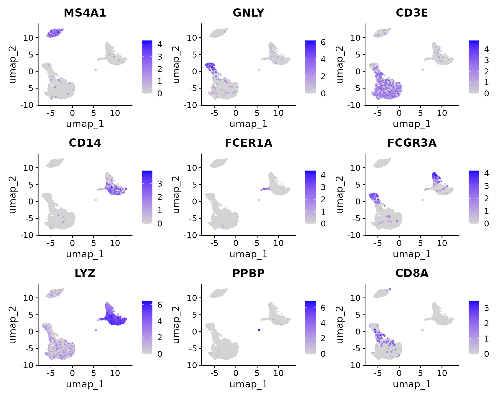
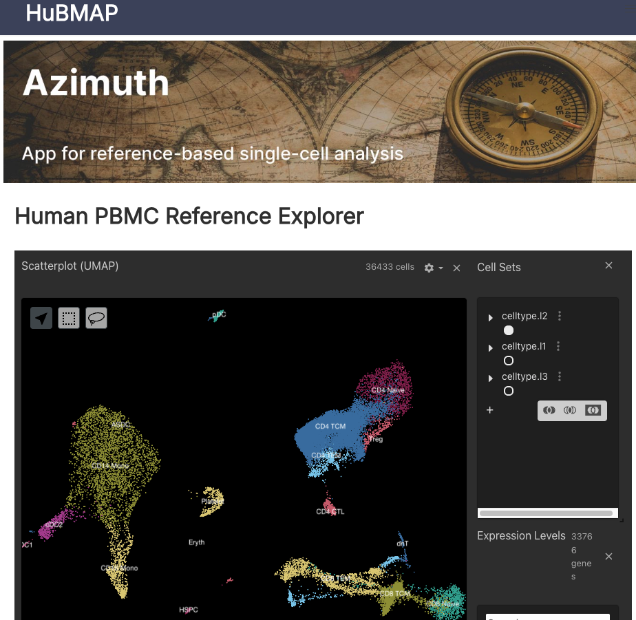
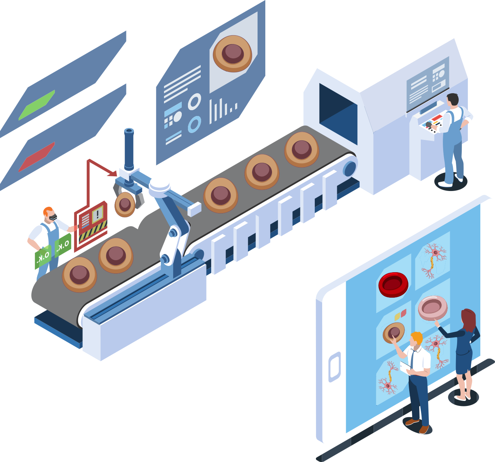

```{r setup, include = FALSE}
# Setup chunk
# Paquetes a usar
#options(htmltools.dir.version = FALSE) cambia la forma de incluir código, los colores

library(knitr)
library(tidyverse)
library(xaringanExtra)
library(icons)
library(fontawesome)
library(emo)
library(countdown) # remotes::install_github("gadenbuie/countdown", subdir = "r"), Explicacion de su uso: https://pkg.garrickadenbuie.com/countdown/#5
library(palmerpenguins)

# set default options
opts_chunk$set(collapse = TRUE,
               dpi = 300,
               warning = FALSE,
               error = FALSE,
               comment = "#")

top_icon = function(x) {
  icons::icon_style(
    icons::fontawesome(x),
    position = "fixed", top = 10, right = 10
  )
}

knit_engines$set("yaml", "markdown")

# Con la tecla "O" permite ver todas las diapositivas
xaringanExtra::use_tile_view()
# Agrega el boton de copiar los códigos de los chunks
xaringanExtra::use_clipboard()

# Crea paneles impresionantes 
xaringanExtra::use_panelset()

# Para compartir e incrustar en otro sitio web
xaringanExtra::use_share_again()
xaringanExtra::style_share_again(
  share_buttons = c("twitter", "linkedin")
)

# Funcionalidades de los chunks, pone un triangulito junto a la línea que se señala
xaringanExtra::use_extra_styles(
  hover_code_line = TRUE,         #<<
  mute_unhighlighted_code = TRUE  #<<
)

# Agregar web cam
xaringanExtra::use_webcam()

# barra de progreso
xaringanExtra::use_progress_bar(color = "#0051BA", location = "top", height = "10px")
```

```{r xaringan-editable, echo=FALSE}
# Para tener opciones para hacer editable algun chunk
xaringanExtra::use_editable(expires = 1)
# Para hacer que aparezca el lápiz y goma
xaringanExtra::use_scribble()
```

```{r xaringan-themer Eve, include=FALSE, warning=FALSE}
# Establecer colores para el tema
library(xaringanthemer)

palette <- c(
 orange        = "#fb5607",
 pink          = "#ff006e",
 blue_violet   = "#8338ec",
 zomp          = "#38A88E",
 shadow        = "#87826E",
 blue          = "#1381B0",
 yellow_orange = "#FF961C"
  )

#style_xaringan(
style_duo_accent(
  background_color = "#FFFFFF", # color del fondo
  link_color = "#562457", # color de los links
  text_bold_color = "#225ea8",
  primary_color = "#01002B", # Color 1
  secondary_color = "#CB6CE6", # Color 2
  inverse_background_color = "#41b6c4", # Color de fondo secundario 
  colors = palette,
  
  # Tipos de letra
  header_font_google = google_font("Barlow Condensed", "600"), #titulo
  text_font_google   = google_font("Work Sans", "300", "300i"), #texto
  code_font_google   = google_font("IBM Plex Mono") #codigo
  #text_font_size = "1.5rem" # Tamano de letra
)

# https://www.rdocumentation.org/packages/xaringanthemer/versions/0.3.4/topics/style_duo_accent
```

class: title-slide, middle, center
background-image: url(figures/Slide1.png) 
background-position: 90% 75%, 75% 75%, center
background-size: 1210px,210px, cover


.center-column[
# `r rmarkdown::metadata$title`
### `r rmarkdown::metadata$subtitle`

#### <span class="author">`r rmarkdown::metadata$author`</span>
#### <span class="date">`r rmarkdown::metadata$date`</span>
]

.left[.footnote[
[R-Ladies Theme](https://www.apreshill.com/project/rladies-xaringan/)]]

---

# Instalar estos paquetes

```{r, eval=FALSE}
# Instalar Azimuth
update.packages(oldPkgs = c("withr", "rlang"))
# instalar remotes (Si no lo tienes)
if (!requireNamespace('remotes', quietly = TRUE)) {
  install.packages('remotes')
}

BiocManager::install(c("SingleCellExperiment","SingleR","celldex"),ask=F)

# instalar paquetes extras necesarios para Azimuth
BiocManager::install('multtest')
install.packages('metap')
BiocManager::install(c("GenomicRanges", "IRanges", "S4Vectors"))
```

---

class: inverse, center, middle

`r fontawesome::fa("laptop-file", height = "3em")`
# Identificación de genes marcadores

---

## Los genes marcadores son el puente entre los clústeres matemáticos y la biología real

- 🔑 **El reto principal** en scRNA-seq no es obtener clústeres, sino interpretarlos biológicamente.
- 📊 Los clústeres se generan con relativa facilidad, pero asignarles un estado celular requiere **conectar datos actuales con conocimiento previo**.
- ❓ El concepto de “tipo celular” no está claramente definido; muchas veces se basa en intuición más que en criterios computacionales.
- ⏳ La interpretación suele ser un paso **manual y un cuello de botella** en el flujo de análisis.
- 🧩 Para agilizar este proceso se usan enfoques computacionales que aprovechan **información previa**:
  + Conjuntos de genes curados asociados a procesos biológicos (ej. Gene Ontology, KEGG).
  + Comparación directa con datasets de referencia publicados, donde las células ya fueron anotadas por expertos.
- 📚 Estos enfoques permiten asignar significado a datasets no caracterizados y facilitan la **identificación de genes marcadores**.

---

class: inverse, center, middle

`r fontawesome::fa("circle-question", height = "3em")`
# Usar funciones en Seurat

---

## `FindAllMarkers` y `FindMarkers`: obtener lista de geens relevantes

- `FindAllMarkers` = visión global de todos los clústeres.
- `FindMarkers` = análisis focalizado en un clúster o comparación específica.

| Función            | ¿Qué hace?                                                                 | Cuándo usarla                                                                 | Ejemplo típico                                                                 |
|---------------------|-----------------------------------------------------------------------------|-------------------------------------------------------------------------------|--------------------------------------------------------------------------------|
| **FindAllMarkers**  | Calcula genes marcadores para **todos los clústeres**, comparando cada uno contra el resto. | Cuando quieres obtener una lista completa de genes característicos de cada clúster en tu dataset. | Al inicio de la interpretación biológica, para asignar identidades celulares a todos los clústeres. |
| **FindMarkers**     | Calcula genes marcadores para **un clúster específico**, comparado contra otro clúster o contra todas las demás células. | Cuando ya identificaste un clúster de interés y quieres analizarlo en detalle. | Comparar células T CD4+ vs CD8+, o un clúster sospechoso de células infectadas vs controles. |

---

## Ejemplo 1: Identificación de genes marcadores

Corre `FindMarkers` para el cluster 0. Ese comando está buscando marcadores positivos del `cluster 0`, usando un criterio de discriminación `ROC` y filtrando por `logFC > 0.25`. El resultado es una lista de genes que definen mejor ese cluster frente al resto, útiles para anotarlo como un tipo celular específico.

```{r, eval=FALSE}
cluster0.markers <- FindMarkers(pbmc, ident.1 = 0, 
                                logfc.threshold = 0.25, 
                                test.use = "roc", 
                                only.pos = TRUE) # solo se reportan genes sobreexpresados en el cluster 0 (no los que están reprimidos)
```

---

## Ejemplo 2: Identificación de genes marcadores

Corre `FindAllMarkers` para cada cluster en el objeto y devuelve una tabla con los genes marcadores de todos los clusters.

.pull-left[
```{r, eval=FALSE}
markers_genes <- FindAllMarkers(
    alldata,
    log2FC.threshold = 0.2, 
    test.use = "wilcox", # método estadístico 
    min.pct = 0.1, 
    min.diff.pct = 0.2,
    only.pos = TRUE, 
    max.cells.per.ident = 50,
    assay = "RNA"
)
```
]

.pull-right[
- **Para clústeres grandes (>200 células)**: Wilcoxon es suficiente.
- **Para clústeres medianos (100–200 células)**: MAST es recomendable.
- **Para clústeres muy pequeños (<50 células)**: MAST o ROC son más adecuados, aunque los resultados deben interpretarse con cautela.
]

---

## Diferencias

- `FindMarkers()` → compara un cluster específico (`ident.1`) contra otro (`ident.2`) o contra el resto de células.

- `FindAllMarkers()` → ejecuta ese mismo análisis para cada cluster en el objeto, uno por uno, y devuelve una tabla combinada con los genes marcadores de todos los clusters.

---

| Prueba estadística              | Descripción                                                                 | Cuándo usarla                                                                 | Ventajas                                                                 | Limitaciones                                                                 |
|---------------------------------|-----------------------------------------------------------------------------|-------------------------------------------------------------------------------|--------------------------------------------------------------------------|------------------------------------------------------------------------------|
| **Wilcoxon Rank Sum Test**      | Prueba no paramétrica que compara distribuciones de expresión entre grupos. | General, clústeres medianos o grandes (>100 células).                         | Robusta, ampliamente usada en scRNA-seq.                                  | Menos potente en clústeres pequeños (<50 células).                           |
| **t-test**                      | Compara medias de expresión bajo supuestos de normalidad.                   | Datos con distribución cercana a normal y clústeres grandes.                  | Fácil de interpretar, rápido.                                             | No robusto frente a outliers o distribuciones sesgadas.                      |
| **Likelihood-ratio test (LR)**  | Compara modelos de regresión con y sin la variable de interés.              | Cuando se quiere ajustar por covariables (batch, condición).                  | Permite incluir factores adicionales.                                     | Más complejo, requiere mayor poder computacional.                            |
| **MAST**                        | Modelo lineal que considera proporción de células expresando y nivel medio. | Clústeres pequeños o medianos (50–200 células) con muchos ceros (dropouts).   | Diseñado para scRNA-seq, maneja bien la dispersión.                       | Computacionalmente más pesado, requiere paquete externo.                     |
| **ROC test**                    | Evalúa si un gen discrimina bien entre dos grupos mediante curvas ROC.      | Clústeres muy pequeños (<50 células) o búsqueda de genes altamente específicos. | Intuitivo para evaluar poder discriminante de genes individuales.         | Menos usado para análisis global, más útil para genes puntuales.             |

---

class: inverse, center, middle

`r fontawesome::fa("chart-line", height = "3em")`
# Visualizar resultados

---

.pull-left[
## Heatmap

- **¿Qué muestran?**: niveles de expresión de muchos genes en muchas células/clusters, con colores que representan intensidad.

- **Cuándo usarlo:**
  + Para visualizar patrones de coexpresión y relaciones entre genes y clusters.
  + Ideal para resúmenes globales y para identificar grupos de genes que definen cada cluster.
  + Ejemplo: mostrar los top 10 genes por cluster y ver cómo se agrupan los perfiles de expresión.
]

.pull-right[

```{r heatmap_plot, message=FALSE, warning=FALSE, echo=FALSE}
library(tidyverse)
library(patchwork)
library(Seurat) ## paquete principal de este capítulo
# Cargar el objeto desde el archivo RDS
alldata_top5 <- readRDS("practica/output/alldata_top5.rds")
top5 <- readRDS("practica/output/top5.rds")
sel.clust <- "RNA_snn_res.0.5"
DoHeatmap(alldata_top5, features = as.character(unique(top5$gene)), group.by = sel.clust, assay = "RNA")
```
]

---

.pull-left[
## Dotplot

- **¿Qué muestran?**: porcentaje de células que expresan un gen (tamaño del punto) y nivel de expresión promedio (color).

- **Cuándo usarlo:**
  + Para comparar varios genes a la vez en múltiples clusters o condiciones.
  + Ideal para ver patrones globales y diferencias entre grupos.
  + Ejemplo: comparar los 10 genes más conservados entre Control y Covid en todos los tipos celulares.
  ]

.pull-right[

```{r dotplot, message=FALSE, warning=FALSE, echo=FALSE}
DotPlot(alldata_top5, features = rev(as.character(unique(top5$gene))), group.by = sel.clust, assay = "RNA") + coord_flip()
```
]

---

.pull-left[
## Violin plot

- **¿Qué muestran?**: distribución completa de la expresión de un gen en cada cluster o condición.

- **Cuándo usarlo:**
  + Para inspeccionar un gen específico y ver cómo varía su expresión dentro de cada grupo.
  + Útil para detectar subpoblaciones o heterogeneidad dentro de un cluster.
  + Ejemplo: ver si un marcador de T cells se expresa homogéneamente en todo el cluster o solo en una fracción.
  ]

.pull-right[
```{r violinplot, message=FALSE, warning=FALSE, echo=FALSE}
VlnPlot(alldata_top5, features = c("IL7R", "CCR7"))
```

]

---

.pull-left[
## **Gradientes** en UMAP 

- Es una **transición continua** en los datos.
- **Variación continua** en los datos.
- Se interpreta como un **cambio progresivo** en la expresión génica.
- **¿Cómo se calcula?:** aparece al reducir dimensionalidad (ej. UMAP, PCA, t-SNE) y observar un continuo de células en lugar de clústeres discretos.
- **¿De qué depende?:** de la matriz de expresión génica (scRNA-seq) y de la técnica de reducción de dimensionalidad. 
- **Resultado:** muestra variación progresiva en perfiles de expresión.grad
]


.pull-right[
Ejemplo: células que muestran un aumento gradual en la expresión de un marcador conforme pasan de un estado “A” a un estado “B”.

```{r, echo=FALSE, out.width='100%', fig.align='center'}

```
]

.footnote-right[ 
[Ejemplo PBMC3K](https://satijalab.org/seurat/articles/pbmc3k_tutorial)]

---

class: inverse, center, middle

`r fontawesome::fa("chart-area", height = "3em")`
# Anotación de los tipos celulares / Asignar identidad celular

---

## Paquetes y bases de datos

| Paquete / Recurso   | Descripción                                                                 | Uso principal                                                                 |
|---------------------|-----------------------------------------------------------------------------|-------------------------------------------------------------------------------|
| [**Azimuth**](https://azimuth.hubmapconsortium.org/)         | Usa referencias curadas (ej. PBMC, tejidos humanos) para proyectar tu dataset y asignar identidades celulares. | Anotación automática basada en mapas moleculares de referencia; integración directa con Seurat. |
| **SingleR**         | Asigna tipos celulares comparando perfiles de expresión con referencias anotadas (bulk o scRNA-seq). | Anotación automática usando datasets de referencia como Blueprint, ENCODE, HPCA. |
| **celldex**         | Colección de referencias curadas (bulk RNA-seq, microarrays) para usar con SingleR. | Proporciona datasets de referencia listos para anotación (ej. BlueprintEncode, HPCA, MouseRNAseq). |
| **scmap**           | Método de proyección que asigna células a clústeres de referencia.          | Anotación rápida de células individuales o clústeres completos contra un dataset de referencia. |
| **Garnett**         | Clasificadores basados en reglas y genes marcadores definidos por el usuario. | Anotación supervisada cuando tienes listas de genes marcadores conocidos. |
| **CellAssign**      | Modelo bayesiano que asigna tipos celulares usando conjuntos de genes marcadores predefinidos. | Útil cuando se dispone de listas de genes específicos para cada tipo celular. |
| **CHETAH**          | Clasificador jerárquico que asigna células a tipos conocidos o las deja como “intermedias”. | Anotación flexible, permite identificar estados celulares transicionales. |
| **scCATCH**         | Combina expresión diferencial y conocimiento de bases de datos de marcadores. | Anotación semi-automática con soporte de literatura y bases de datos. |
| **Seurat + referencias externas** | Permite integrar datasets anotados como referencia (ej. usando `FindTransferAnchors`). | Transferencia de etiquetas desde un dataset anotado a tu dataset nuevo. |

---

## [Azimuth](https://azimuth.hubmapconsortium.org/)

.pull-left[
Azimuth es una herramienta de anotación basada en referencias que permite asignar identidades celulares a tus clústeres de scRNA-seq comparando tu dataset con mapas moleculares curados de tejidos humanos y de ratón.

- **Rapidez y reproducibilidad**: Evita depender solo de intuición o inspección manual de genes marcadores.
- **Cobertura amplia**: Incluye referencias para múltiples tejidos humanos y algunos de ratón.
- **Integración con Seurat**: Puedes correr RunAzimuth() directamente en R y obtener anotaciones dentro de tu objeto Seurat.
]

.pull-right[
```{r, echo=FALSE, out.width='70%', fig.align='center'}

```
[Human PBMC Reference Explorer](https://azimuth.hubmapconsortium.org/references/human_pbmc/) 
]

---

## Niveles

En Azimuth, las columnas `predicted.celltype.l1, predicted.celltype.l2` y `predicted.celltype.l3` representan distintos niveles de detalle en la anotación automática de tipos celulares:

- `predicted.celltype.l1` → nivel más general (ej. “T cell”, “B cell”, “Monocyte”).
- `predicted.celltype.l2` → nivel intermedio, con subtipos más específicos (ej. “Naive CD4 T”, “Memory CD4 T”, “CD14+ Monocyte”).
- `predicted.celltype.l3` → nivel más fino, con anotaciones aún más detalladas según la referencia usada (ej. “Naive CD4 T (CCR7+)”, “Effector CD8 T”, “Plasmacytoid DC”).

---

## [CellTyping](https://www.celltypist.org/)

.pull-left[
- 🔑 **Herramienta en Python** para anotación automática de tipos celulares en scRNA-seq.
- 🧬 Modelos pre-entrenados basados en datos del **Human Cell Atlas** y otros proyectos de referencia.
- ⚡ Rápido y escalable, diseñado para trabajar con datasets grandes.
- 🔎 Entrada flexible: acepta formatos comunes como .csv y .h5ad (AnnData).
- 📊 Salida clara: asigna etiquetas celulares y permite usar estrategias como majority voting para mayor robustez.
- 🌍 Comunidad activa: modelos en constante actualización y expansión.
- ⚠️ Limitación: depende de que el tipo celular esté representado en el modelo; siempre se recomienda validar con genes marcadores y literatura.
]

.pull-right[
```{r, echo=FALSE, out.width='70%', fig.align='center'}

```
]

---

class: inverse, center, middle

`r fontawesome::fa("code", height = "3em")`
# Ejercicios

---

## Dataset: pacientes con COVID-19 vs sanos

- **Control de calidad y normalización de los datos**
  + Descarga el archivo: [Practica1.qmd](https://github.com/EveliaCoss/Workshop_scRNAseq_presentacion/blob/main/practica/Practica1.qmd)
  + Visualización del reporte final: [Practica1](https://eveliacoss.github.io/Workshop_scRNAseq_presentacion/practica
/Practica1.html)
  + 🌟 Checkpoint: [pbmc3k_tutorial.rds](https://drive.google.com/file/d/121V7fFNFKmuG5cD7ng_mYt3DMEGoFErw/view?usp=drive_link)

- **Reducción de dimensiones e integración de datos**
  + Descarga el archivo: [Practica2.qmd](https://github.com/EveliaCoss/Workshop_scRNAseq_presentacion/blob/main/practica/Practica1.qmd)
  + Visualización del reporte final: [Practica2](https://eveliacoss.github.io/Workshop_scRNAseq_presentacion/practica
/Practica2.html)
  + 🌟 Checkpoint: [pbmc3k_integrated.rds](https://drive.google.com/file/d/1D5BQAt-8x-eYQo2_6S5muEE4nbXMuL6d/view?usp=drive_link)

- **Biomarcadores y anotación de los tipos celulares**
  + Descarga el archivo: [Practica3.qmd](https://github.com/EveliaCoss/Workshop_scRNAseq_presentacion/blob/main/practica/Practica1.qmd)
  + 🌟 Checkpoint: [pbmc3k_annotated.rds](https://drive.google.com/file/d/12SuvKiwChYNxuawaZH5UAhcDqx1IIspr/view?usp=drive_link)
  
---

class: center, middle

`r fontawesome::fa("code", height = "3em")`
## Gracias por su atención

Respira y coméntame tus dudas. 

```{r, echo=FALSE, out.width='20%', fig.align='right'}
knitr::include_graphics("figures/cat.png")
```

.left[.footnote[.black[
Imagen tomada de: [Allison Horst](https://allisonhorst.com/) 
]]]