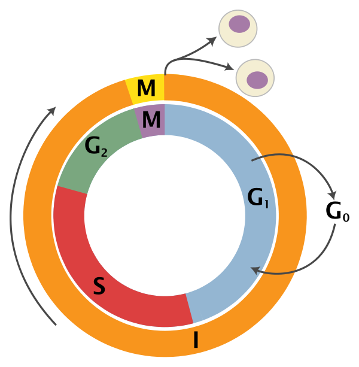
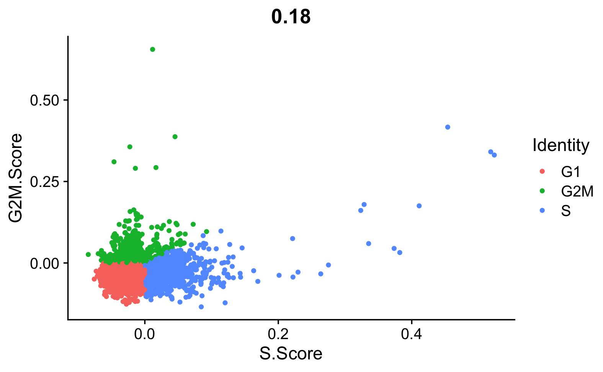
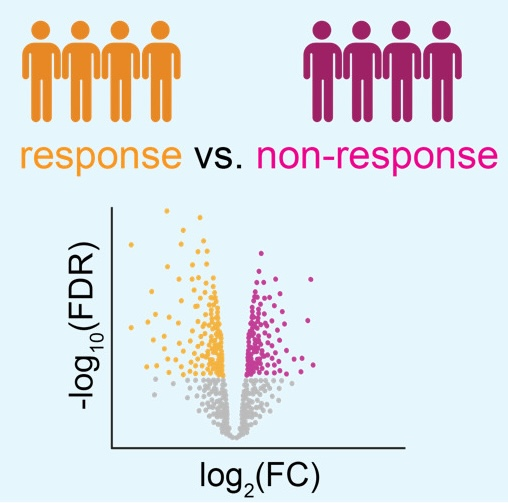
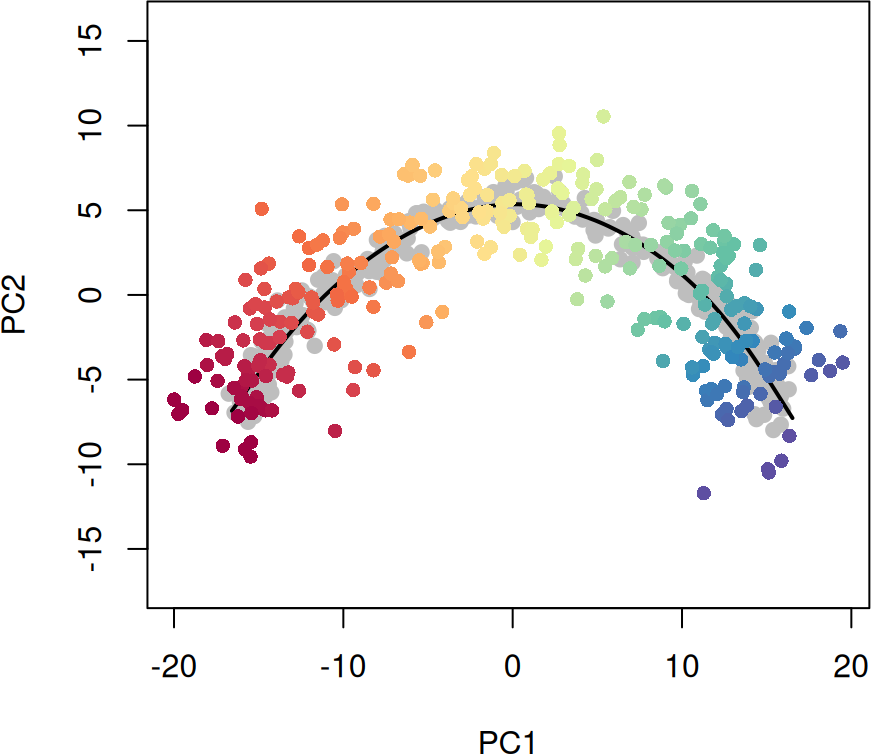
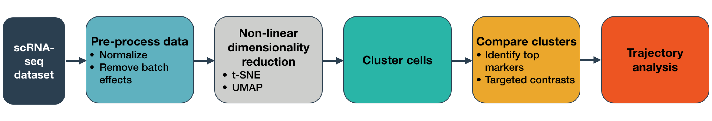
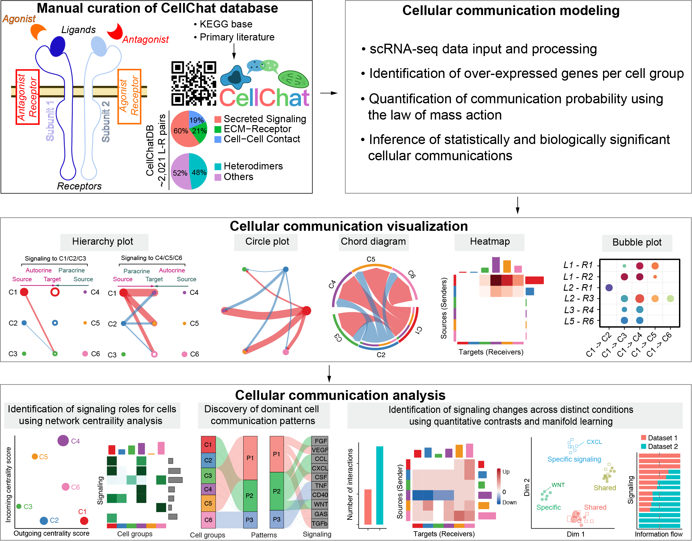
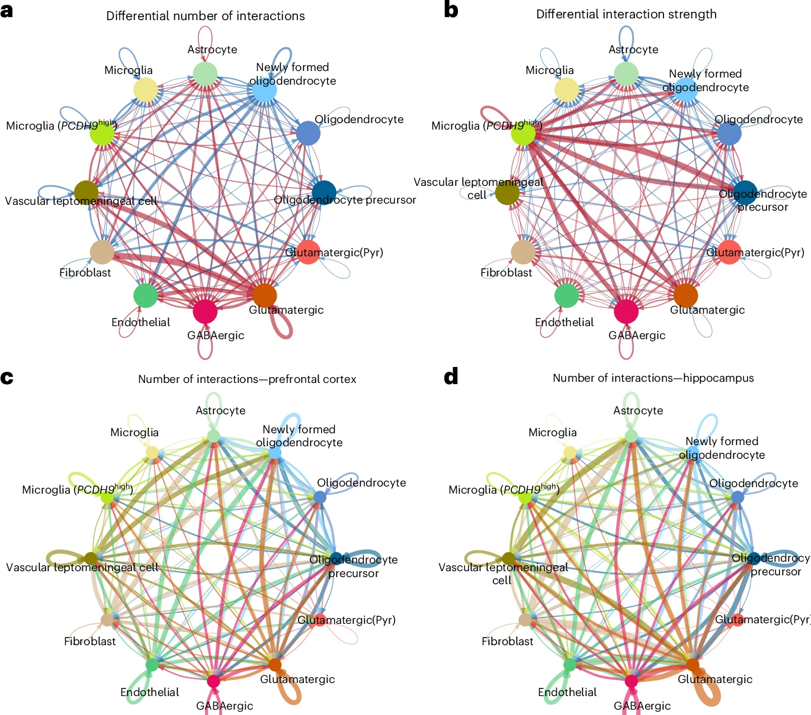

```{r setup, include = FALSE}
# Setup chunk
# Paquetes a usar
#options(htmltools.dir.version = FALSE) cambia la forma de incluir código, los colores

library(knitr)
library(tidyverse)
library(xaringanExtra)
library(icons)
library(fontawesome)
library(emo)
library(countdown) # remotes::install_github("gadenbuie/countdown", subdir = "r"), Explicacion de su uso: https://pkg.garrickadenbuie.com/countdown/#5
library(palmerpenguins)

# set default options
opts_chunk$set(collapse = TRUE,
               dpi = 300,
               warning = FALSE,
               error = FALSE,
               comment = "#")

top_icon = function(x) {
  icons::icon_style(
    icons::fontawesome(x),
    position = "fixed", top = 10, right = 10
  )
}

knit_engines$set("yaml", "markdown")

# Con la tecla "O" permite ver todas las diapositivas
xaringanExtra::use_tile_view()
# Agrega el boton de copiar los códigos de los chunks
xaringanExtra::use_clipboard()

# Crea paneles impresionantes 
xaringanExtra::use_panelset()

# Para compartir e incrustar en otro sitio web
xaringanExtra::use_share_again()
xaringanExtra::style_share_again(
  share_buttons = c("twitter", "linkedin")
)

# Funcionalidades de los chunks, pone un triangulito junto a la línea que se señala
xaringanExtra::use_extra_styles(
  hover_code_line = TRUE,         #<<
  mute_unhighlighted_code = TRUE  #<<
)

# Agregar web cam
xaringanExtra::use_webcam()

# barra de progreso
xaringanExtra::use_progress_bar(color = "#0051BA", location = "top", height = "10px")
```

```{r xaringan-editable, echo=FALSE}
# Para tener opciones para hacer editable algun chunk
xaringanExtra::use_editable(expires = 1)
# Para hacer que aparezca el lápiz y goma
xaringanExtra::use_scribble()
```

```{r xaringan-themer Eve, include=FALSE, warning=FALSE}
# Establecer colores para el tema
library(xaringanthemer)

palette <- c(
 orange        = "#fb5607",
 pink          = "#ff006e",
 blue_violet   = "#8338ec",
 zomp          = "#38A88E",
 shadow        = "#87826E",
 blue          = "#1381B0",
 yellow_orange = "#FF961C"
  )

#style_xaringan(
style_duo_accent(
  background_color = "#FFFFFF", # color del fondo
  link_color = "#562457", # color de los links
  text_bold_color = "#225ea8",
  primary_color = "#01002B", # Color 1
  secondary_color = "#CB6CE6", # Color 2
  inverse_background_color = "#41b6c4", # Color de fondo secundario 
  colors = palette,
  
  # Tipos de letra
  header_font_google = google_font("Barlow Condensed", "600"), #titulo
  text_font_google   = google_font("Work Sans", "300", "300i"), #texto
  code_font_google   = google_font("IBM Plex Mono") #codigo
  #text_font_size = "1.5rem" # Tamano de letra
)

# https://www.rdocumentation.org/packages/xaringanthemer/versions/0.3.4/topics/style_duo_accent
```

class: title-slide, middle, center
background-image: url(figures/Slide1.png) 
background-position: 90% 75%, 75% 75%, center
background-size: 1210px,210px, cover


.center-column[
# `r rmarkdown::metadata$title`
### `r rmarkdown::metadata$subtitle`

#### <span class="author">`r rmarkdown::metadata$author`</span>
#### <span class="date">`r rmarkdown::metadata$date`</span>
]

.left[.footnote[
[R-Ladies Theme](https://www.apreshill.com/project/rladies-xaringan/)]]

---

class: inverse, center, middle

`r fontawesome::fa("laptop-file", height = "3em")`
# Pipeline con **varios datasets**

---

## Pipeline con **varios datasets**:

.pull-left[
**Clase 2. Control de calidad y Normalización con Seurat**
- Paso 1. Descarga e importación de datos en R
- Paso 2. Estructura del objeto `Seurat`
- Paso 3. Control de calidad con `Seurat`
- Paso 4. Normalización de los datos

**Clase 3. Selección de genes altamente variables, Reducción de dimensiones y clustering**
- Paso 5. Selección de genes altamente variables de cada objeto
- Paso 6. Escalamiento de los datos de cada objeto
- Paso 7. Encontrar “anchors” de integración
- Paso 8. Integración de datasets
- Paso 9. Determinar dimensionalidad  
- Paso 10. Decidir cuántas PCs usar 
- Paso 11. Clustering de células  
- Paso 12. Reducciones no lineales (UMAP/t-SNE)
]

.pull-right[
**Clase 4. Identificación de genes marcadores y Anotación de tipos celulares**
- Paso 13. Identificación de genes marcadores
- Paso 14. Anotación de los tipos celulares / Asignar identidad celular
- Paso 15. Visualización gráfica (heatmap, dotplot, violin plot, gradiantes)

**Clase 5. Expresión diferencial por condiciones e Inferencia de trayectorias**
- Paso 16. Control del ciclo celular
- Paso 17. Expresión diferencial entre condiciones
- Paso 18. Detección de Trayectorias (pseudotime / diferenciación)

**Clase 6. Comunicación celular**
- Paso 19. Comunicación celular (CellChat)
]

---

class: inverse, center, middle

`r fontawesome::fa("atom", height = "3em")`
# Ciclo celular en scRNA-seq

---

.pull-left[
## Información general del Ciclo celular 

Para examinar la **variación del ciclo celular** en nuestros datos, asignamos a cada célula una puntuación, basada en la expresión de marcadores de las fases G2/M y S.

- **¿Por qué es importante?**
  + Genes asociados a fases S y G2/M (ej. *MKI67, TOP2A, CCNB1*) generan variabilidad que puede dominar PCA o clustering.
  + Si no se controla, puede confundirse con diferencias de condición o linaje.
]

.pull-right[

```{r, echo=FALSE, out.width='60%', fig.align='center'}

```
.content-box-blue[ 
- **G0:** reposo/quiescencia. Célula no se divide (ej. neuronas).
- **G1:** crecimiento inicial. La célula aumenta tamaño y componentes.
- **S:** síntesis. Se replican los cromosomas.
- **G2:** preparación final. Crece más y organiza el huso mitótico.
- **M:** mitosis. División nuclear (profase, metafase, anafase, telofase).
]
]


.footnote[
Adaptado de [Wikipedia](https://en.wikipedia.org/wiki/Cell_cycle) (Licencia de imagen: CC BY-SA 3.0)
]

---

.pull-left[
## Ciclo celular

Se puede asignar **fase de ciclo celular** (G1, S, G2/M) usando funciones como `CellCycleScoring` en `Seurat`, que emplea listas de genes asociados a cada fase (`cc.genes.updated.2019$s.genes`).

Esto es útil para verificar si la variabilidad entre clusters está influenciada por el **ciclo celular** y, si es necesario, regredir ese efecto en la normalización.

🔹 **Qué contesta este análisis:**

- ¿Qué proporción de células está proliferando?
- ¿El ciclo celular explica la variabilidad entre clusters?
- ¿Debo corregirlo para evitar sesgos en trayectorias o DE?

]

.pull-right[
```{r, echo=FALSE, out.width='100%', fig.align='center'}

```
.content-box-yellow[ 
👉 Ideas claves: 
- **G0:** reposo/quiescencia (pausa opcional).
- **G1:** crecimiento inicial.
- **S:** síntesis de ADN.
- **G2:** preparación final para dividirse.
- **M:** mitosis (división nuclear).
]

]

.footnote[ [Cell-Cycle Scoring and Regression](https://satijalab.org/seurat/articles/cell_cycle_vignette.html), Tutorial [https://satijalab.org/seurat/articles/cell_cycle_vignette](https://satijalab.org/seurat/articles/cell_cycle_vignette)
]

---

class: inverse, center, middle

`r fontawesome::fa("atom", height = "3em")`
# Expresión diferencial entre condiciones y pseudobulk

---

## Expresión diferencial entre condiciones

.pull-left[
- **Objetivo:** comparar condiciones (ej. sano vs enfermo, tratado vs control) dentro de cada tipo celular o cluster.
- **Responde:** qué genes cambian significativamente entre condiciones.
- **Uso típico:** cuando tu hipótesis es sobre diferencias moleculares entre grupos.
]

.pull-right[
```{r, echo=FALSE, out.width='80%', fig.align='center'}

```
]

.footnote[
Imagen tomada de: [Rathgeber, etal. Clinical Hematology International](https://chi.scholasticahq.com/article/117961-single-cell-genomics-based-immune-and-disease-monitoring-in-blood-malignancies) 
]

---

## Pseudobulk

- **¿Dónde entra?** después de la anotación y agrupación por condición.
  + Se hace al agregar las cuentas de células individuales por cluster y condición, generando un perfil tipo bulk RNA-seq.
  + El análisis single-cell tiene mucho ruido y dropout (genes no detectados en muchas células).
  + Al sumar las cuentas de células de un mismo tipo/condición, reduces ese ruido y obtienes perfiles más estables.

- **¿Qué contesta?**
  + Permite hacer **expresión diferencial robusta entre condiciones**, usando herramientas clásicas de bulk (`DESeq2, edgeR, limma`).
  + **Reduce ruido** de célula individual y controla mejor la variabilidad técnica.
  + Responde preguntas de tipo: qué genes cambian en un **tipo celular específico entre condiciones**, con mayor poder estadístico.
  
---

## Pseudobulk - ¿Cuándo preferirlo?

- Cuando tu hipótesis es sobre **diferencias entre condiciones** (ej. sano vs enfermo) en tipos celulares específicos.
- Cuando necesitas resultados **estadísticamente sólidos y comparables con bulk RNA-seq**.
- Cuando quieres **evitar sesgos** por tratar cada célula como un replicado independiente.

.pull-left[
1) Definir las agrupaciones (sample/condición/células de interés). Ejemplo: `sample_id, celltype`.

2) Extraer cuentas crudas.  

3) Agrupar por muestra y condición (pseudobulk). 

4) Crear objeto DESeq2

5) [Visualización y análisis](https://satijalab.org/seurat/articles/visualization_vignette)
]

.pull-right[
El pseudobulking en `Seurat` se realiza usando la función `AggregateExpression()`. 

```{r, eval=FALSE}
pseudo_ifnb <- AggregateExpression(ifnb, assays = "RNA", return.seurat = T, group.by = c("stim", "donor_id", "seurat_annotations"))
```

]

.content-box-blue[ 
En resumen: aunque el scRNA-seq ya da resolución individual, el **pseudobulk se usa para ganar poder estadístico, reducir ruido y obtener resultados más confiables** en análisis de expresión diferencial entre condiciones.
]

.footnote[
Tutorial: [Differential expression testing](https://satijalab.org/seurat/articles/de_vignette) 
]

---

class: inverse, center, middle

`r fontawesome::fa("circle-nodes", height = "3em")`
# Predicción de Trayectorias

---

.pull-left[
## **Trayectorias** en UMAP 

- Permiten inferir **líneas de tiempo celulares (pseudotime)**, aunque no son tiempo real, sino una reconstrucción basada en similitud de perfiles de expresión.
- Es un camino inferido que conecta poblaciones celulares.
- Se interpreta como un *proceso dinámico, como diferenciación, activación o progresión de enfermedad.*
- **¿Cómo se calcula?:** algoritmos de inferencia de trayectorias (`Monocle, Slingshot, PAGA`) ordenan células a lo largo de un camino.
- **¿De qué depende?:**  de la estructura del gradiente y de la similitud entre células.
- **Resultado**: reconstruye un proceso dinámico y asigna un pseudotime relativo. 
]

.pull-right[
Ejemplo: células madre → progenitoras → diferenciadas, siguiendo un “camino” en el espacio de UMAP.

```{r, echo=FALSE, out.width='100%', fig.align='center'}
knitr::include_graphics("figures/trajectory_exp1.png")
```
]

.footnote[
[Pipelines para inferir la trayectoria](https://biocellgen-public.svi.edu.au/mig_2019_scrnaseq-workshop/trajectory-inference.html) 
]

---

## Pipeline con `Slingshot`

.pull-left[
`Slingshot` es una herramienta de inferencia de linajes unicelulares capaz de trabajar con conjuntos de datos que presentan múltiples ramificaciones. 

**Objetivos:**

- Es una herramienta para inferir linajes celulares en datos de scRNA-seq.
- Puede manejar datasets con múltiples ramas y bifurcaciones.
]

.pull-right[
```{r, echo=FALSE, out.width='100%', fig.align='center'}

```
]

.footnote[ Tutorial de: [Slingshot](https://bioconductor.posit.co/packages/3.23/bioc/vignettes/slingshot/inst/doc/vignette.html)
]

---

## Pipeline de `Slingshot`

Dos etapas principales:

**1) Inferencia de la estructura global de linajes**
  + Usa un MST (Minimum Spanning Tree) basado en clusters.
  + Identifica el número de linajes y los puntos de ramificación.
  + Permite descubrir linajes nuevos y también incorporar conocimiento biológico (ej. estados terminales).

**2) Inferencia de pseudotiempo**
  + Ajusta curvas principales simultáneas (principal curves) a los linajes.
  + Traduce la estructura global en estimaciones estables de pseudotiempo a nivel de célula.


```{r, echo=FALSE, out.width='100%', fig.align='center'}

```
.footnote[Imagen tomada de:
[Monocle3](https://cole-trapnell-lab.github.io/monocle3/docs/installation/); Tutorial de [Slingshot](https://bioconductor.posit.co/packages/3.23/bioc/vignettes/slingshot/inst/doc/vignette.html)
]

---

## **RNA velocity** en UMAP 

.pull-left[
- **¿Cómo se calcula?:** compara la abundancia de RNA no empalmado (pre-mRNA) vs. RNA empalmado (maduro) para cada gen.
- **¿De qué depende?:** de datos de scRNA-seq que distinguen reads empalmados vs. no empalmados (ej. protocolos con suficiente resolución).
- **Resultado**: añade *dirección temporal* al análisis, indicando hacia dónde evoluciona cada célula en el espacio de expresión.
- **¿Qué contesta?**
  + Predice la **dirección futura** de cada célula, usando la proporción de transcritos espliceados vs no espliceados.
  + Permite inferir *dinámica* de transición: hacia qué estado se está moviendo una célula.
  + Complementa pseudotime: mientras pseudotime ordena retrospectivamente, velocity predice prospectivamente.
]


.pull-right[

.content-box-blue[ 
No se hace en `Seurat` directamente, sino con paquetes como `scVelo` (Python) o `velocytoR`. Seurat puede servir como punto de partida para exportar matrices.
]
]

---

## Flujo de trabajo sugerido

1) **Anotación con SingleR** → obtienes etiquetas de tipo celular.

2) **Control de ciclo celular (opcional)** → asignar fases y decidir si corregirlas.

3) **Expresión diferencial entre condiciones** → comparas sano vs enfermo, tratamiento vs control, dentro de cada tipo celular. Puede hacerse a nivel *single-cell o pseudobulk*.

4) **Trayectorias (opcional)** → aplicar pseudotime/velocity para explorar procesos dinámicos. Si tu pregunta es dinámica, puedes ver cómo cambian las trayectorias entre condiciones.

5) **Comunicación celular (CellChat, CellPhoneDB, NicheNet)** → analizas interacciones entre poblaciones, basadas en ligando-receptor.

---

class: inverse, center, middle

`r fontawesome::fa("share-nodes", height = "3em")`
# CellChat

---

## CellChat

.pull-left[
- Diseñado para inferir y visualizar redes de comunicación célula-célula a partir de datos de scRNA-seq.

- Datos de entrada:
  + Matriz de expresión normalizada (genes en filas, células en columnas).
  + Metadatos con anotaciones de grupos celulares (ej. tipos celulares o clusters).
  
- Base de datos:
  + `CellChatDB.human` o `CellChatDB.mouse` (ligando-receptor curados).
]

.pull-right[

```{r, echo=FALSE, out.width='100%', fig.align='center'}
# 

```
]

.footnote[ GitHub de: [CellChat](https://github.com/sqjin/CellChat); Tutotial de [CellChat](https://htmlpreview.github.io/?https://github.com/jinworks/CellChat/blob/master/tutorial/CellChat-vignette.html)
]

---


```{r, echo=FALSE, out.width='60%', fig.align='center'}

```

.footnote[ GitHub de: [CellChat](https://github.com/sqjin/CellChat); Tutotial de [CellChat](https://htmlpreview.github.io/?https://github.com/jinworks/CellChat/blob/master/tutorial/CellChat-vignette.html)
]

---

## Ejemplo: Análisis de comunicación neuronal-microglial (PCDH9high)

Se utilizó el programa CellChat para explorar posibles interacciones ligando-receptor en la comunicación bidireccional entre neuronas y microglía (PCDH9high).

```{r, echo=FALSE, out.width='40%', fig.align='center'}

```
Fig. 6: Cell–cell communication of the neurogenic niches in the prefrontal cortex and hippocampus.

.footnote[ [Chen, *et al*, 2024, *nature medicine*](https://www.nature.com/articles/s41591-024-03150-z)
]

---

## Human Cell Atlas - Brain Cell Atlas

- Título:  A brain cell atlas integrating single-cell transcriptomes across human brain regions
- Link del artículo: https://www.nature.com/articles/s41591-024-03150-z
- Presentación:  https://docs.google.com/presentation/d/1eft2wKhTyt3cFy_lLkVYwJFaDsukAtSfqjw2xsHOAlA/edit?usp=sharing

---

class: center, middle

`r fontawesome::fa("code", height = "3em")`
## Gracias por su atención

Respira y coméntame tus dudas. 

```{r, echo=FALSE, out.width='20%', fig.align='right'}
knitr::include_graphics("figures/cat.png")
```

.footnote[
Imagen tomada de: [Allison Horst](https://allisonhorst.com/) 
]