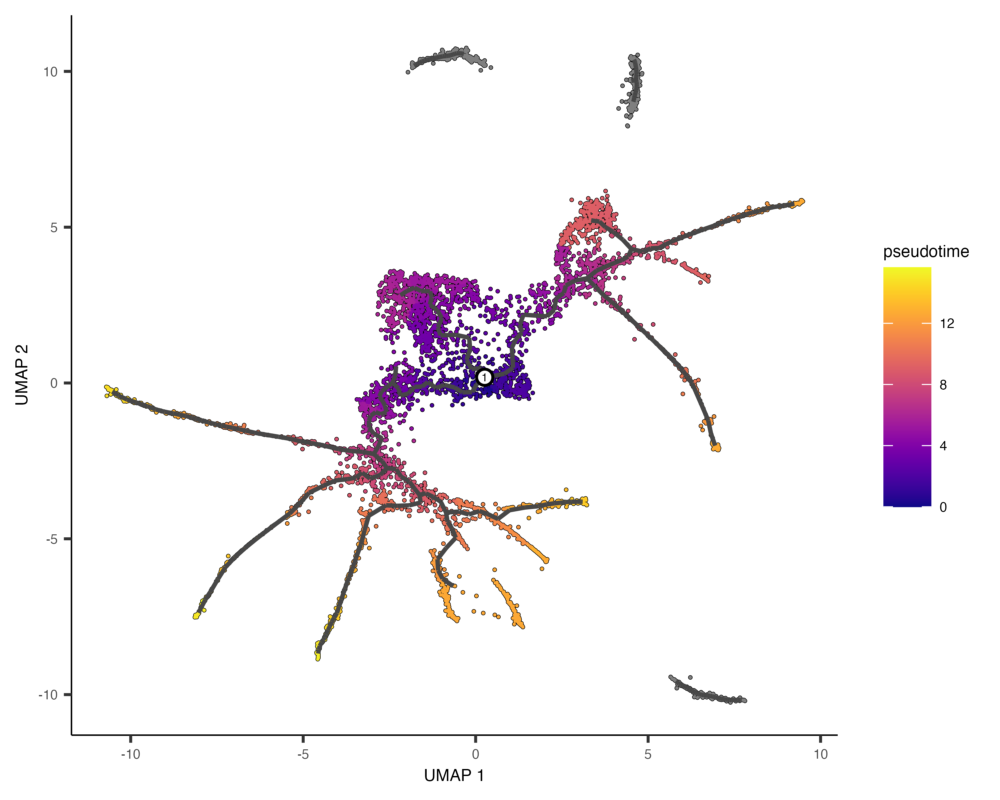

```{r setup, include = FALSE}
# Setup chunk
# Paquetes a usar
#options(htmltools.dir.version = FALSE) cambia la forma de incluir código, los colores

library(knitr)
library(tidyverse)
library(xaringanExtra)
library(icons)
library(fontawesome)
library(emo)
library(countdown) # remotes::install_github("gadenbuie/countdown", subdir = "r"), Explicacion de su uso: https://pkg.garrickadenbuie.com/countdown/#5
library(palmerpenguins)

# set default options
opts_chunk$set(collapse = TRUE,
               dpi = 300,
               warning = FALSE,
               error = FALSE,
               comment = "#")

top_icon = function(x) {
  icons::icon_style(
    icons::fontawesome(x),
    position = "fixed", top = 10, right = 10
  )
}

knit_engines$set("yaml", "markdown")

# Con la tecla "O" permite ver todas las diapositivas
xaringanExtra::use_tile_view()
# Agrega el boton de copiar los códigos de los chunks
xaringanExtra::use_clipboard()

# Crea paneles impresionantes 
xaringanExtra::use_panelset()

# Para compartir e incrustar en otro sitio web
xaringanExtra::use_share_again()
xaringanExtra::style_share_again(
  share_buttons = c("twitter", "linkedin")
)

# Funcionalidades de los chunks, pone un triangulito junto a la línea que se señala
xaringanExtra::use_extra_styles(
  hover_code_line = TRUE,         #<<
  mute_unhighlighted_code = TRUE  #<<
)

# Agregar web cam
xaringanExtra::use_webcam()

# barra de progreso
xaringanExtra::use_progress_bar(color = "#0051BA", location = "top", height = "10px")
```

```{r xaringan-editable, echo=FALSE}
# Para tener opciones para hacer editable algun chunk
xaringanExtra::use_editable(expires = 1)
# Para hacer que aparezca el lápiz y goma
xaringanExtra::use_scribble()
```

```{r xaringan-themer Eve, include=FALSE, warning=FALSE}
# Establecer colores para el tema
library(xaringanthemer)

palette <- c(
 orange        = "#fb5607",
 pink          = "#ff006e",
 blue_violet   = "#8338ec",
 zomp          = "#38A88E",
 shadow        = "#87826E",
 blue          = "#1381B0",
 yellow_orange = "#FF961C"
  )

#style_xaringan(
style_duo_accent(
  background_color = "#FFFFFF", # color del fondo
  link_color = "#562457", # color de los links
  text_bold_color = "#225ea8",
  primary_color = "#01002B", # Color 1
  secondary_color = "#CB6CE6", # Color 2
  inverse_background_color = "#41b6c4", # Color de fondo secundario 
  colors = palette,
  
  # Tipos de letra
  header_font_google = google_font("Barlow Condensed", "600"), #titulo
  text_font_google   = google_font("Work Sans", "300", "300i"), #texto
  code_font_google   = google_font("IBM Plex Mono") #codigo
  #text_font_size = "1.5rem" # Tamano de letra
)

# https://www.rdocumentation.org/packages/xaringanthemer/versions/0.3.4/topics/style_duo_accent
```

class: title-slide, middle, center
background-image: url(figures/Slide1.png) 
background-position: 90% 75%, 75% 75%, center
background-size: 1210px,210px, cover


.center-column[
# `r rmarkdown::metadata$title`
### `r rmarkdown::metadata$subtitle`

#### <span class="author">`r rmarkdown::metadata$author`</span>
#### <span class="date">`r rmarkdown::metadata$date`</span>
]

.left[.footnote[
[R-Ladies Theme](https://www.apreshill.com/project/rladies-xaringan/)]]

---

class: inverse, center, middle

`r fontawesome::fa("laptop-file", height = "3em")`
# Información del dataset y ouput de Cell Ranger

---


---

---

---

.pull-left[
## **Trayectorias** en UMAP 

- Permiten inferir **líneas de tiempo celulares (pseudotime)**, aunque no son tiempo real, sino una reconstrucción basada en similitud de perfiles de expresión.
- Es un camino inferido que conecta poblaciones celulares.
- Se interpreta como un *proceso dinámico, como diferenciación, activación o progresión de enfermedad.*
- **¿Cómo se calcula?:** algoritmos de inferencia de trayectorias (`Monocle, Slingshot, PAGA`) ordenan células a lo largo de un camino.
- **¿De qué depende?:**  de la estructura del gradiente y de la similitud entre células.
- **Resultado**: reconstruye un proceso dinámico y asigna un pseudotime relativo. 
]


.pull-right[
Ejemplo: células madre → progenitoras → diferenciadas, siguiendo un “camino” en el espacio de UMAP.

```{r, echo=FALSE, out.width='100%', fig.align='center'}

```
]

---

.pull-left[
## **RNA velocity** en UMAP 

- **¿Cómo se calcula?:** compara la abundancia de RNA no empalmado (pre-mRNA) vs. RNA empalmado (maduro) para cada gen.
- **¿De qué depende?:** de datos de scRNA-seq que distinguen reads empalmados vs. no empalmados (ej. protocolos con suficiente resolución).
- **Resultado**: añade *dirección temporal* al análisis, indicando hacia dónde evoluciona cada célula en el espacio de expresión.
]


.pull-right[
]

---


---


---


---


---
class: center, middle

`r fontawesome::fa("laptop-file", height = "3em")`
# Zenodo

---

class: center, middle

`r fontawesome::fa("code", height = "3em")`
## Gracias por su atención

Respira y coméntame tus dudas. 

```{r, echo=FALSE, out.width='20%', fig.align='right'}
knitr::include_graphics("figures/cat.png")
```

.left[.footnote[.black[
Imagen tomada de: [Allison Horst](https://allisonhorst.com/) 
]]]