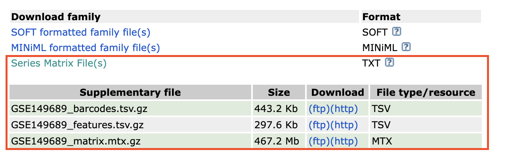
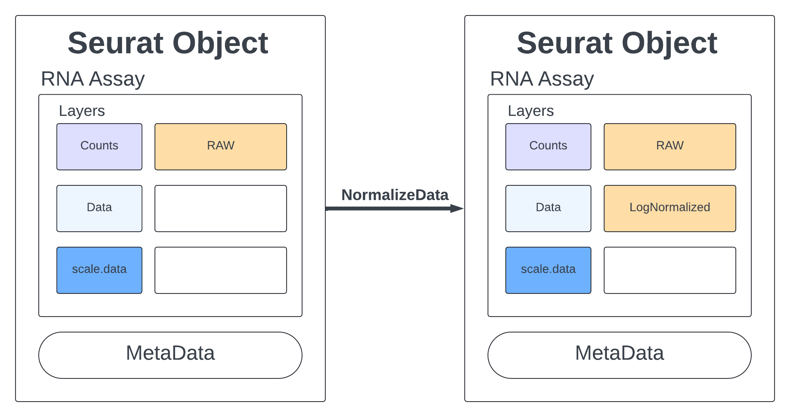

## Descripción de los datos

### Información general

-   **Título del estudio:** Immunophenotyping of COVID-19 and Influenza Underscores the Association of Type I IFN Response in Severe COVID-19
-   **Especie:** *Homo sapiens*
-   **Número de acceso de la base de datos GEO (Gene Expression Omnibus):** [GSE149689](GSE149689)
-   **Tipo de experimento:** scRNA-seq

**Antecedentes:**

Aunque la mayoría de los individuos infectados con SARS-CoV-2 presentan COVID-19 leve, algunos pacientes desarrollan COVID-19 grave, acompañado de síndrome de dificultad respiratoria aguda e inflamación sistémica. Para identificar los factores que impulsan la progresión severa de la enfermedad, realizamos secuenciación de RNA de célula única (single-cell RNA-seq) utilizando células mononucleares de sangre periférica (PBMCs) obtenidas de donadores sanos, pacientes con COVID-19 leve o grave, y pacientes con influenza grave.

**Resultados del artículo:**

Los pacientes con COVID-19 mostraron firmas hiper-inflamatorias en todos los tipos celulares de las PBMCs, particularmente una regulación al alza de la respuesta inflamatoria mediada por *TNF/IL-1β* en comparación con la influenza grave. En los monocitos clásicos de pacientes con COVID-19 grave, la respuesta de interferón tipo I coexistió con la inflamación impulsada por *TNF/IL-1β*, lo cual no se observó en pacientes con infección leve. Con base en esto, proponemos que la respuesta de interferón tipo I exacerba la inflamación en pacientes con infección grave por COVID-19.

**Artículo relacionado:** Lee JS, Park S, Jeong HW, Ahn JY *et al.* Immunophenotyping of COVID-19 and influenza highlights the role of type I interferons in development of severe COVID-19. *Sci Immunol* 2020 Jul 10;5(49). PMID: [32651212](https://www.ncbi.nlm.nih.gov/pubmed/32651212 "Link to PubMed record")

### Diseño experimental

Este estudio se realizó con **secuenciación de RNA de célula única (scRNA-seq)** en **células mononucleares de sangre periférica (PBMCs)** de tres grupos:

-   **5 pacientes con influenza grave**
-   **11 pacientes con COVID-19** (con distintos grados de severidad)
-   **4 controles sanos**

Este diseño permitió comparar directamente las respuestas inmunitarias entre influenza y COVID-19, así como distinguir qué características estaban asociadas con la progresión hacia formas graves de COVID-19.

## Paso 1. Cargar paquetes y datasets en R

### Cargar paquetes

```{r paquetes, message=FALSE, warning=FALSE}
library(Matrix) # install.packages("Matrix")
library(hdf5r)  # install.packages("hdf5r")
library(rhdf5)  # BiocManager::install("rhdf5")
library(dplyr)
library(ggplot2)
library(patchwork)
library(DoubletFinder) # remotes::install_github('chris-mcginnis-ucsf/DoubletFinder', force = TRUE)
library(Seurat) ## paquete principal de este capítulo
```

### Descargar los datasets desde GEO

Archivos que estamos descargando del estudio **GSE149689**:

1.  `GSE149689_series_matrix.txt.gz`

    -   Contiene la **matriz de expresión génica resumida**.
    -   Es un archivo tabular donde cada fila corresponde a un gen y cada columna a una muestra.
    -   Útil para análisis rápidos sin necesidad de reconstruir todo el objeto de secuenciación.

2.  `GSE149689_barcodes.tsv.gz`

    -   Lista de **códigos de barras celulares**.
    -   Cada código identifica una célula individual en el experimento de scRNA-seq.
    -   Permite distinguir las lecturas de cada célula.

3.  `GSE149689_features.tsv.gz`

    -   Contiene la lista de **genes (features)** analizados.
    -   Incluye identificadores como el nombre del gen y, a veces, anotaciones adicionales.
    -   Se usa para mapear las filas de la matriz de conteos.

4.  `GSE149689_matrix.mtx.gz`

    -   Es la **matriz de conteos cruda** en formato *Matrix Market*.
    -   Representa cuántas veces se detectó cada gen en cada célula.
    -   Este archivo, junto con *barcodes* y *features*, forma el conjunto completo para reconstruir el objeto de análisis en herramientas como **Seurat**.

[](https://www.ncbi.nlm.nih.gov/geo/query/acc.cgi?acc=GSE149689)

```{r datasets, eval=FALSE, message=FALSE, warning=FALSE}
# Nombre de la carpeta
dest_dir <- "fullData"

# Si la carpeta existe, eliminarla primero
if (dir.exists(dest_dir)) {
  unlink(dest_dir, recursive = TRUE)
  message("Carpeta eliminada: ", dest_dir)
}
# Crear la carpeta nuevamente
dir.create(dest_dir)
message("Carpeta creada: ", dest_dir)

# Definir carpeta destino
if (!dir.exists(dest_dir)) dir.create(dest_dir)

# Aumentar el tiempo de espera a 10 minutos (600 segundos)
options(timeout = 600)

# Lista de URLs a descargar
urls <- c(
  "ftp://ftp.ncbi.nlm.nih.gov/geo/series/GSE149nnn/GSE149689/matrix/GSE149689_series_matrix.txt.gz",
  "ftp://ftp.ncbi.nlm.nih.gov/geo/series/GSE149nnn/GSE149689/suppl/GSE149689_barcodes.tsv.gz",
  "ftp://ftp.ncbi.nlm.nih.gov/geo/series/GSE149nnn/GSE149689/suppl/GSE149689_features.tsv.gz",
  "ftp://ftp.ncbi.nlm.nih.gov/geo/series/GSE149nnn/GSE149689/suppl/GSE149689_matrix.mtx.gz"
)

# Descargar cada archivo
for (url in urls) {
  dest_file <- file.path(dest_dir, basename(url))
  if (!file.exists(dest_file)) {
    message("Descargando: ", basename(url))
    download.file(url, destfile = dest_file, mode = "wb")
  } else {
    message("Ya existe: ", basename(url))
  }
}
```

### Importar matriz de conteos en R

```{r}
# Leer la matriz de conteos
sm <- as(Matrix::readMM("fullData/GSE149689_matrix.mtx.gz"), Class = "dgCMatrix")
# Leer nombres de genes y células
genes <- as.character(read.delim("fullData/GSE149689_features.tsv.gz", header = FALSE)[,2])
cells <- as.character(read.delim("fullData/GSE149689_barcodes.tsv.gz", header = FALSE)[,1])

# Asignar nombres
rownames(sm) <- genes
colnames(sm) <- cells

# agregar en el slot
sm@Dimnames <- list(genes, cells)
```

### Importar la metadata en R

```{r}
# Leer metadatos de la serie
meta <- read.delim("fullData/GSE149689_series_matrix.txt.gz", 
                   skip = 55, # saltar las líneas iniciales de cabecera.
                   header = TRUE, # Que la celda tenga ese nombre en la columna
                   fill = TRUE) # rellena filas cortas con NA para que todas tengan el mismo número de columnas.

# 
t(meta[c(7,8,9,10,11,12),])

# Contar células por muestra
data.frame(sample = colnames(sm)) %>%
  # Usa sub() para extraer el texto después del último guion (-) en cada nombre de muestra.
  mutate(suffix = sub(".*-", "", sample)) %>%
  # Cuenta cuántas veces aparece cada valor de suffix.
  count(suffix) %>%
  cbind(colnames(meta)[2:21], t(unname(meta[10,2:21])))
```

¿Cuántos genes se detectaron por célula en mi matriz de expresión y cuál es el rango de esos conteos?

```{r}
# Conteo de genes por célula
nC <- colSums(sm, na.rm = TRUE)  # ignora NA
range(nC) # 0 152409
```

¿Cuántas células y genes tenemos detectados?

```{r}
dim(sm) # 33538 85144 (genes, celulas)
```

## Paso 2. Subset de las muestras

Muestras elegidas para ejercicios

-   COVID-19: 1 (M), 15 (F), 16 (F), 17 (M)
-   Normales: 5 (F), 13 (F), 14 (F), 19 (M)

F= Femenino; M= Masculino

```{r}
# Dataset original
# Severe cases:
# 1,9,10,15,16,17
# M,F,M,F,F,M

#Healthy:
# 5,13,14,19
# F,F,F,M
# Only 19 is male.

# Selección de muestras con severidad + sanos
samples_use <- c(c(1,15,16,17),c(5,13,14,19))
# ¿cuántas células pertenecen en total a las muestras 1, 5, 13, 14, 15, 16, 17 y 19?
sum(table(sub(".*-","",colnames(sm)))[as.character(samples_use)]) # 39628

# Selección aleatoria de células de las muestras que definiste en samples_use
sel <- unlist(lapply(samples_use,function(x){
  set.seed(1);x <- sample(size = 1500,grep(paste0("-",x,"$"),colnames(sm),value = T) )
}))
# nueva matriz sm2 que contiene solo las células seleccionadas (1,500 por muestra).
sm2 <- sm[,sel]
# Cuenta cuántas células quedaron por muestra en sm2.
table(sub(".*-","",colnames(sm2)))[as.character(samples_use)]
# 1   15   16   17    5   13   14   19 
# 1500 1500 1500 1500 1500 1500 1500 1500 

dim(sm2) #[1] 33538 12000
```

Si tenías 8 muestras en `samples_use` y tomaste 1,500 células de cada una, deberías obtener 33538 × 12000.

## Paso 3. Guardar en formato HDF5 de 10x

Carga la tabla de anotaciones de genes (`features.tsv.gz`), que contiene ID, nombre y tipo de cada gen.

```{r}
feats <- read.delim("fullData/GSE149689_features.tsv.gz",header = F)
```

Iteración por muestras:

-   Define nombres de archivo como nCoV_PBMC_1.h5, Normal_PBMC_5.h5, etc.
-   Extrae las células correspondientes a cada muestra (sm3).
-   dim(sm3) muestra dimensiones de esa submatriz.

```{r}
# Nombre de la carpeta
hd5_dir <- "sub"

# Si la carpeta existe, eliminarla primero
if (dir.exists(hd5_dir)) {
  unlink(hd5_dir, recursive = TRUE)
  message("Carpeta eliminada: ", hd5_dir)
}
# Crear la carpeta nuevamente
dir.create(hd5_dir)
message("Carpeta creada: ", hd5_dir)


for(i in c(paste0("nCoV_PBMC_",c(1,15,16,17)), paste0("Normal_PBMC_",c(5,13,14,19)) )) {
  message(paste0("PROCESSING SAMPLE:    ",i) )
  spn <- sub(".*_","",i)
  fn <- paste0("sub/",i,".h5")
  group <- grep(paste0("-",spn,"$"),colnames(sm2),value = T)
  sm3 <-  sm2[,group]
  dim(sm3)
  
  # file.remove(fn)
  # Crear archivo HDF5
  rhdf5::h5createFile(fn)
  rhdf5::h5createGroup(fn,"matrix")
  
  # Guardar datos de la matriz dispersa
  rhdf5::h5write(sm3@Dimnames[[2]],fn,"matrix/barcodes") # nombres de las células.
  rhdf5::h5write(sm3@x,fn,"matrix/data") # valores no nulos (conteos).
  rhdf5::h5write(sm3@i,fn,"matrix/indices") # posiciones de fila.
  rhdf5::h5write(sm3@p,fn,"matrix/indptr")  # punteros de columna.
  rhdf5::h5write(sm3@Dim,fn,"matrix/shape") # dimensiones
  
  # Guardar anotaciones de genes
  rhdf5::h5createGroup(fn,"matrix/features")
  rhdf5::h5write(sm3@Dimnames[[1]]
          ,fn,"matrix/features/name") # nombres de genes.
  rhdf5::h5write(sm3@Dimnames[[1]]
          ,fn,"matrix/features/_all_tag_keys") # etiquetas (aquí repite los nombres).
  rhdf5::h5write(feats[,3],
          fn,"matrix/features/feature_type") # tipo de cada gen (ej. “Gene Expression”).
  rhdf5::h5write(feats[,1],
          fn,"matrix/features/id") #  IDs de genes.
  rhdf5::h5write(rep("GRCh38",nrow(sm3))
          ,fn,"matrix/features/genome") # referencia del genoma (GRCh38).
  
  # Validación
  rhdf5::h5ls(fn)
  
  nd <- Seurat::Read10X_h5(fn) # lista el contenido del archivo
  print(sum(!nd == sm3))      # lo lee como si fuera un archivo 10X
  message("\n\n")             # compara que coincida con la matriz original
}
```

Resumen de las muestras:

-   La mayoría de las muestras corresponden a mujeres, mientras que únicamente las muestras 1, 17 y 19 pertenecen a hombres.
-   La muestra 16 presenta una calidad demasiado baja, por lo que debe descartarse del análisis.
-   Para los ejercicios se recomienda utilizar las muestras de COVID-19 número 1, 15 y 17, junto con las muestras normales número 13, 14 y 19.
-   Con esta selección se obtiene un conjunto que incluye un hombre en las muestras normales (Muestra 19) y dos hombres en las muestras de COVID-19 (Muestra 1 y 17).

## Paso 4. Cargar datos HDF5 de 10x

Eliminar variables previas y liberar memoria RAM

```{r}
# Eliminar todas las variables
rm(list = ls())
# Liberar memoria con gc()
gc()
```

Cargar datos HDF5 de 10x

```{r}
path_covid <- "sub"

cov.15 <- Seurat::Read10X_h5(
    filename = file.path(path_covid, "ncov_pbmc_15.h5"),
    use.names = T
)
cov.1 <- Seurat::Read10X_h5(
    filename = file.path(path_covid, "ncov_pbmc_1.h5"),
    use.names = T
)
cov.16 <- Seurat::Read10X_h5(
    filename = file.path(path_covid, "ncov_pbmc_16.h5"),
    use.names = T
)
cov.17 <- Seurat::Read10X_h5(
    filename = file.path(path_covid, "ncov_pbmc_17.h5"),
    use.names = T
)

ctrl.5 <- Seurat::Read10X_h5(
    filename = file.path(path_covid, "normal_pbmc_5.h5"),
    use.names = T
)
ctrl.13 <- Seurat::Read10X_h5(
    filename = file.path(path_covid, "normal_pbmc_13.h5"),
    use.names = T
)
ctrl.14 <- Seurat::Read10X_h5(
    filename = file.path(path_covid, "normal_pbmc_14.h5"),
    use.names = T
)
ctrl.19 <- Seurat::Read10X_h5(
    filename = file.path(path_covid, "normal_pbmc_19.h5"),
    use.names = T
)
```

## Paso 5. Crear objetos Seurat y fusionar objetos

```{r}
# Crear objetos Seurat a partir de las matrices de conteo
sdata.cov1 <- CreateSeuratObject(cov.1, project = "covid_1")
sdata.cov15 <- CreateSeuratObject(cov.15, project = "covid_15")
sdata.cov17 <- CreateSeuratObject(cov.17, project = "covid_17")
sdata.cov16 <- CreateSeuratObject(cov.16, project = "covid_16")
sdata.ctrl5 <- CreateSeuratObject(ctrl.5, project = "ctrl_5")
sdata.ctrl13 <- CreateSeuratObject(ctrl.13, project = "ctrl_13")
sdata.ctrl14 <- CreateSeuratObject(ctrl.14, project = "ctrl_14")
sdata.ctrl19 <- CreateSeuratObject(ctrl.19, project = "ctrl_19")

# Añadir metadatos indicando condición
sdata.cov1$type <- "Covid"
sdata.cov15$type <- "Covid"
sdata.cov16$type <- "Covid"
sdata.cov17$type <- "Covid"

sdata.ctrl5$type <- "Ctrl"
sdata.ctrl13$type <- "Ctrl"
sdata.ctrl14$type <- "Ctrl"
sdata.ctrl19$type <- "Ctrl"

# Fusionar todos los objetos en uno solo
alldata <- merge(sdata.cov1, c(sdata.cov15, sdata.cov16, sdata.cov17, sdata.ctrl5, sdata.ctrl13, sdata.ctrl14, sdata.ctrl19), add.cell.ids = c("covid_1", "covid_15", "covid_16", "covid_17", "ctrl_5", "ctrl_13", "ctrl_14", "ctrl_19"))
```

Eliminar variables que ya no usamos

```{r}
# Eliminar variables intermedias
rm(cov.1, cov.15, cov.16, cov.17, ctrl.5, ctrl.13, ctrl.14, ctrl.19, sdata.cov1, sdata.cov15, sdata.cov16, sdata.cov17, sdata.ctrl5, sdata.ctrl13, sdata.ctrl14, sdata.ctrl19)
# Liberar memoria con gc()
gc()
```

Visualización de la metadata:

```{r}
head(alldata@meta.data, 10)
```

Visualización de los counts del paciente 1 con COVID:

```{r}
GetAssayData(alldata, assay = "RNA", layer = "counts.covid_1")[1:3, 1:3]
```

Visualización de los counts del control 13:

```{r}
GetAssayData(alldata, assay = "RNA", layer = "counts.ctrl_13")[1:3, 1:3]
```

## Paso 6. Calcular la calidad (QC)

-   **Genes mitocondriales (`^MT-`)**

    -   Calidad celular (apoptosis, estrés).

-   **Genes ribosomales (**`^RP[SL]`**)**

    -   Altos porcentajes de genes ribosomales pueden reflejar células en estados de alta síntesis proteica o, en algunos casos, ruido técnico.
    -   Sirven para evaluar si ciertos clusters están dominados por ribosomas más que por señales biológicas relevantes.

-   **Genes de hemoglobina (**`^HB`**)**

    -   Se expresan en células de origen eritroide o contaminaciones de glóbulos rojos.
    -   Un alto porcentaje puede indicar contaminación de eritrocitos en la preparación de PBMCs.

-   **Marcadores de plaquetas (**`PECAM1|PF4`**)**

    -   Se usan para detectar contaminación por plaquetas o subpoblaciones plaquetarias.
    -   Ayudan a decidir si excluir esas células o interpretarlas como una población real.

```{r}
# Genes Mitocondriales
alldata <- PercentageFeatureSet(alldata, "^MT-", col.name = "percent_mito")
# Genes ribosomales (^RP[SL])
alldata <- PercentageFeatureSet(alldata, "^RP[SL]", col.name = "percent_ribo")
# Genes de hemoglobina (^HB)
alldata <- PercentageFeatureSet(alldata, "^HB[^(P|E|S)]", col.name = "percent_hb")
# Marcadores de plaquetas (PECAM1|PF4)
alldata <- PercentageFeatureSet(alldata, "PECAM1|PF4", col.name = "percent_plat")
```

Visualizar la información que acabamos de agregar:

```{r}
head(alldata[[]])
```

Visualización grafica

```{r, warning=FALSE, message=FALSE}
feats <- c("nFeature_RNA", "nCount_RNA", "percent_mito", "percent_ribo", "percent_hb", "percent_plat")
VlnPlot(alldata, group.by = "orig.ident", split.by = "type", features = feats, pt.size = 0.1, ncol = 3)
```

```{r}
plot1 <- FeatureScatter(alldata, feature1 = "nCount_RNA", feature2 = "percent_mito", group.by = "orig.ident", pt.size = .5)
plot2 <- FeatureScatter(alldata, feature1 = "nCount_RNA", feature2 = "nFeature_RNA", group.by = "orig.ident", pt.size = .5)
plot1 + plot2
```

Número de células ANTES del filtrado:

```{r}
table(alldata$orig.ident)
```

## Paso 7. Filtrado de células con baja calidad (primer filtro)

Estaremos filtrando las células con al menos 200 genes detectados, y los genes deben estar expresados en al menos tres células. Estos valores dependen del método de preparación de la biblioteca utilizado.

-   **Genes mitocondriales:** Una alta proporción de lecturas mitocondriales suele indicar células dañadas o en apoptosis. Por eso se filtran células con \< 10% de lecturas mitocondriales.

-   **Genes ribosomales:** Son muy abundantes y pueden dominar la señal, pero no aportan información biológica específica sobre el estado celular. Control de sesgo técnico, pero sin eliminar células normales con actividad ribosomal fisiológica.

```{r}
data.filt <- subset(alldata, subset = nFeature_RNA > 200 & 
                      nFeature_RNA < 2500 & percent_mito < 10 &
                      percent_ribo < 20)
dim(data.filt)
```

```{r}
data.filt
```

Tenemos 33, 538 genes detectados en 2,548 células. Estas células se encuentran distribuidas en los siguientes datasets:

```{r}
table(data.filt$orig.ident)
```

-   ¿Dónde se almacenan la métricas de QC en Seurat?

Están almacenadas en la seccion de `@meta.data` del objeto Seurat.

```{r}
# Opción A
head(data.filt@meta.data, 5)
# Opción B
# head(data.filt[[]], 5)
```

Si quieres ver qué capas tienes disponibles en tu objeto:

```{r}
Layers(data.filt, assay = "RNA")
```

### ¿Cuántas lecturas totales tiene cada gen en cada dataset?

Además, también podemos ver qué genes contribuyen en mayor medida a esas lecturas. Por ejemplo, podemos representar gráficamente el porcentaje de recuentos por gen:

```{r}
# Extraer los nombres de los genes del assay
gene_names <- Features(data.filt, assay = "RNA")

# Asignar rownames a cada matriz dentro de la lista y Obtener una lista con todas las matrices de conteos (cada dataset es un dgCMatrix).
cell_counts <- lapply(data.filt@assays$RNA@layers, function(mat) {
  rownames(mat) <- gene_names
  mat
})

# Verificacion 
rownames(cell_counts$counts.covid_1)[1:10]

# Para cada dataset, calcular el total de lecturas por gen
gene_totals <- lapply(cell_counts, function(mat) {
  rowSums(mat)  # suma de lecturas por gen
})

# ¿Qué genes son los más abundantes (top 10) en cada dataset?
top_genes <- lapply(gene_totals, function(x) {
  sort(x, decreasing = TRUE)[1:10]  # top 10 genes
})

top_genes
```

### Calcular cuántas células expresan cada gen

```{r}
# cell_counts es tu lista de capas con matrices genes × células
expr_cells <- lapply(cell_counts, function(mat) {
  # número de células con al menos 1 lectura por gen
  cells_per_gene <- rowSums(mat > 0)
  names(cells_per_gene) <- rownames(mat)
  cells_per_gene
})
```

Si quieres saber de un caso en especifico

```{r}
# Ejemplo: ver MALAT1 en counts.covid_1
expr_cells$counts.covid_1["MALAT1"]
```

```{r}
library(ggplot2)
library(reshape2)

# 1. Crear data.frame con todos los genes y datasets
# lapply va a recorre cada nombre de dataset en la lista.
# do.call Une todos esos data.frame en uno solo, apilándolos fila por fila.
df_expr <- do.call(rbind, lapply(names(expr_cells), function(name) {
  data.frame(
    # el nombre del dataset actual.
    dataset = name,
    #  los nombres de los genes en ese dataset.
    gene = names(expr_cells[[name]]),
    #  el número de células que expresan cada gen.
    cells = expr_cells[[name]]
  )
}))

# 2. Filtrar solo los top genes
# lapply va a recorre cada nombre de dataset en la lista.
# do.call Une todos esos data.frame en uno solo, apilándolos fila por fila.
df_top <- do.call(rbind, lapply(names(top_genes), function(name) {
  # obtiene los nombres de los genes top 10 de ese dataset.
  genes <- names(top_genes[[name]])
  data.frame(
    # el nombre del dataset
    dataset = name,
    # el nombre del gen
    gene = genes,
    # busca en expr_cells cuántas células expresan esos genes específicos.
    cells = expr_cells[[name]][genes]
  )
}))

# Heatmap
ggplot(df_top, aes(x = dataset, y = gene, fill = cells)) +
  geom_tile(color = "white") + # heatmap. con bordeado blanco
  scale_fill_gradient(low = "white", high = "red") +
  theme_minimal() +
  labs(title = "Número de células que expresan los top genes",
       x = "Dataset",
       y = "Gen")
```

### Prevalencia relativa de los top genes entre condiciones (COVID vs control)

```{r}
# Calcular el total de células por dataset
total_cells <- lapply(cell_counts, function(mat) ncol(mat))

# Crear un data.frame con porcentajes a partir de df_top y total_cells
df_top_percent <- do.call(rbind, lapply(unique(df_top$dataset), function(name) {
  total <- total_cells[[name]]  # total de células en ese dataset
  subset_df <- df_top[df_top$dataset == name, ]
  subset_df$percent_cells <- 100 * subset_df$cells / total
  subset_df
}))

# Ver primeras filas
head(df_top_percent)
```

Extraer el top genes

```{r}
# Graficarlo
ggplot(df_top_percent, aes(x = dataset, y = gene, fill = percent_cells)) +
  geom_tile(color = "white") + # heatmap. con bordeado blanco
  scale_fill_gradient(low = "white", high = "blue") +
  theme_minimal() +
  labs(title = "Porcentaje de células que expresan los top genes",
       x = "Dataset",
       y = "Gen",
       fill = "% de células") +
  theme(axis.text.x = element_text(angle = 45, hjust = 1))
```

## Paso 8. Detección del lncRNA MALAT1

-   **Nombre completo:** *Metastasis Associated Lung Adenocarcinoma Transcript 1*
-   **Tipo de gen:** ARN largo no codificante (lncRNA), también llamado **NEAT2**.
-   **Localización:** Cromosoma 11q13.1 en humanos.
-   **Función principal:**
    -   Regulación de la expresión génica a nivel de splicing y transcripción.
    -   Participa en la organización de dominios nucleares llamados “speckles”.
    -   Influye en la proliferación y migración celular.
-   **Expresión:** Se encuentra altamente expresado en muchos tejidos, y en datos de scRNA-seq suele aparecer como uno de los genes con más lecturas porque es muy abundante en el núcleo.

### 1. Calcular el porcentaje de UMIs de MALAT1 por célula

```{r}
malat1_percent <- lapply(cell_counts, function(mat) {
  gene_counts <- mat["MALAT1", ]          # lecturas de MALAT1 por célula
  total_counts <- colSums(mat)            # total de lecturas por célula
  100 * gene_counts / total_counts        # porcentaje de UMIs de MALAT1
})
```

### 2. Calcular la proporción de células que superan el umbral del 20% de los UMIs

*MALAT1* es extremadamente abundante, por lo que puede representar un gran porcentaje de los UMIs en algunas células. Debido a esto es importante calcular su presencia:

```{r}
malat1_summary <- lapply(malat1_percent, function(pct) {
  # número total de células en el dataset.
  total_cells <- length(pct)
  # número de células con >20% UMIs de MALAT1
  cells_above <- sum(pct > 20)      
  #  el porcentaje de células que cumplen esa condición.
  percent_cells <- 100 * cells_above / total_cells
  list(total_cells = total_cells,
       cells_above = cells_above,
       percent_cells = percent_cells)
})

malat1_summary
```

### 3. Calcular el porcentaje global

El lncRNA *MALAT1* se usa como marcador de calidad, porque un exceso de *MALAT1* puede indicar **sesgo técnico**. También puede ser biológicamente relevante, ya que regula procesos nucleares.

```{r}
total_cells_all <- sum(sapply(malat1_summary, function(x) x$total_cells))
cells_above_all <- sum(sapply(malat1_summary, function(x) x$cells_above))

percent_global <- 100 * cells_above_all / total_cells_all
percent_global
```

## Interpretación 🔎

-   En todos tus datasets, **menos del 0.44% de las células** tienen MALAT1 representando más del 20% de sus UMIs.
-   Esto significa que, aunque MALAT1 aparece como un gen muy abundante en el total de lecturas, **solo un pequeño subconjunto de células está dominado por él**.

::: callout-note
## Resumen

Este tipo de ejercicio es útil para explicar que en lka técnica de **scRNA-seq,** un gen puede acumular **muchísimas lecturas totales**, pero eso no significa que esté presente en la mayoría de las células.

En un experimento de **single-cell RNA sequencing (scRNA-seq)** es importante no confundir tres niveles distintos de información:

-   **Lecturas (reads/UMIs):** Son las secuencias crudas que se obtienen del secuenciador. Cada lectura corresponde a un fragmento de ARN capturado. Se asignan a genes y se cuentan. 👉 Ejemplo: “MALAT1 tiene 307 lecturas en el dataset covid_1”.

```{r}
expr_cells$counts.covid_1["MALAT1"]
```

-   **Células:** Cada columna de la matriz de conteos representa una célula individual. Lo que analizamos es cuántas lecturas de cada gen caen en cada célula. 👉 Ejemplo: “En menos 0.44% de las células, MALAT1 constituye más del 20% de los UMIs”.

-   **Datasets:** Son los conjuntos de células que provienen de una condición experimental o muestra (ej. pacientes COVID, controles sanos). Cada dataset es una matriz genes × células. 👉 Ejemplo: “El dataset `counts.covid_1` contiene 349 células”.

```{r}
total_cells$counts.covid_1
```
:::

## Paso 9. Normalización de los datos

```{r}
pbmc <- NormalizeData(data.filt, verbose = F)
```

## Paso 10. Guardar dataset

```{r}
saveRDS(pbmc, file = "output/pbmc3k_tutorial.rds")
```

Hasta este paso tendremos `counts` y `data`.

[](https://rnabio.org/module-08-scrna/0008/02/01/QA_clustering/)

## **Referencias**

-   [Información del dataset de GEO GSE149689](https://www.ncbi.nlm.nih.gov/geo/query/acc.cgi?acc=GSE149689)
-   [Más explicación de este dataset GSE149689](https://nbisweden.github.io/workshop-scRNAseq/archive/2024/other/data.html)
-   [Preprocesamiento de las muestras GSE149689 - Código original](https://raw.githubusercontent.com/NBISweden/workshop-scRNAseq/master/scripts/data_processing/subsample_covid_data.Rmd)
-   [Limpieza de QC](https://nbisweden.github.io/workshop-scRNAseq/archive/2024/labs/seurat/seurat_01_qc.html)
-   [Quality Assessment/Clustering](https://rnabio.org/module-08-scrna/0008/02/01/QA_clustering/)
