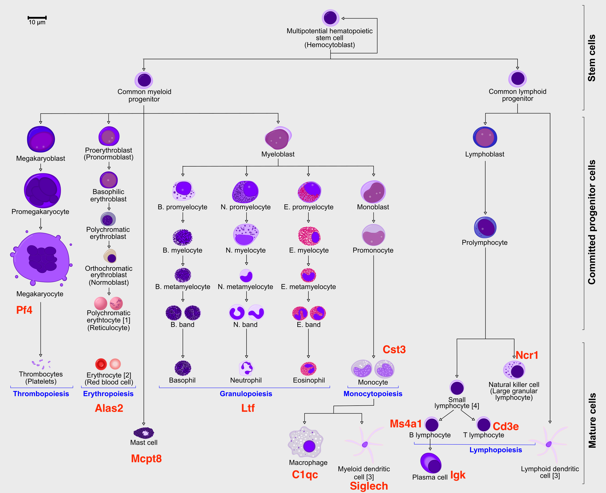

```{r}
devtools::install_github("jinworks/CellChat")
library(CellChat)
library(patchwork)
options(stringsAsFactors = FALSE)

cellchat_example.png
```

## Paso 8. Predicción de Trayectorias con **Slingshot**

Definiendo la paleta de cikries

```{r}
# Define some color palette
pal <- c(scales::hue_pal()(8), RColorBrewer::brewer.pal(9, "Set1"), RColorBrewer::brewer.pal(8, "Set2"))
set.seed(1)
pal <- rep(sample(pal, length(pal)), 200)
pal
```

Nice function to easily draw a graph:

```{r}
# Add graph to the base R graphics plot
draw_graph <- function(layout, graph, lwd = 0.2, col = "grey") {
  res <- rep(x = 1:(length(graph@p) - 1), times = (graph@p[-1] - graph@p[-length(graph@p)]))
  segments(
    x0 = layout[graph@i + 1, 1], x1 = layout[res, 1],
    y0 = layout[graph@i + 1, 2], y1 = layout[res, 2], lwd = lwd, col = col
  )
}
```

## **Preparing data**

If you have been using the **Seurat**, **Bioconductor** or **Scanpy** toolkits with your own data, you need to reach to the point where you have:

-   A dimensionality reduction on which to run the trajectory (for example: PCA, ICA, MNN, harmony, Diffusion Maps, UMAP)

-   The cell clustering information (for example: from Louvain, K-means)

-   A KNN/SNN graph (this is useful to inspect and sanity-check your trajectories)

We will be using a subset of a bone marrow dataset (originally containing about 100K cells) for this exercise on trajectory inference.

The bone marrow is the source of adult immune cells, and contains virtually all differentiation stages of cell from the **immune** system which later circulate in the blood to all other organs.



You can download the data:

```{r}
# download pre-computed data if missing or long compute
fetch_data <- TRUE

# url for source and intermediate data
path_data <- "https://export.uppmax.uu.se/naiss2023-23-3/workshops/workshop-scrnaseq"
path_file <- "data/trajectory/trajectory_seurat_filtered.rds"
if (!dir.exists(dirname(path_file))) dir.create(dirname(path_file), recursive = TRUE)
if (!file.exists(path_file)) download.file(url = file.path(path_data, "trajectory/trajectory_seurat_filtered.rds"), destfile = path_file)
```

We already have pre-computed and subsetted the dataset (with 6688 cells and 3585 genes) following the analysis steps in this course. We then saved the objects, so you can use common tools to open and start to work with them (either in R or Python).

In addition there was some manual filtering done to remove clusters that are disconnected and cells that are hard to cluster, which can be seen in this [script](https://github.com/NBISweden/workshop-scRNAseq/blob/master/scripts/data_processing/slingshot_preprocessing.Rmd).

## **Reading data**

```{r}
obj <- readRDS("data/trajectory/trajectory_seurat_filtered.rds")

# Calculate cluster centroids (for plotting the labels later)
mm <- sparse.model.matrix(~ 0 + factor(obj$clusters_use))
colnames(mm) <- levels(factor(obj$clusters_use))
centroids2d <- as.matrix(t(t(obj@reductions$umap@cell.embeddings) %*% mm) / Matrix::colSums(mm))
```

Let’s visualize which clusters we have in our dataset:

```{r}
vars <- c("batches", "dataset", "clusters_use", "Phase")
pl <- list()

for (i in vars) {
  pl[[i]] <- DimPlot(obj, group.by = i, label = T) + theme_void() + NoLegend()
}
wrap_plots(pl)
```

You can check, for example, the number of cells in each cluster:

```{r}
table(obj$clusters)
```

## **Exploring the data**

It is crucial that you have some understanding of the dataset being analyzed. What are the clusters you see in your data and most importantly **How are the clusters related to each other?**. Well, let’s explore the data a bit. With the help of this table, write down which cluster numbers in your dataset express these key markers.

| Marker  | Cell Type                  |
|---------|----------------------------|
| Cd34    | HSC progenitor             |
| Ms4a1   | B cell lineage             |
| Cd3e    | T cell lineage             |
| Ltf     | Granulocyte lineage        |
| Cst3    | Monocyte lineage           |
| Mcpt8   | Mast Cell lineage          |
| Alas2   | RBC lineage                |
| Siglech | Dendritic cell lineage     |
| C1qc    | Macrophage cell lineage    |
| Pf4     | Megakaryocyte cell lineage |

```{r}
vars <- c("Cd34", "Ms4a1", "Cd3e", "Ltf", "Cst3", "Mcpt8", "Alas2", "Siglech", "C1qc", "Pf4")
pl <- list()

pl <- list(DimPlot(obj, group.by = "clusters_use", label = T) + theme_void() + NoLegend())
for (i in vars) {
  pl[[i]] <- FeaturePlot(obj, features = i, order = T) + theme_void() + NoLegend()
}
wrap_plots(pl)
```

Another way to better explore your data is to look in higher dimensions, to really get a sense for what is right or wrong. As mentioned in the dimensionality reduction exercises, here we ran UMAP with **3** dimensions.

Since the steps below are identical to both `Seurat` and `Scran` pipelines, we will extract the matrices from both, so it is clear what is being used where and to remove long lines of code used to get those matrices. We will use them all. Plot in 3D with `Plotly`:

```{r}
df <- data.frame(obj@reductions$umap3d@cell.embeddings, variable = factor(obj$clusters_use))
colnames(df)[1:3] <- c("UMAP_1", "UMAP_2", "UMAP_3")
p_State <- plot_ly(df, x = ~UMAP_1, y = ~UMAP_2, z = ~UMAP_3, color = ~variable, colors = pal, size = .5)  %>% add_markers()
p_State
```

Abrirlo en una pantalla aparte

```{r, eval=FALSE}
# to save interactive plot and open in a new tab
try(htmlwidgets::saveWidget(p_State, selfcontained = T, "data/trajectory/umap_3d_clustering_plotly.html"), silent = T)
utils::browseURL("data/trajectory/umap_3d_clustering_plotly.html")
```

We can now compute the lineages on these dataset.

```{r}
# Define lineage ends
ENDS <- c("17", "27", "25", "16", "26", "53", "49")

set.seed(1)
lineages <- as.SlingshotDataSet(getLineages(
  data           = obj@reductions$umap3d@cell.embeddings,
  clusterLabels  = obj$clusters_use,
  dist.method    = "mnn", # It can be: "simple", "scaled.full", "scaled.diag", "slingshot" or "mnn"
  end.clus       = ENDS, # You can also define the ENDS!
  start.clus     = "34"
)) # define where to START the trajectories


# IF NEEDED, ONE CAN ALSO MANULALLY EDIT THE LINEAGES, FOR EXAMPLE:
# sel <- sapply( lineages@lineages, function(x){rev(x)[1]} ) %in% ENDS
# lineages@lineages <- lineages@lineages[ sel ]
# names(lineages@lineages) <- paste0("Lineage",1:length(lineages@lineages))
# lineages


# Change the reduction to our "fixed" UMAP2d (FOR VISUALISATION ONLY)
lineages@reducedDim <- obj@reductions$umap@cell.embeddings

{
  plot(obj@reductions$umap@cell.embeddings, col = pal[obj$clusters_use], cex = .5, pch = 16)
  lines(lineages, lwd = 1, col = "black", cex = 2)
  text(centroids2d, labels = rownames(centroids2d), cex = 0.8, font = 2, col = "white")
}
```

## **Defining Principal Curves**

Once the clusters are connected, Slingshot allows you to transform them to a smooth trajectory using principal curves. This is an algorithm that iteratively changes an initial curve to better match the data points. It was developed for linear data. To apply it to single-cell data, slingshot adds two enhancements:

-   It will run principal curves for each ‘lineage’, which is a set of clusters that go from a defined start cluster to some end cluster

-   Lineages with a same set of clusters will be constrained so that their principal curves remain bundled around the overlapping clusters

Since the function `getCurves()` takes some time to run, we can speed up the convergence of the curve fitting process by reducing the amount of cells to use in each lineage. Ideally you could all cells, but here we had set `approx_points` to 300 to speed up. Feel free to adjust that for your dataset.

```{r}
# Define curves
curves <- as.SlingshotDataSet(getCurves(
  data          = lineages,
  thresh        = 1e-1,
  stretch       = 1e-1,
  allow.breaks  = F,
  approx_points = 100
))

curves
```

```{r}
# Plots
{
  plot(obj@reductions$umap@cell.embeddings, col = pal[obj$clusters_use], pch = 16)
  lines(curves, lwd = 2, col = "black")
  text(centroids2d, labels = rownames(centroids2d), cex = 1, font = 2)
}
```

With those results in hands, we can now compute the differentiation **pseudotime**.

```{r}
pseudotime <- slingPseudotime(curves, na = FALSE)
cellWeights <- slingCurveWeights(curves)

x <- rowMeans(pseudotime)
x <- x / max(x)
o <- order(x)

{
  plot(obj@reductions$umap@cell.embeddings[o, ],
    main = paste0("pseudotime"), pch = 16, cex = 0.4, axes = F, xlab = "", ylab = "",
    col = colorRampPalette(c("grey70", "orange3", "firebrick", "purple4"))(99)[x[o] * 98 + 1]
  )
  points(centroids2d, cex = 2.5, pch = 16, col = "#FFFFFF99")
  text(centroids2d, labels = rownames(centroids2d), cex = 1, font = 2)
}
```

The pseudotime represents the distance of every cell to the starting cluster!

## **Finding differentially expressed genes**

The main way to interpret a trajectory is to find genes that change along the trajectory. There are many ways to define differential expression along a trajectory:

-   Expression changes along a particular path (i.e. change with pseudotime)

-   Expression differences between branches

-   Expression changes at branch points

-   Expression changes somewhere along the trajectory

-   …

`tradeSeq` is a recently proposed algorithm to find trajectory differentially expressed genes. It works by smoothing the gene expression along the trajectory by fitting a smoother using generalized additive models (GAMs), and testing whether certain coefficients are statistically different between points in the trajectory.

```{r}
BiocParallel::register(BiocParallel::MulticoreParam())
```

The fitting of GAMs can take quite a while, so **for demonstration purposes we first do a very stringent filtering** of the genes.

In an ideal experiment, you would use all the genes, or at least those defined as being variable.

```{r}
sel_cells <- split(colnames(obj@assays$RNA@data), obj$clusters_use)
sel_cells <- unlist(lapply(sel_cells, function(x) {
  set.seed(1)
  return(sample(x, 20))
}))

gv <- as.data.frame(na.omit(scran::modelGeneVar(obj@assays$RNA@data[, sel_cells])))
gv <- gv[order(gv$bio, decreasing = T), ]
sel_genes <- sort(rownames(gv)[1:500])
```
